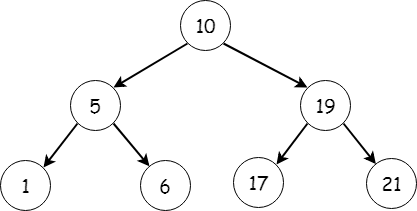

# Smallest Node

## Description
A [binary tree](https://youtu.be/i_Q0v_Ct5lY) is a data structure whose units are "nodes." A node has a value as well as references to its children nodes. 

In this example, `10` is the root node.  `10` has two children: `5` and `19`.  `5` and `19` in turn have their own children.  We can follow the connection from parent node to child node until we arrive at a "leaf."  A leaf node has no children, for example, `1`.  Note that smaller values are on the left, and larger values on the right.

## Requirements
`smallest_node.py` has a very basic implemetation of a binary tree. You will be adding a method to the `BinaryTree` class called `find_smallest`.  `find_smallest` will return the value of the smallest node.  The smallest node will be located at the bottom left of the binary tree.

Implement a recursive solution.

You should make sure you understand the problem before you start coding.  What are the steps that are repeated?

There is only one test to start with.  Feel free to add more.
