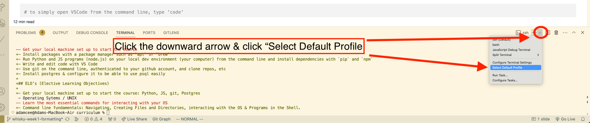
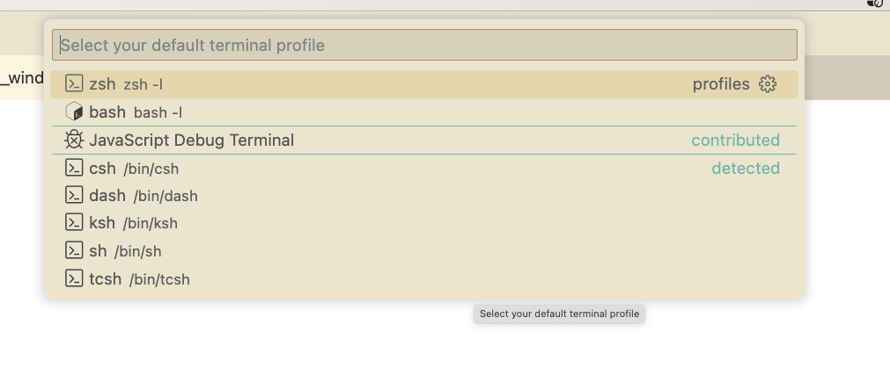

# Windows Installfest

## Prerequesites

- Make sure Windows Update has been run recently
- Make sure you already have created an account with Github

## What we'll cover

We are going to install everything that you will need for this course. Please do this in order!

1. Terminal
2. Visual Studio Code & `code`
3. Windows Subsystem for Linux (WSL)
4. Package Management
5. Python
6. Node
7. Git
8. Alisases
9. PostgreSQL
10. VSCode Extensions

## Terminal

The default terminal you should use initially is Windows Powershell. You can find this by opening the Start menu and starting to type "powershell".

It isn't a requirement but Microsoft now makes a great terminal environment that is available for free on the Windows Store called Windows Terminal. This is a one stop shop that allows you to open a terminal with either Command Prompt, Windows Powershell, or any other terminal, and will be useful once we get to the WSL phase of these instructions and you will want to regularly open an Ubuntu terminal.

## Visual Studio Code & `code`

There are many IDEs (integrated development environments) out there that developers can use. For our class, we're going to be using Visual Studio Code, a free IDE created by Microsoft. VSCode is a powerful, flexible editor that supports many different coding languages. VSCode is also highly extensible, with a rich ecosystem of plugins.

- Download [Visual Studio Code](https://code.visualstudio.com/download) and click on the general Windows installer.
- During install, VSCode will by default ask to add itself to your system's PATH envirnmental variable - keep this box checked!
- This will allow you to open VSCode from the terminal using the command `code` like so:

```bash
# to simply open VSCode from the command line, type 'code'
code
# to open a specific file, specify it as the first argument to `code`
code myfile.txt
# to open the current folder
code .
```

Test that this `code` command actually works before moving on. You may need to close and reopen your terminal.

> A note about extensions: You are free to install any/all extensions you find on the VSCode marketplace as they suit you and we will be recommending some throughout the course. That said, I want to strongly advise you to _not_ install any AI code-completion tool like Github Copilot or Micrsoft's IntelliCode. Your goal in this course is to learn to program and these tools tend to interfere with that process by giving you regular autocompletion options that are not accurate solutions to the problem at hand. These tools have their place, but it is generally a bad habit to copy/paste code you do not understand yourself and these tools make that a seamless process, so please do avoid them for the duration of this course.

> Additionally, as a Windows user, you are going to want to hold off on installing any extensions until we have WSL installed.

## Windows Subsystem for Linux (WSL)

The modern approach to developing on Windows is to install a version of Linux _within_ Windows. This seems tricky, and it is sometimes, but it ends up being a much better way to do things in a terminal environment with Windows.

First, search for `Windows PowerShell` in the start menu, then right click on it and select 'Run as administrator'. Then type:

```bash
wsl --install
```

By default this will install WSL2 on your system and start downloading a version of Linux called Ubuntu. This will take some time and require you to restart your PC (manually) when done.

Once restarted an Ubuntu terminal should automatically run and it will ask you to provide a username and password. Note, this username and password is solely for this Linux distribution and need not match your Windows account info. That said, the password you choose should be relatively simple as you will need to type it in often.

```bash
# username will need to be all lowercase
Enter new UNIX username: <username>
# Once you enter the name it will prompt for your password. Note that you will not see any feedback while typing, not even '****' type masking
New password:
Retype new password:
```

If you see an output at this below than you have succesfully setup your WSL environment:

```bash
<username>@<computer_name> $
```

In the future you can open up a WSL terminal by searching the Start menu for 'Ubuntu'. I also highly recommended you install the app Windows Terminal from the Windows Store and configure that to select Ubuntu as the environment by default, as it's a much better terminal experience than the default Ubuntu program.

To configure the correct default shell open Windows Terminal and then select `'down arrow' -> Settings -> Startup -> Default Profile -> Ubuntu`

### Configure VS Code's Terminal to use WSL by Default

Lastly, let's configure VS Code to always use a WSL terminal by default; this will make life easier.

1. Go to the "Terminal" > "New Terminal" menu to open a new terminal.

2. Along the top right of the terminal, click the downward arrow next to the "+" symbol (see image below). This will give you a list of available terminals to choose from.
 

3. Choose "Select Default Profile". This will open the VS Code "Command Palette" and you will see all available terminals. There should be one named "Ubuntu" (Ubuntu running inside WSL), or, if you've installed & configured "Windows Terminal", "Windows Terminal". Choose either. **IMPORTANT: Your list of options may look different from the ones in this screenshot.**

 

## Package Management

Now that we are in our WSL environment, package management is identical to what it would be like on Linux, so we will be using `apt`.

Advanced Package Tool (APT, or `apt`) is a built-in package manager for Ubuntu that handles the installation, versioning and removal of software.

### Updating

The `update` command in apt will fetch a list of packages from an external source that are available for download. This list changes frequently so it's important to run the update command before installing anything to ensure you will be fetching the latest package and not an outdated one.

```bash
# update the list of external packages that are available for install
sudo apt-get update
# you will be prompted for your password at this point
```

## Python

Python comes built in with Ubuntu but to ensure that we have the must up to date version, let's run the following commands:

```bash
sudo apt-get install python3
sudo apt-get install python3-pip
sudo apt-get install python3-setuptools
```

> Note: if you ever need to install multiple packages simultaneously, apt-get supports this like so:
>
> ```bash
> sudo apt-get install python3 python3-pip python3-setuptools
> ```
>
> This is just a matter of convenience though, installing the packages as seperate commands will result in the same outcome.

Test that you can run the commands `python3` and `pip`. For `pip` you will simply see some output indicating it's usage, but as long as it recognizes the command as existing you are good. As per usual you may need to close and reopen your terminal to see these working.

### Python Virtual Environment

Python uses the concept of a 'virtual envrionment' to install packages through pip uniquely for a given project. In order to make creating such environments possible first install the necessary tool:

```bash
sudo apt-get install python3.10-venv
```

While you can make virtual environments for a given project it is also wise to have a default virtual environment, which we will create now. Open a new terminal and ensure you are in the home folder (`~`) and then run:

```bash
python3 -m venv default
```

If it works this will create a new folder in your current directory called 'default'. Inside that folder we should see a bin folder holding an `activate` script. Run that script with:

```bash
source ~/default/bin/activate
```

After running the above you should see the name of the venv ('default') represented somewhere in your command line. Close the terminal and reopen it and you will see this name is no longer there. That is because the venv needs to be set every time you open your terminal. Because it is easy to forget to do this we will make it happen on startup by adding it to our `.bash_profile` file later, but first, let's install node.

## Node

In this section, we'll use `apt` to install `npm`, the default package manager for node. We'll then use `npm` to install `n`, which is a tool to help manage different versions of `node`. Lastly, we'll use `n` to install the latest stable version of `node`.

```bash
# use apt to install npm
sudo apt-get install npm
# use npm to install n (-g means globally, as opposed to in a specific project/folder)
sudo npm install -g n
# use n to install the latest stable version of node
sudo n stable
```

Close and reopen your terminal if necessary and test that both the commands `node` and `npm` are recognized.

## `git`

Git may or may not be install by default on your system, but to make sure use `brew` to install it.

```bash
sudo apt-get install git
```

Next, we'll configure Git with sensible defaults:

```bash
git config --global user.name "<YOUR_NAME>"
git config --global user.email "<YOUR_EMAIL>"
```

We also want to make sure that when committing we open the commit message prompt in VSCode (default will be `vim` and you will not like it):

```bash
git config --global core.editor code
```

You can confirm git is configured correctly by running:

```bash
git config --global -l
```

You should see that your username, email, and editor are all listed.

### Github and `gh`

Github's preferred way you interact with it now is a command line tool called `gh`. First, you will need a github account to continue, then, in your terminal type:

```bash
sudo apt-get install gh
```

Once downloaded type:

```bash
gh auth login
```

and follow the wizard steps to complete the authentication process. When done you should be able to close a repo like so:

> Note: On Windows using WSL it is likely not going to be able to open the link for you automatically so you may need to enter it manually into a browser but that isn't something to be concerned about.

```bash
gh repo clone lodash/lodash
```

This will install that repo in your current directory. Assuming this is successful if you want to delete it afterwards type:

```bash
rm -rf lodash
```

## Alisases

Every time you open your terminal a special file will automatically be read from to do any necessary 'setup' type work. Assuming the terminal you are using is `bash` this file will be called `.bash_profile`. If you are using `zsh` it will `.zshrc`. If you are unsure what terminal you are running type:

```bash
echo $SHELL
```

Open this file in VSCode like so:

```bash
code ~/.bash_profile
```

VSCode should open with the `.bash_profile` as the current document. If you didn't have a profile before, it'll be empty. Either way, paste the code below at the bottom of your profile:

```bash
alias python='python3'
alias pip='pip3'
```

Aliases are what they sound like, simply a new name that points to an existing command. If you are ever in doubt what a given alias points to type:

```bash
which <COMMAND>
```

If `<COMMAND>` is an alias, it will tell you what it points to. If `<COMMAND>` is a real command it will tell you what its full path is in the file system.

These aliases won't automatically be applied in your current terminal, but they will take effect in any new terminal windows you open. Alternatively if you don't want to close/open your terminal you can force the terminal to re-read the newly updated file with:

```bash
source ~/.bash_profile
```

## PostgreSQL

We will now install PostgreSQL by running the following command:

```bash
sudo apt-get install postgresql@14 postgresql-contrib
```

Start a PostgreSQL instance (in the background) like so:

```bash
sudo service postgresql@14 restart
```

To enter PostgreSQL we will switch our shell user to one named `postgres`, and then we can enter the running PostgreSQL instance.

```bash
# switch to the user `postgres`
sudo -i -u postgres

# connect to the running PostgreSQL instance
psql
```

If your terminal now looks like it does below, you have succesfully installed PostgreSQL:

```
postgres=#
```

Now that you are logged into postgres you can create a user role within your PostgreSQL database that matches the user within your Ubuntu instance by running the following command.

```sql
CREATE ROLE <your_username> WITH LOGIN SUPERUSER INHERIT CREATEDB CREATEROLE;
```

To exit out of this enviroment type

```
postgres=# \q
```

You will still be logged in as the user 'postgres' even after this step, so either close the terminal outright or press `Ctrl-D` to return to the regular terminal environment you began in.

Now you can enter PostgreSQL by typing `psql postgres || psql` into the terminal.

## VSCode Extensions

### WSL

Before you download any other extensions search the extension store for 'WSL' and download the extension with that name published by Microsoft. Then close VSCode and, from your WSL terminal type:

```bash
code
```

This should open VSCode from WSL and initiate some setup it needs to do in order to assume this is your default environment. In general you will want to open VSCode this way, from the command line, and not from double clicking the program from the Windows Start Menu, as VSCode sees these as two seperate environments and they will bne configured differently.

> Its very important you download this extension first, otherwise the next steps won't work quite right!

### Python

Open VSCode from the terminal and create a new file called `example.py`, like so:

```bash
code example.py
```

This will be enough for VSCode to prompt you to download it's official Python extension. If this doesn't happen for whatever reason, you can select the extension tab on the left pane and search for 'python' and download the one made by Microsoft (it should be the top result). You will know this was succesful if afterwords you can write some simply Python code like:

```py
print("hello")
```

and when you hover over the print function with your mouse pointer VSCode gives you some intellisense (essentially in-line documentation about what that bit of code does).

### Live Share

Live Share is another official Microsoft extension that will allow us as instructors and TAs to collaborate with you VSCode in real-time, which can be very helpful when troubleshooting a tricky bug. Search the extensions store for 'Live Share' and make sure it is published by Microsoft and download it. We won't expect you to set it up at this point but it is good enough to have it already installed for now.

### Live Server

Live Server is an extension that makes it simple to spin up a server to work with a website using HTML/CSS/JS without having to write your own basic server in Python/Django. This is useful when learning frontend.
