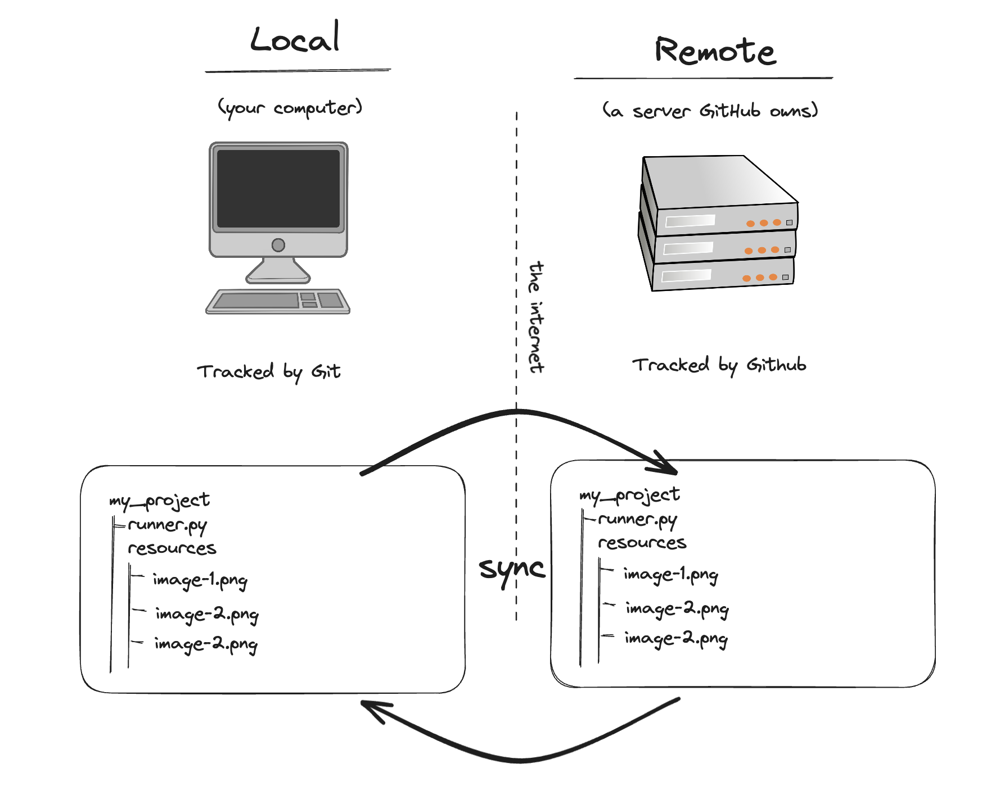
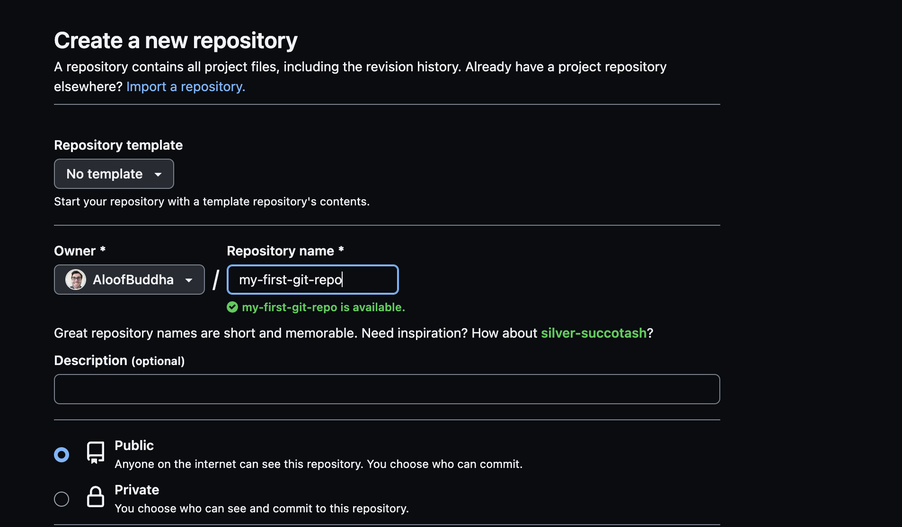
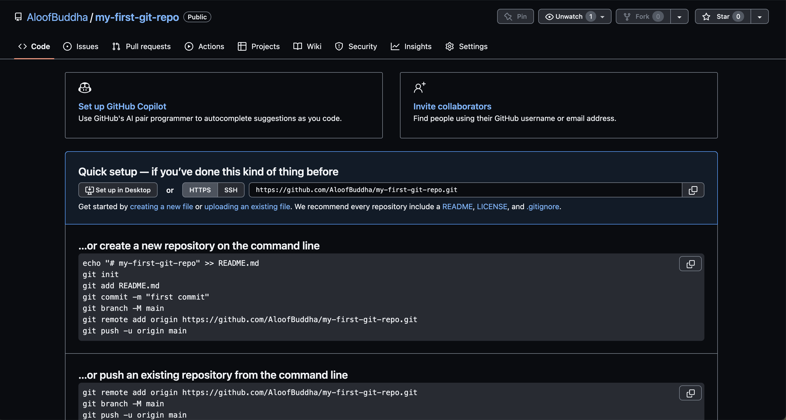
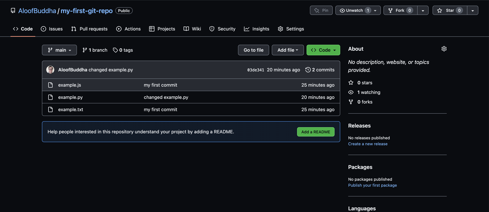
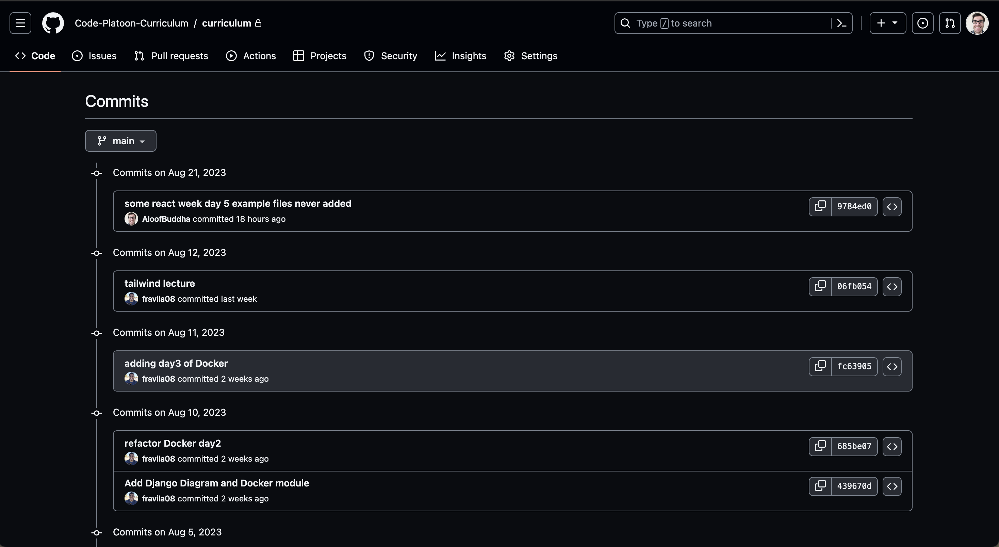
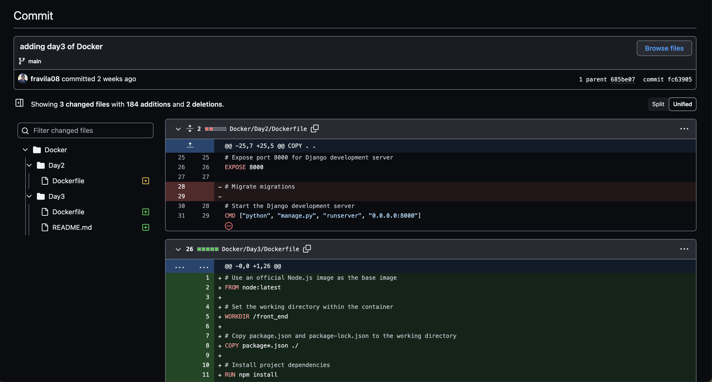
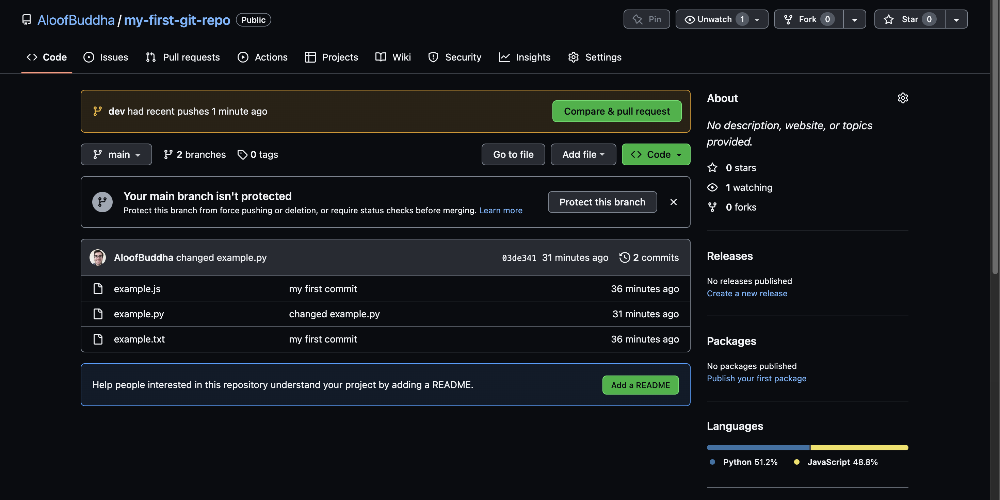
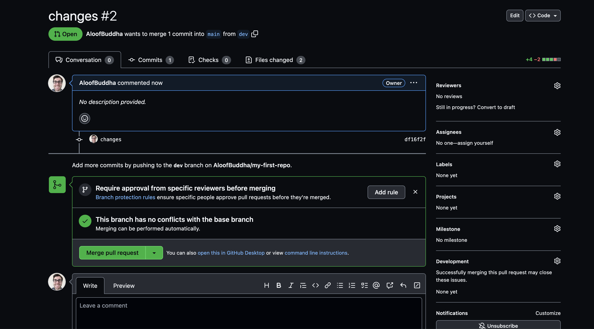
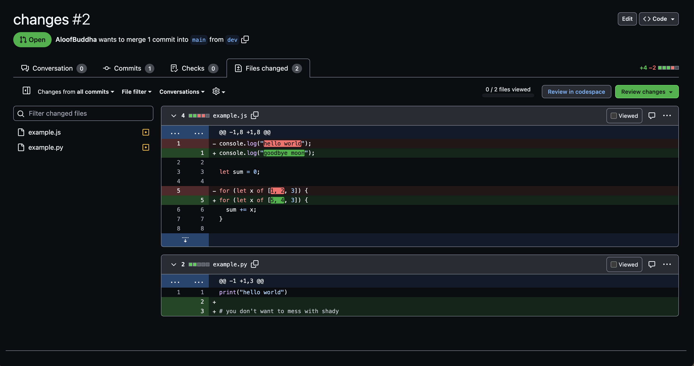

# Github Fundamentals

## Intro

You will go deeper into using git in conjunction with github and learn how to save your work to your "remote" git repo on github.

## What is Github?

To reiterate from part 1:

- **_Git_** is the original invention, and it is designed to manage changes for a _local_ project living on your own personal computer.

- **_Github_** is a modern product/company (now owned by Microsoft) that aims to be the de-facto place to _back up_ your local git repo on the internet. Github let's you sync your local project (and it's history) with a _remote_ computer, so you even if your personal computer is destroyed, a copy of your project still exists in it's entirelty on the internet. This remote location is also useful for collaborating with others, but that's beyond the scope of this lesson.



For this lecture we will dig into how we integrate our local Git repo with Github for the sake of long term persistence and all the other benefits hosting something on the internet has.

## Creating a new repo in `Github`

In a browser, go to [github.com](github.com), sign in (you should have created an account by now, but if not, please do), and click the '+' button near your profile picture and select 'New repository'. You should see a page like below:



Give the repo a name and leave all the defaults as they are, and then hit 'Create repository'. You should now see a page like:



Github doesn't know anything about our local repo (yet) so we needed to first create a repo Github is aware of, but it's contents are empty.

This page gives us some steps for hooking up this remote repo to our local git repo, but it can be extremely dense to read for a newcover, so we will now walk through the process step by step. The only thing to note right now is the url, which we want to copy for later. I don't mean the url in the browser url bar but the one on the page that ends in `.git`, which has a convenient 'copy' button next to it. This url represents the location of your Github repo for the sake of hooking up your local to the remote. By way of example mine is: `https://github.com/AloofBuddha/my-first-git-repo.git`.

## Setting up a connection between your local and remote (Github) repos

Now head back to the cli and navigate into the git repo you worked on in part 1. We will use the command `git remote` to add a new 'remote' location to back up our work.

In the cli type:

```bash
git remote add origin <your-github-repo-url>
```

Which for me is therefore:

```bash
git remote add origin https://github.com/AloofBuddha/my-first-git-repo.git
```

Let's break this command down:

1. `git remote` is the core subcommand

2. `git remote add` means we want to add a new remote connection (there could theoretically be many but there's usually just one)

3. `git remote add origin` names that new remote connection 'origin'. This could have been any name, but by convention if one has a single remote back up location it is generally called 'origin' to imply that's the official source of truth for that project.

4. `git remote add origin https://github.com/AloofBuddha/my-first-git-repo.git` names that new remote origin and links it up to the url we provided.

If you now type `git remote -v` you should see that this url is recognized for the sake of pushing (pushing code from local to remote) and fetching (fetching code from remote to local).

Now that we have made the connection, let's backup our local work.

## `git push`

First, type `git push` in the cli. This won't work yet, but will give you a helpful message. The first time you push a local repo to a remote repo, it wants you to be more specific. The instructions I got tell me to instead type:

```bash
git push --set-upstream origin main
```

What this means is we are going to push our current branch (`main`) to the remote repo named `origin` and we are using the flag `--set-upstream` to link them, so in the future `git push` will suffice. The output of that command for me looks like:

```bash
Enumerating objects: 8, done.
Counting objects: 100% (8/8), done.
Delta compression using up to 8 threads
Compressing objects: 100% (4/4), done.
Writing objects: 100% (8/8), 634 bytes | 634.00 KiB/s, done.
Total 8 (delta 0), reused 0 (delta 0), pack-reused 0
To https://github.com/AloofBuddha/my-first-git-repo.git
 * [new branch]      main -> main
branch 'main' set up to track 'origin/main'.
```

This tells us we pushed some code from `main` to `origin/main` and set up that connection. Now go back to the github page from before and refresh. You should now see your files at the Github url where your project lives:



Great! This is almost everything you need to know at this point! If you press the 'commits' link in the previous image you will be able to explore the history of your repo in a more usable fashion than `git log`.





What we have done so far will suffice for working on your own, but there are a few more topics that become more significant when collaborating with others.

## `git branch` and Github

Remember the feature branch we made in part one? You might notice if you explore your projects Github page that it is only aware of main right now. That's because we haven't setup any connection between that branch and `origin` like we had to do with `main`. Let's create a new branch now so we can see what that process looks like:

Remember, if we want to make a new branch, type `git checkout -b <name-of-new-branch>`. This will create, then immediately checkout the new branch. I wrote:

```bash
git checkout -b dev
```

> I chose the name `dev` as this is a common pattern - `main` can represent the stable copy of something while `dev` is a place to do new work from that may or may not prove fruitful.

I am now on a new branch called `dev` and can confirm this with `git status`. Nothing has changed yet, as initially a branch will fully copy whatever branch it was branched off from (we were on `main`, so that's what the initial contents of `dev` now are).

Now let's make a change and commit it:

- example.js

```js
console.log("hello");

let sum = 0;

for (let i = 0; i < 5; i++) {
  sum += i;
}

console.log(sum);
```

```bash
# <Changed contents of example.js>
git add .
git commit -m 'changed example.js'
```

Now let's share this change with the remote repo with `git push`.

If you do this, you will see a message like before - git needs to know the connection initially, so we need a more involved command like:

```bash
 git push --set-upstream origin dev
```

Now that we type this command, our local dev branch will be linked to a Github branch called dev. Go back to Github's site to see this:



In the dropdown on Github where it says `main` you will actually see the dev branch has been pushed in full. But what you likely noticed first was the banner at the top. What's a 'pull request'?

## Pull requests

Remember when we did `git merge` to combine the `my-feature` branch into `main` locally? This works, but integration with Github offers a preferred alternative called a 'pull request'.

A 'pull request' is a way of 'merging' two branches so the merged into branch represents the combined work of both. Imagine we did a lot of work on `dev` and were ready to have this work added to the stable branch, `main` - this is how we would do that. This is identical to what `git merge` does but a pull request can be completed with a visual interface, and it has the added benefit of making it clear what changes have been made, and in a real world project is usually set up so that a reviewer on the team is required to 'approve' the PR before merging. This is a central part of the cycle of modern software development, which goes:

1. check out `main`
2. create a feature branch to represent the new changes you want to make
3. push those changes to Github
4. initialize a PR to pull your feature branch into `main`
5. Get a code review from another team member
6. Once approved complete the PR. Your work is now integrated into the `main` branch.
7. In a real world project, there is likely some kind of DevOps (automation based on code) set up so that, when a new change is merged into `main` the server where your website is being hosted will be made aware of the changes to refresh the website with the new data, and a QA employee will be alerted to now test the new feature.

Ok, Let's now click that PR alert and go through the steps to merge. As we are the only user of this repo this will be simple, but in the real world you will often be collaborating with others, and there could be merge conflicts to fix (ie the two branches overlap in areas that need manual attention to combine correctly) and there are usually permissions so not just anyone can merge to `main` without some kind of code review first.





Now that this is done `main` now represents the combined changes of `main` and `dev`. You will also see a little alert to delete the feature branch if desired. Branches are relatively disposable, there only real purpose is to allow you to create features and merge them into main, so once done feel free to delete!

## Syncing with remote

If you go back to your local repo, you may notice that your `main` branch doesn't reflect any of those new changes you just merged in the PR. That's because they only exist in Github currently. We already learned how to sync new changes Git -> Github using `git push`, but how do we sync changes from Github -> Git? Unsurprisingly - with `git pull`!

Go back to the cli and first make sure you are on the `main` branch (`git checkout main`). Now type `git pull`. This will 'pull' all the changes from the remote into local, so they stay in sync. This becomes more important once you are collaborating with others, as even if you didn't make any recent changes, someone else may have, so running `git pull` on your `main` branch before doing any new work on a group project is a wise habit to develop. That way, any feature branch you create is branching from the current state of `main`, not merely the last state of `main` you pulled, which is likely out of date if you work with others.

## Conclusion

This concludes our intro to Git/Github lecture, but as you probably suspect there is a lot that has not been covered. Git is a very complex tool and we have only scratched the surface. The essential point is that you already have what you need to backup your own work when working alone, and learned the workflow you will use on a daily basis when working on assignments.🚀

## Cheatsheet

- `git clone <repo-url>` - We didn't cover this one explicitly but its how you can create a local repo from an existing Github repo

- `git remote add origin <github-url>` - set up your local git repo to refer to a remote (Github) repo

- `git push -u origin main` - initial setup for pushing your main branch to an equivalent branch on your Github repo (origin)

- `git push` - continually push changes once the initial setup has been done

- `git pull` - update your local repo to reflect any new changes to the remote (Github) repo

## Advice

Concepts like branching, pull requests and merging really only come into play once collaborating with others, so the most essential topics to have gathered from today are staging changes, committing those changes, and pushing them to a remote.

Other good general bits of git advice I feel are worth sharing:

1. Be careful when using a visual git tool (like the one built into VSCode), as it is running commands behind the scenes, many of which you may not understand. You can use it, but be careful to understand how to do something using the cli first, as these tools can get you into trouble sometimes and you will be in over your head.

2. **Never** use a git command you copied off the internet and don't fully understand. You will only run into even greater complications. If you encounter a new git command on stack overflow do your due dilligence and read about it first, and ideally seek a TAs help before proceeding.

3. Run `git status` between every other command you run. It will tell you what the state of the system is and is the main way you get familiar with the concepts git uses.

> These tips come from personal experience. It is far better to be completely unproductive than to wipe out a years worth of your entire teams work because you copy/pasted a command like `git reset --hard`

## Resources

- [Atlassian Git resouces](./https://www.atlassian.com/git/tutorials/setting-up-a-repository)

Atlassian is a company that makes many software development tools like Jira (project management) and a Github competitor called BitBucket. We don't use or teach BitBucket but their tutorials around Git are extremely high quality with diagrams that help a lot compared to Git's own official docs.

- [Code Platoon git workflow cheat sheet & intermediate git cheat sheet](https://github.com/Code-Platoon-Curriculum/curriculum/blob/main/optional_lessons/intermediate-git.md)