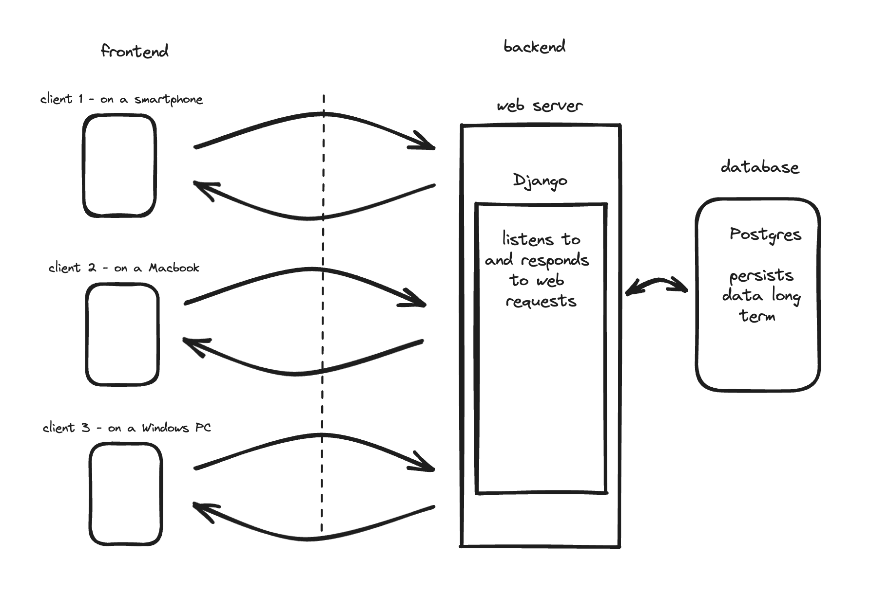
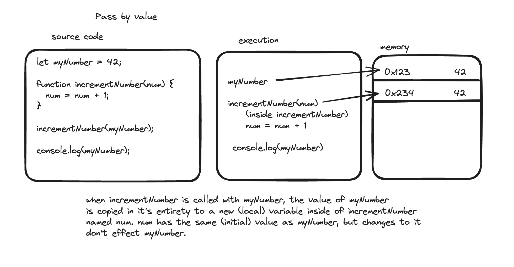
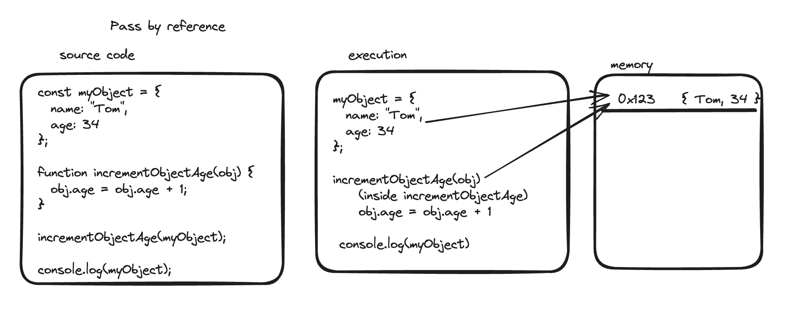

# Intro to Intermediate Javascript

## Intro

We will cover why Javascript (or JS) is such an important language for the web, and review/dig deeper into JS language fundamentals. Every programming language has fundamental features such as:

- It's syntax
- Logical operators (if, and, etc)
- "Primitive" data types (often numbers or strings or booleans)
- More complex data types (often arrays, lists, objects, etc)
- If it is "strongly typed" or "weakly typed" (also called a *dynamic* language, as the type of a variable can change)
- It's tools to compile (if necessary) a program written in the language and run that program on a computer

JS and Python have some similarities (both are dynamic languages) and differences ("objects" work very differently in JS than Python). It is important to know the programming language you use inside and out; your goal in this course should be to become proficient in both JS and Python, and, to become an expert in one of them.

## How the internet works

Before we can really talk about JavaScript, let's take a high level view of how the internet works, as it relates to web-development



That dotted line represents the internet, a 'divide' of time/space that be communicated over, albeit with a delay.

At one end is the _backend_. Take Facebook for example: Facebook owns a server (in reality, many) that hosts the website `facebook.com`. A backend can be complex, but at minimum it includes a database where data is persisted long-term, and a web server that fields requests from clients. A website like `facebook.com` has a single backend, owned by Facebook itself. This means Facebook has 100% control over those computers, including what OS they are running and what programming languages they choose to create their web server.

The _frontend_ on the other hand represents the client*s*. Many people use Facebook.com, but Facebook the company has **no direct control** over what computers these clients are using, what OS is running on it or what programming languages exist on their computers.

## Why does JavaScript matter?

So what does this have to do with JavaScript? Well, on the backend, you can choose any language you want, at Code Platoon we teach Python and Django, but a web server could be built in Java or C# or any other langauge. This is _not_ so on the frontend! To make every website compatibe with every client a client needs to use a specific program called a _web browser_ to interact with that website's backend. For obscure historical reasons web browsers support exactly one language - **JavaScript**! JavaScript can sometimes seem unnecessarily obtuse in it's designed, especially compared to Python, but there's a reason for this - by the design of the web, a [website from 1996](https://www.spacejam.com/1996/jam.html) should still work today. That means no breaking changes! No Python 2 -> Python 3. Websites written 25+ year ago should still work today, and to accomodate this JavaScript only ever adds features, never removes any. This means the language can appear poorly designed at times but just remember - **you don't have a choice!**

> In reality you do now, TypeScript is a 'better' JS that 'transpiles' down to JS, but it's beyond the scope of the course at the moment

## Node.js

JavaScript was initially intended to simply be the language for the frontend, but there's nothing stopping anyone from implementing it as a general purpose (backend) language, and thats exactly what someone did with the creation of [Node.js](https://nodejs.org/en/). At Code Platoon we use Python + Django for our backend purposes, but Node.js (also referred to as just Node) will allow us to practice our JavaScript on our local computer before we get to the frontend portion of the course.

```bash
  node # open Node in REPL (Read-Evaluate-Print-Loop) mode
```

```bash
  node example.js # execute a specific JavaScript file
```

## Intro to JavaScript

A lot of what we are about to run through was covered in the pre-work, but we want to do a quick overview if there is any confusion. Please do call it out and ask questions on a topic you feel weak on, as these are your core 'tools' in the language and you want to make sure you understand them well before moving on to more advanced parts of the language.

> This is a good lecture to try stuff out as we are going. I like to make a file called `scratchpad.js` and just test out code snippets to see what they do. It's important to actually test stuff out because even MDN's website is not the final arbiter of correctness, it's the actual program that runs your code (in this case a specific version of `node`) and the only way to know for sure what a given line of code does is to run it.

### Variables

Variables are named labels/identifiers for storing values. There are two (modern) ways to declare/create a variable in JavaScript:

```js
// const can not be reassigned
const num = 1;
num = 42; // Uncaught TypeError: Assignment to constant variable
```

```js
// let can be reassigned
let num = 1;
num = 42; // kosher
```

Prefer `const` to `let` initially and then make it a `let` if it truly needs to be variable.

There is a third type of variable in JavaScript called `var`. This used to be the only way to declare a variable, but now that `let` and `const` exist is considered deprecated, though you may see it in older codebases. This is an example of JavaScript only adding features, never removing them.

### Functions

You should be familiar with ordinary JS functions by now

```js
makeFullName("Benjamin", "Cohen"); // "Benjamin Cohen"

function makeFullName(firstName, lastName) {
  return firstName + " " + lastName;
}
```

Note that you were able to call the function (seemingly) before it was declared. This is because of a feature in JS called 'hoisting', which pulls all function definitions to the top of the file before any other code is ran.

### Data Types

Two kinds of data: primitive data types, and complex data types.

- **Primitive data types** evaluate to themselves, and are immutable (unchangable once created). Examples are: Strings, Numbers, Booleans, `undefined`, `null`

- **Complex data types** 'contain' other data types and are mutable (you are really dealing with a memory address and not a 'thing' so you just change what's at that memory address). More on this in the complex data types section.

### Primitive Data Types

#### Strings

Anything enclosed in single, double quotes, or back ticks

```js
"I am a string";
"Me too, and I make doing 'this' look easy";
`Back ticks give you string interpolation: ${4 + 44}`;
```

Interpolation is when you substitute a variable/expression into a string.

```js
const firstName = "Tom";
console.log(`My first name is ${firstName}`);
```

String are _immutable_, so you cannot change a string once created.

```js
const name = "benjamin";
name[0] = "B";
console.log(name); // "benjamin"
```

Even though they are immutable, you can still use the value of one string to create a brand new string.

```js
const firstname = "Benjamin";
const fullname = firstname + " Cohen"; // "Benjamin Cohen"
```

#### Numbers

We aren't going to discuss numbers in depth, you know how numbers work, but it's an important point that in JavaScript there is not 'int' vs 'float' distinction, they are all of type `number`. You can confirm a values type with:

```js
typeof 5; // 'number'
typeof -5.231; // 'number'
```

Like most languages, JS has a built-in class called `Math` with helpful methods on it like `Math.pow` or `Math.floor`

```js
Math.pow(3, 2); // 9
Math.floor(5.23); // 5
```

#### Booleans

Booleans are `true` or `false` and all the boolean operators work as expected

```js
true || false; // true
```

**Short-circuiting**. This is likely a new idea. When JavaScript evaluates a boolean expression, it will only evaluate as much as it needs to to know the result. So for the example above, after looking at `true` and seeing the comparsion is an `||`, it knows that statement must be `true` (because `true || <anything>` === `true`) so the `false` value is never read. Why is this important? First another idea:

**truthiness**. Because JavaScript is dynamically typed, values are 'implicitly coerced' from one type to another when it makes sense. For example:

```js
1 || false; // 1
```

This not only doesn't break, it treats the 1 as 'truth-y' and, instead of returning true, it returns the original value, `1`.

**equality (`==` vs `===`)**. You may have seen both of these operators for comparing two values by truthiness. The different is subtle:

- `==` will perform implicit type cooercion, so `1 == '1'` evaluates to `true`.
- `===` will _not_ perform such cooercions, so `1 === '1'` evaulates to `false`.
- Prefer `===` unless you have a very specific reason to use `==`, as that coercion behavior is almost never what you really want and it makes it easy to create odd type-based bugs.

> For reference: [Booleans](./examples/booleans.js)

#### `undefined`

A way to represent something with no meaningful value yet. This is what unassigned variables hold by default.

```js
let babyName;
console.log(babyName); // undefined
```

#### `null`

`null` is almost identical in purpose and meaning to `undefined` but specifically use to represent a non-existent object (as opposed to an uninitiated variable). We will talk more about objects in a moment.

### Complex Data Types

#### Arrays

Arrays holds an _ordered list_ of values. These values can be anything: strings, numbers, objects, even other arrays!

You can access the values in the array by reference to its 'index', which is 0-based.

```js
const daysOfTheWeek = ["mon", "tues", "wed"];
daysOfTheWeek[0] = "sun";
console.log(daysOfTheWeek); // ["sun", "tues", "wed"]
```

- Like most things in JavaScript, arrays are actually _objects_ under the hood, and therefore have many great methods to help you with manipulating them as desired. Reference [MDN](https://developer.mozilla.org/en-US/docs/Web/JavaScript/Reference/Global_Objects/Array)

```js
const daysOfTheWeek = ["mon", "tues", "wed"];
daysOfTheWeek.push("thurs");
console.log(daysOfTheWeek); // ["mon", "tues", "wed", "thurs"];
```

> For reference: [Arrays](./examples/arrays.js)

#### Objects

Objects are collections of key/value pairs. You can't access it by `index` like with arrays because objects are not essentially ordered, but you can access a `value` by it's `key`

Objects are therefore useful for holding many details about a single entity, accessed through a unique key (like an `id`)

```js
// objects can be nested
const database = {
  457: {
    name: "Tom",
    age: 34,
  },
  57782: {
    name: "Sally",
    age: 42,
  },
};

// an objects value can be referenced by key using [] syntax
const tomEntry = database[457];

// if the key is a string, you can also use . syntax
console.log(tomEntry.name); // "Tom"

// You can re-assign a key's value (mutable)
tomEntry.age = tomEntry.age + 1;
```

> For reference: [Objects](./examples/objects.js)

### Functions and data types

#### Pass by value

The most important reason to distinguish between classes of data types is in how a function will consider them when passed as a variable.

```js
// primitive
let myNumber = 42;

// 'num' is 'copy by value', changes to it won't effect what was passed in
function incrementNumber(num) {
  num = num + 1;
}

incrementNumber(myNumber);

console.log(myNumber); // 42
```

This concept is called _pass by value_. Why? Because when you pass a primitive data type to a function, it actually gets a _brand new copy_:



if we wanted this function to actually update the variable we would need to do something like:

```js
let myNumber = 42;

function incrementNumber(num) {
  return num + 1;
}

myNumber = incrementNumber(myNumber);

console.log(myNumber); // 43
```

#### Pass by reference

The opposite is true for a complex data type like an array or object:

```js
// complex
const myObject = { name: "Tom", age: 34 };

// obj is 'copy by reference', changes to it will effect what was passed in
function incrementObjectAge(obj) {
  obj.age = obj.age + 1;
}

incrementObjectAge(myObject);

console.log(myObject); // { name: "Tom", age: 35 };
```

This is because complex data types are not copied when passed in to a function as an argument, only their memory address is copied (pass by reference), so the internal variable of the function ultimately references the same object.



> For reference: [Pass by value](./examples/pass-by-value.js)
> For reference: [Pass by reference](./examples/pass-by-reference.js)

### `if/else` and the ternary operator

You are likely already familiar with an `if/else`` statement, but to review:

```js
const age = 24;
let canDrink;

if (age < 21) {
  canDrink = "nope!";
} else {
  canDrink = "yup!";
}
```

Note how `if/else` statements _do_ things but don't _evaluate_ to anything. So something like the below won't work:

```js
const age = 24;
const canDrink = if (age < 21) {
  return "nope!";
} else {
  return "yup!";
}
```

That isn't valid JS, but there is some valid JS that does the above, which is sometimes useful when we want to assign variables based on some conditional - _the ternary operator_!

```js
const age = 24;
const canDrink = age < 21 ? "nope!" : "yup!";
```

Not only is this more condensed, but this way the canDrink variable could be set as const if desired.

### Iteration (Loops)

Loops are an essential tool when working with complex data structures. The original `for` loop accomplishes this well enough:

```js
let myNumbers = [1, 44, 72];
for (let i = 0; i < myNumbers.length; i++) {
  console.log(myNumbers[i]);
}
```

That works but it would be nice if it just understood this was an array and we wanted to see each value once. This is where `for ... of` syntax comes in:

```js
let myNumbers = [1, 44, 72];
for (let num of myNumbers) {
  console.log(num);
}
```

> Don't confuse this with `for ... in`, a JavaScript keyword that allows you to loop through the keys of an object. JavaScript has a lot of deprecated stuff like this :/

Ok that's useful enough. But the idea is actually even more sophisticated. Even objects can be iterated through as well with the built-in method `Object.entries()`:

```js
const database = {
  457: {
    name: "Tom",
    age: 34,
  },
  57782: {
    name: "Sally",
    age: 42,
  },
};

for (let entry of Object.entries(database)) {
  const key = entry[0];
  const value = entry[1];
  console.log(key, value); // '457', { name: 'Tom', age: 34 }
}
```

## Conclusion

We've done a review and deep dive of JS language fundamentals! We'll be moving on to Python, but, JS will continue to pop up in the course. And, you will find that *concepts* translate well between languages. Python objects are different than JS objects, but, as you'll see, JS objects are very similar to Python dictionaries in terms of how they can be used! There is a lot of syntax to learn, but the more you focus on the underlying concepts the more you'll find your comfort level and ability continuing to grow! 🚀
