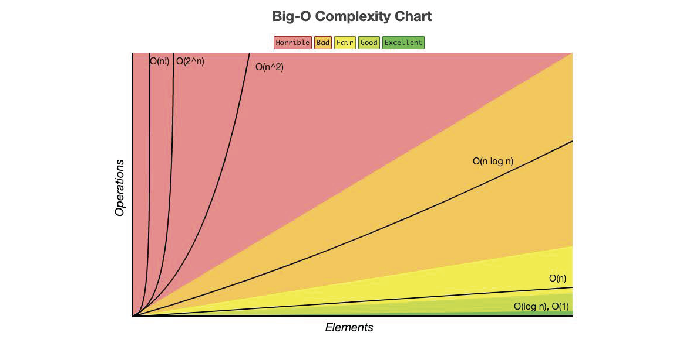

# Determining Big-O Notation

## Introduction

Big-O notation is a crucial tool in computer science for analyzing the time and space complexity of algorithms, providing insights into their efficiency. This expanded lecture will cover various types of Big-O notations, along with their explanations, strengths, and weaknesses, through code examples, comments, and explanations.

## Common Big-O Notations



- **O(n!):** Represents factorial time complexity, where the efficiency grows factorially with the input size.
- **O(2^n):** Denotes exponential time complexity, commonly seen in algorithms with recursive branching.
- **O(n²):** Signifies quadratic time complexity, indicating that the efficiency grows with the square of the input size.
- **O(n log n):** Represents linearithmic time complexity, commonly observed in efficient sorting algorithms like mergesort and heapsort.
- **O(n):** Indicates linear time complexity, where the efficiency scales linearly with the input size.
- **O(log n):** Denotes logarithmic time complexity, common in algorithms like binary search.
- **O(1):** Represents constant time complexity, indicating consistent efficiency regardless of the input size.

## 1. O(1) - Constant Time

**Strengths:**

- Constant time complexity indicates consistent performance regardless of input size.
- Ideal for operations with fixed runtime, such as accessing specific elements.

**Weaknesses:**

- Limited to operations where the runtime is truly constant.
- Not suitable for scenarios with variable or input-dependent runtime.

```python
# O(1) - Constant Time
def get_first_element(arr):
    # Accessing the first element in the array
    return arr[0]
```

The function get_first_element is considered O(1) because its time complexity is constant and does not depend on the size of the input array (arr). In Big-O notation, O(1) denotes constant time complexity, meaning that the execution time of the algorithm remains constant, regardless of the size of the input.

The operation performed is accessing the first element of the array (arr[0]). Regardless of how large the array is, the time it takes to access the first element remains the same. This is because arrays provide direct access to any element based on its index, and the index of the first element (0-indexed) is always known.

Key characteristics of O(1) constant time complexity:

- The algorithm's performance is independent of the input size.
- It provides a fixed and consistent runtime for any input.

It's important to note that O(1) does not mean that the operation itself is instant or has zero cost, but rather that the cost does not grow with the input size. The function's efficiency remains constant, making it an ideal choice for operations where quick access to specific elements is required.

## 2. O(log n) - Logarithmic Time

**Strengths:**

- Efficient for large datasets, as the algorithm divides the problem space in half with each step.
- Commonly used in binary search and other divide-and-conquer strategies.

**Weaknesses:**

- May not be as efficient for small datasets or when the input is not easily divisible.

```python
# O(log n) - Logarithmic Time
def binary_search(arr, target):
    low, high = 0, len(arr) - 1
    
    while low <= high:
        mid = (low + high) // 2
        if arr[mid] == target:
            return mid
        elif arr[mid] < target:
            low = mid + 1
        else:
            high = mid - 1
    return -1
```

The function `binary_search` is O(log n) because it performs a binary search, which divides the search space in half with each iteration. In Big-O notation, O(log n) denotes logarithmic time complexity, where the algorithm's efficiency grows logarithmically with the size of the input.

Let's break down the key steps in the binary search algorithm:

1. **Initialization:**
   - The algorithm starts with a search space defined by the indices `low` and `high` covering the entire array (`arr`).

2. **Binary Search Iteration:**
   - In each iteration of the while loop, the algorithm calculates the middle index `mid` of the current search space.
   - If the value at `arr[mid]` is equal to the target, the target is found, and the index is returned.
   - If the target is less than the value at `arr[mid]`, the search space is narrowed to the lower half (`low` to `mid-1`).
   - If the target is greater than the value at `arr[mid]`, the search space is narrowed to the upper half (`mid+1` to `high`).

3. **Halving the Search Space:**
   - With each iteration, the search space is halved, leading to a significant reduction in the number of remaining elements to be searched.

The efficiency of binary search is logarithmic because, with each iteration, the algorithm discards half of the remaining elements. The logarithmic growth comes from the fact that the search space is effectively divided by 2 in each step.

Key characteristics of O(log n) logarithmic time complexity:

- Efficient for large datasets.
- The algorithm's efficiency grows proportionally to the logarithm of the input size.

Binary search is particularly useful for scenarios where the input is sorted, as it takes advantage of this property to efficiently locate a target element.

## 3. O(n) - Linear Time

**Strengths:**

- Linear time complexity is efficient for operations that involve examining each element individually.
- Appropriate for scenarios where input size directly correlates with the algorithm's runtime.

**Weaknesses:**

- May become inefficient for very large datasets or when a more optimized algorithm is available.

```python
# O(n) - Linear Time
def linear_sum(arr):
    total = 0
    for num in arr:
        total += num
    return total
```

The function `linear_sum` is O(n) because it involves a linear traversal of the input array (`arr`). In Big-O notation, O(n) denotes linear time complexity, meaning that the algorithm's efficiency grows linearly with the size of the input.

Let's break down the key steps in the `linear_sum` function:

1. **Initialization:**
   - The algorithm initializes a variable `total` to 0.

2. **Linear Traversal:**
   - The algorithm uses a `for` loop to iterate through each element (`num`) in the array (`arr`).
   - For each element, it adds its value to the running total (`total`).

3. **Accumulation:**
   - The variable `total` accumulates the sum of all elements in the array as the loop progresses.

The efficiency of this algorithm is directly proportional to the size of the input array. As the number of elements in the array increases, the algorithm's runtime grows linearly because it needs to visit and process each element once.

Key characteristics of O(n) linear time complexity:

- The algorithm's efficiency scales linearly with the input size.
- Suitable for scenarios where the time complexity is directly proportional to the number of elements to be processed.

In the context of `linear_sum`, this function is appropriate for calculating the sum of elements in an array when a linear traversal is required. However, for certain operations, more optimized algorithms might be available, especially if the properties of the input data can be exploited.

## 4. O(n²) - Quadratic Time

**Strengths:**

- Quadratic time complexity is straightforward to implement and understand.
- Suitable for small datasets or cases where simplicity is prioritized.

**Weaknesses:**

- Inefficient for large datasets due to nested iterations.
- Prone to performance degradation as input size increases.

```python
# O(n²) - Quadratic Time
def bubble_sort(arr):
    n = len(arr)
    for i in range(n):
        for j in range(0, n - i - 1):
            if arr[j] > arr[j + 1]:
                arr[j], arr[j + 1] = arr[j + 1], arr[j]
```

The function `bubble_sort` is O(n²) because it employs nested loops, and in each iteration of the outer loop, the inner loop iterates through a decreasing range. In Big-O notation, O(n²) denotes quadratic time complexity, indicating that the algorithm's efficiency is proportional to the square of the input size.

Let's break down the key steps in the `bubble_sort` function:

1. **Initialization:**
   - The algorithm starts with the initialization of `n`, representing the length of the input array.

2. **Nested Loops:**
   - The outer loop (`for i in range(n)`) iterates over each element of the array.
   - The inner loop (`for j in range(0, n - i - 1)`) iterates through a decreasing range, comparing adjacent elements.

3. **Bubble Sort:**
   - Within the inner loop, if the element at index `j` is greater than the element at index `j + 1`, they are swapped.
   - This process is repeated until the entire array is sorted.

The efficiency of bubble sort is quadratic because, in the worst-case scenario, the algorithm compares and swaps elements in a nested manner, resulting in a number of operations proportional to the square of the input size.

Key characteristics of O(n²) quadratic time complexity:

- Inefficient for large datasets due to nested iterations.
- Performance degrades significantly as the input size increases.

Bubble sort is often used for educational purposes due to its simplicity, but for practical applications, more efficient sorting algorithms like quicksort or mergesort are preferred, especially for large datasets.

## 5. O(n log n) - Linearithmic Time

**Strengths:**

- Linearithmic time complexity combines the efficiency of linear and logarithmic growth.
- Efficient for moderate to large datasets, often observed in advanced sorting algorithms like mergesort.

**Weaknesses:**

- Slightly more complex than linear or logarithmic time complexities.
- May be overkill for very small datasets where simpler algorithms suffice.

```python
# O(n log n) - Linearithmic Time
def merge_sort(arr):
    if len(arr) > 1:
        mid = len(arr) // 2
        left_half = arr[:mid]
        right_half = arr[mid:]

        merge_sort(left_half)
        merge_sort(right_half)

        i, j, k = 0, 0, 0

        while i < len(left_half) and j < len(right_half):
            if left_half[i] < right_half[j]:
                arr[k] = left_half[i]
                i += 1
            else:
                arr[k] = right_half[j]
                j += 1
            k += 1

        while i < len(left_half):
            arr[k] = left_half[i]
            i += 1
            k += 1

        while j < len(right_half):
            arr[k] = right_half[j]
            j += 1
            k += 1
```

The function `merge_sort` is O(n log n) because it employs a divide-and-conquer strategy, breaking the array into smaller parts, sorting them individually, and then merging them. In Big-O notation, O(n log n) denotes linearithmic time complexity, combining the efficiency of linear and logarithmic growth.

Let's break down the key steps in the `merge_sort` function:

1. **Divide and Conquer:**
   - The array is divided into two halves (`left_half` and `right_half`) until each subarray has only one element.

2. **Recursive Sorting:**
   - The `merge_sort` function is recursively called on each half to sort them individually.

3. **Merge Operation:**
   - The sorted halves are merged back together in a way that ensures the overall sortedness of the array.

The efficiency of `merge_sort` is O(n log n) because, in each level of recursion, the array is divided into two halves, and the merging step takes linear time. The logarithmic factor comes from the recursive splitting of the array.

Key characteristics of O(n log n) linearithmic time complexity:

- Efficient for moderate to large datasets.
- Often observed in advanced sorting algorithms like mergesort.
- Strikes a balance between linear and logarithmic growth.

## Conclusion

Understanding the strengths and weaknesses of different Big-O notations is crucial for making informed decisions in algorithm selection. Consider the nature of your data, the size of your dataset, and the specific requirements of your problem to choose an algorithm that balances efficiency and simplicity. The appropriate choice may vary depending on the context of your application.
