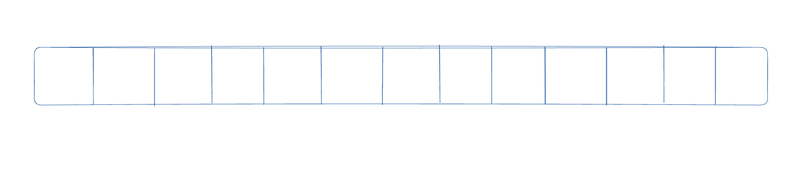
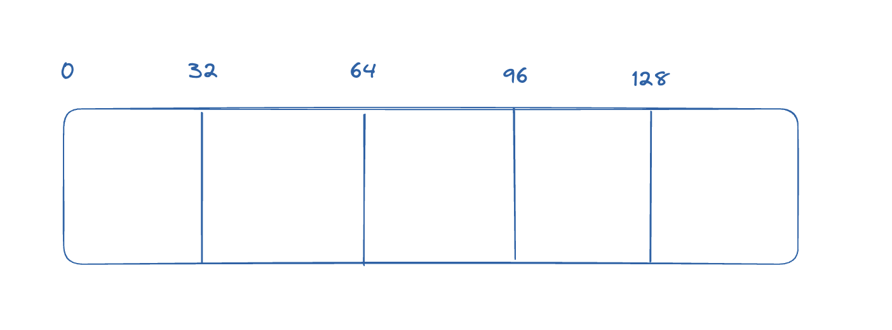
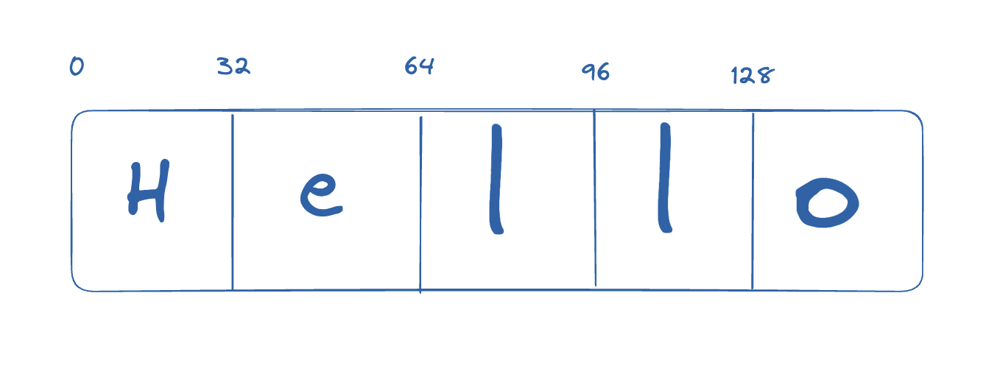
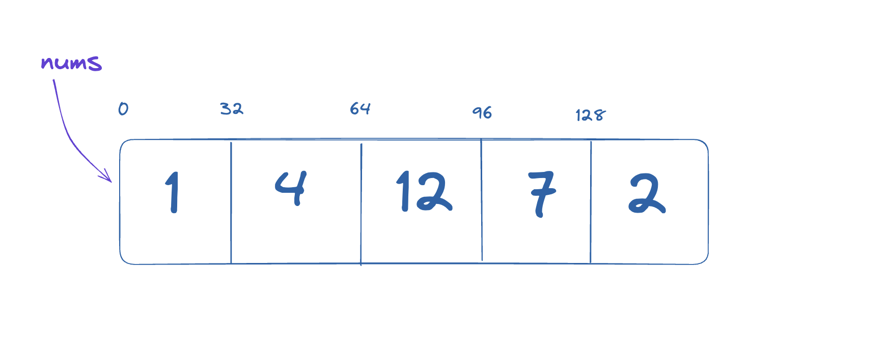

# The memory model - how a computer actually works

## Resources & Notes

[How Memory Works & Arrays](https://docs.google.com/presentation/d/1KChsMlbIBOfxeHu2QZQ-DLPH2rzCAO813XMKISYEl84/edit?usp=sharing)

## How Computer Memory is Organized

In order to learn specific Data Structures, it's important we can do a little complexity analysis first. And in order to do this, it's important we understand a little about how memory in a computer actually works on a physical level, as this determines what is and isn't efficient to do on a computer.

Memory in a computer can be thought of as a contiguous block of identically sized 'slots', like so:



Think of memory like a single long street, with plots of land of identical size, one after the other.

Like a street, we can think of each spot in memory as having an 'address', and in this case the address is relative to the beginning of the street, and the size of a plot of land.



What I have described here is an example of a 32-bit architecture - i.e. the standard size of a 'thing' in this memory structure is 32 bits, or 4 bytes. In reality memory addresses are usually described in terms of hexadecimal, so you will often see a memory address look like '0x1047cc0f0'. Even though we don't usually consider memory locations in a high-level language like Python, we can see this concept with the built in `id()` function.

```py
x = 1 # create a variable called x and store a 1 in it
id(x) # the memory location of x, as a decimal (4370252016)
hex(id(x)) # the memory location of x, as hexadecimal (0x1047cc0f0)
```

For the purposes of this lesson we will assume that all primitive values we represent in memory (integers, floats, characters, booleans) can fit within this amount of space. Bigger things could obviously be store in multiple of these locations one next to the other, but this point will be important once we start talking about arrays.

So for example, if 32-bits represents a single slot in memory, and an individual character can be stored in a single slot, a string might look like this in memory:



Now that we understand the basic structure of computer memory, we can move on to the most essential data structure - Arrays!

## Arrays

Javascript has a data type called array and Python has a data type called a list, and both of these types roughly approximate the concept of an Array, but are ultimately more powerful that the base idea in data structure speak. For now, let's consider the concept of an array in the abstract.

An **Array** is a collection of elements of the same data type that are stored at contiguous memory locations. An example:

```py
nums = [1, 4, 12, 7, 2]
```



`nums` is a variable that _refers_ to the array. In DS-speak we call this a _pointer_. A pointer refers to a specific address in memory, so in this example the pointer `nums` holds the memory address `0`.

So why is it important that in an Array the values are contiguous blocks of memory all of the same size? Well, let's consider what is actually happening when you index an array.

```py
nums[0] # 1
nums[2] # 12
nums[4] # 2
```

Indexing is actually just a quick mathematical operation. To get the memory location of an index in an array we evaluate an equation like:

```sh
memory_address_of_beginning_of_arr + index_desired * size_of_each_thing_in_array
```

So to get the value of `nums[4]` we take the beginning memory location of `nums` and add `4 * sizeof(int)`. Because we established that an int is 32 bits, that means the memory address of `nums[4]` is: `0 + 4 * 32 = 128`. And indeed it is!

This property of the memory being in order and holding same-sized objects is necessary because it's what allows us to 'jump' to the 4-th index without having to actively look through the previous elements.

> An important note: in traditional Arrays, the full size of the Array must be known when defining it. That isn't the case with JS or Python arrays, which you can add to indefinitely. How this actually works under the hood is that, when you try to add an element to an already full array in JS, behind the scenes it will double it's size in memory, copy over all the existing elements, and then add the next one. This is significant because in reality adding an element to an array, even to the end, is not necessarily `O(1)`.
