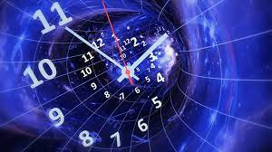
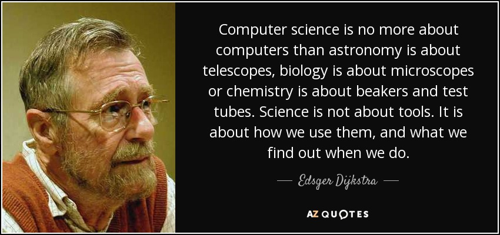

# Complexity Analysis: Time and Space

---

## An embarassment of riches - modern computing

---

These days computers are very powerful - they have lots of processing power and lots of memory (space for data). For most of the programs you write in this class your computer will be so powerful that it would be difficult to detect a difference between an extremely efficient program and an inefficient one (both doing the same thing).

---

It wasn't always this way. For decades, programmers always had to work against the limitations of processor power and memory.

And, as a professional software engineer these concerns are still relevant:

---

- Web app load times over low-bandwidth connections (which is a large percentage of the world).
- Applications or data at scale (Google processes over 99,000 searches *per second*).
- Embedded systems (IoT devices, etc).
- Energy efficiency.

---

## What is complexity analysis?

---

*Complexity analysis* is the term for how programmers think about the **perfomance** of a program:

---

1. How long (how much processing power, how many CPU cycles) does it take to run?
2. How much space (memory) does it take up?

In other words ...

---

1. Time
2. Space



---

### Things we care about - worst case perfomance

---

Programmers usually care about the **worst-case performance** of their programs, as that is when possible problems (like running out of memory!) can occur. We will discuss Big-O later but it encapsulates this idea of using worst-case performance to evaluate and compare programs.

---

### Things we don't care about - real numbers and details

Programmers usually don't care about best-case performance. Sometimes we may care about average-case perfomance.

Most importantly, when it comes to complexity analysis, we don't care about the **real value** (300 milliseconds, 20 bytes) for how much time/space a program uses.

We don't care about if Python performs a bit better than Javascript when searching arrays (I have no idea if this is true), as we don't care about **real numbers** for the purpose of analysis.



As a working software engineer evaluating real-world performance of your systems you absolutely will care about real numbers. But for an ideal, apples-to-apples comparison of **algorithms** --- different ways to write a program to solve a problem -- we don't care.

Today we are *computer scientists* -- tomorrow we will be *software engineers.* With that, let's carry on!

## Space complexity

This is analyzing how much memory a program uses when it runs. **You generally will be not asked about space complexity in technical interviews**, and, generally speaking, people focus more on **time complexity.**

This is what we will do in this course. However space complexity is an important concept, and, if it does come up in a technical interview, it will probably be about **in-array replacement** -- modifying an array without creating a copy -- versus creating additional variables. Let's look at that now.

### Doubling each element in an array

#### Question: Can someone remind me of how an Array works in computer memory?

Remembering what we have learned about arrays, let's look at a common problem:

Given an array of integers of some arbitrary length *n*, such as `[1, 0, 14, 25, 3]` (where *n = 5* since the length of the array is 5), write a program to double the value of each element in the array.

Before we get started ...

#### Question: How much space does an array of *n* integers take up?

#### Answer: How to estimate and make stuff up like a programmer

A great tool is to **make assumptions.**

Let's pretend that an integer takes up 1 byte (8 bits, such as `00010001` or `10101111` or `00001111`) of space. Let's also assume (the fancy word for "pretend") that we are not going to worry about fixed array sizes - an array of length 3 takes up 3 bytes of space, an array of length 3 million takes up 3 million bytes (3 megabytes) of space ([computers love powers of two](https://web.archive.org/web/20230929202158/https://cup-of-char.com/exploring-the-powers-of-2/)).

So our array of length *n* will always take up *n* bytes of space. Our program's space complexity can never get any smaller than that.

### Solution A: Using Additional Variables

Here is one way to solve that problem:

```python
def double_elements_new_array(arr):
    doubled = []
    for num in arr:
        doubled.append(num * 2)
    return doubled

# Example usage:
arr = [1, 2, 3, 4, 5]
print(double_elements_new_array(arr))
```

Remember - **we don't care about the details**. We don't care if in reality the Python interpreter needs to allocate *x* bytes of data every time a function is defined or a `for ... in` loop is used (I have no idea).

We care about the **ideal, abstracted** space complexity of our program. There is an array. It takes up space.


#### Question: What is the space complexity of the above solution?

#### Answer: 2 * n

Our array is length *n*. Each element *i* in the array takes up 1 byte. An array of length 5 takes 5 bytes. Our program implementation **creates a new array** and for each element *i* in the array, **doubles and inserts that element into the new array**.

So we have **two** arrays of the same length:

```python
arr = [0, 1, 2, 3]
doubled_arr = [0, 2, 4, 6]
```

#### Question: Does the size of a specific integer matter?

#### Answer: No. Why not?

*Because for the purposes of complexity analysis we have **made the assumption** that the computer always allocates 8 bytes for any integer and that that is the max amount of space an integer can take up.*

### Solution B: Solving in-place

Let's pretend you were asked this question during a technical interview. You solved it as above. Now, your interviewer says:

**"Great job! Can you improve the runtime perfomance, specifically w/regards space efficiency, of this program at all? Or is this the most efficient version of this program possible.**

As you may already know, and we are about to learn -- we can!

#### Question: How can we make this program use less memory (take up less space)?

#### Answer: Modify the array in-place

Here is a solution which does **not** create a new array or make copies. It modifies the value of each element of the array **in-place**, inside the array:

```python
def double_elements_in_place(arr):
    for i in range(len(arr)):
        arr[i] = arr[i] * 2
    return arr

# Example usage:
arr = [1, 2, 3, 4, 5]
print(double_elements_in_place(arr))
```

#### Question: What is the space complexity of this solution?

#### Answer

How much space does our new version of the "double the value of every integer in an array of length *n*" take up?

The answer is -- **n bytes**, as our assumption is that each integer element *i* takes up 1 byte (examples: `00000000` or `00000001`) of space.

Now your interviewer asks ...

#### Question: "Is this the most efficient implementation of this algorithm, with regards to space complexity?"

Yes - it is. Can we make this program take up any less space? No -- we cannot.

### Space Complexity - Summary

- We will not return to space complexity very often, but, it is valuable to have a basic understanding of it.
- Be prepared to know how to modify an array **in-place** for technical interview or coding challenge problems.

## Time Complexity

Time complexity analysis is more common in technical interviews and will be our main focus in this module. 

### Assumptions - all operations are equal

Just like we made assumptions when evaluating space complexity, we normally do the same thing here. We are interested in comparing the efficiency of our **algorithms** - programs run by imaginary computers.

#### Things we don't care about

- How many nanoseconds it actually takes a real computer, using a real program language, to add 2 + 2, or duplicate a string, or calculate a square root, etc.
- All the stuff that's not a core part of the algorithm - initializing variables, creating an empty list, etc. We don't care how much time that stuff takes and ignore it.
- Multiple operations: `x = x * 3 + 2 / 4` we count as one "step", the same as `x = x + 2`


#### Things we do care about

- The operation occuring the most - usually in a loop.
- How often this happens.

### Time Complexity: Doubling each element in an array

Let's look at both our previous implementations:

*Space-inefficient solution:*

```python
def double_elements_new_array(arr):
    doubled = []
    for num in arr:
        doubled.append(num * 2)
    return doubled

# Example usage:
arr = [1, 2, 3, 4, 5]
print(double_elements_new_array(arr))
```

*Space-efficient solution:*

```python
def double_elements_in_place(arr):
    for i in range(len(arr)):
        arr[i] = arr[i] * 2
    return arr

# Example usage:
arr = [1, 2, 3, 4, 5]
print(double_elements_in_place(arr))
```

#### Question: How many steps does each algorithm take for an array of length n?

If our input is `[1, 2, 3, 4, 5]` how many steps does each algorithm take?

#### How to Find the Answer

##### 1. What gets bigger when our input (array length, *n*) gets bigger? 

*The loop!*

##### 2. What happens inside the loop?

Something. an operation. We don't care. We abstract it all so that we count one "step" for each element in the array.

##### 3. So, how long does it take for an array of length 5?

Well, the `for` loop iterates over every element in the array, so ... it takes 5 "steps". Or -- *n* (length of array).

So -- **does one implementation have a more efficient time complexity than the other?**

**No** - they are the same.

### Tradeoffs

It is not uncommon to trade *space for time* in an algorithm, or vice versa. A python dictionary might take up more space than a list, but it is faster to find something in the dictionary - if you know the key.

As we learn more about complexity analysis and Big-O we will learn that even for runtime complexity - time complexity - there are tradeoffs to be made between how long *searching* vs *sorting* vs *inserting* are.

### Time Complexity: Contains Duplicate

A more interesting problem to examine time complexity is:

Given an array *arr* of integers of length *n*, write a program that will return `True` if any one element *el* is a duplicate of any other element, and return `False` if each element *el* in the array is unique.

Before we get started ...

---

#### Question: How long does it take to print every element in the array, printing each element twice?

---

#### Answer - *n*

---

For our array (such as [3,4,0,5,2] with length 5 so *n=5*) of length *n* it takes *n* steps to iterate through the array and print out each item. This implementation:

---

```python
def print_elements_twice(arr):
    for num in arr:
        print(num)
        print(num)

# Example usage:
arr = [9, 8, 7, 6, 5]
print(print_elements_twice(arr))
```

... this implementation takes *n* steps - we count both print statements as a single step. Soon we will discuss why in more depth.

---

Back to our problem!

### Solution A: Naive Approach

```python
def contains_duplicate_naive(arr):
    for i in range(len(arr)):
        for j in range(i+1, len(arr)):
            if arr[i] == arr[j]:
                return True
    return False

# Example usage:
arr = [1, 2, 3, 4, 5, 6, 7, 8, 9, 10, 1]
print(contains_duplicate_naive(arr))  # True
```

#### Question: What is the time complexity of this algorithm?

How many steps does this algorithm take to run for an input of size 11 (array of length 11)? Such as:

```python
arr = [1, 2, 3, 4, 5, 6, 7, 8, 9, 10, 1] #length 11 
```

**Important** - remember, we care about the **worst case** performance.

We **don't** care about the "best case" scenario, which might look like:

```python
arr = [1, 1, 2, 3, 4, 5, 6, 7, 8, 9, 10] #length 11 
```

The algorithm would only take two steps to find the duplicate for the above input. But we want to know **worst case performance** - because once we know that, we know all other inputs for our algorithm will perform better than our worst case!

So - how many steps for our worst case input (which is the first example input, with `1` as the first, and the last, element in the array)?

#### Answer: Use a simple example and manually "count" the steps

Let's simplify!! Let's use a smaller array.

##### How to choose good "test" data

1. Small enough to think about and manually step through on paper.
2. Do your best to have it be your "worst-case" scenario.
3. Big enough to be useful

How about ...

```python
arr = [1, 2, 3, 1]
```

That is big enough to be useful but small enough to easily think through. Lets manually step thru the implementation of our algorithm.  We will focus on the part that matters for runtine analysis - the loop! We know the outer for loop goes through each element of the array, so lets start there.

*look in the code comments to manually step thru*

  **NOTE -- we could also use the [VS Code Debugger](https://code.visualstudio.com/docs/editor/debugging) to do this**

Remember, `arr = [1, 2, 3, 1]`

##### i = 0, j = 1

```python
# arr = [1, 2, 3, 1]

for i in range(len(arr)):            # i = 0 
    for j in range(i+1, len(arr)):   # j = 2 
        if arr[i] == arr[j]:         # arr[0] == arr[1] --> 1 == 2 --> False
            return True              # Does not return True, inner loop iterates
return False

```

##### i = 0, j = 2

```python
# arr = [1, 2, 3, 1]

for i in range(len(arr)):           # i = 0
    for j in range(i+1, len(arr)):  # j = 2 
        if arr[i] == arr[j]:        # arr[0] == arr[2] --> 1 == 3 --> False
            return True             # Does not return True, inner loop iterates
return False
```

##### i = 0, j = 3

```python
# arr = [1, 2, 3, 1]

for i in range(len(arr)):           # i = 0
    for j in range(i+1, len(arr)):  # j = 3 
        if arr[i] == arr[j]:        # arr[0] == arr[3] --> 1 == 1 --> True
            return True             # returns True, exits all loops. Program returns True
return False
```

How many steps was this? 3.

#### Question: Was our "sample data" the worst-case scenario?

#### Answer: NO!

Why not?

`arr = [1, 2, 3, 1]` is not our worst case scenario, and we know why because - **the outer for loop never iterated**. The first element was the same as the last, so our program didn't need to! What would our worst case be?

Our worst case data looks like:

```python
arr = [1, 2, 3, 3]
```

Why is this worst case? **Because the program has to loop through all the way to the end** to find the duplicate.

How many steps would this take?

Well ...

```python
# arr = [1, 2, 3, 3]

for i in range(len(arr)):           # for our worst case we know our outer loop has to iterate to the 3rd element
    for j in range(i+1, len(arr)):  # we know from counting through our previous scenario this loop is 3 steps each time because
        if arr[i] == arr[j]:        
            return True             
return False
```

The outer loop iterates 3 times. Each time the outer loop iterates, the inner loop iterates 4 steps -- **except** the very last time, where we are at the very last elements of the array and comparing `arr[2] == arr[3] --> 3 == 3 --> True`.

So 2 * 4 + 1. 

If we wanted to simplify ...

3 * 4 --> the four steps of the inner loop times each outer loop.

Now, this is **more** than the actual number of steps, but again - **we don't care about real number**. We just want to know **approximately** what our worst-case runtime perfomance is.

Which is, for an input of size 4, twelve (12) steps -- three times four (3 * 4)

To express it mathematically, for input size `n` our runtime performance is: `(n - 1) * n``

Which simplifies to ...

`n^2 - n``

Which in the spirit of approximation we can call just n^2

#### Why can we approximate?

Why did we just turn `(n - 1) * n into n^2``  ? Well ...

Imagine an array of size one million - 1,000,000 - not unrealistic, if, say, you are writing a program for the U.S. Census or to send out monthly billing information to all Netflix users.

Well with an array that big ... 

```
(1,000,000 - 1) * 1,000,000

simplifies to ...

1,000,000^2 - 1,000,000
```

... or in plain language one million squared minus one million. Which is ...

Too many zeros to write. But, one trillion or `1 * 10^12` (one times ten raised to the twelfth power) in scientific notation.

FYI in scientific notation one million is `1 * 10^6`

And a trillion minus a million is ... nine hundred ninety-nine billion nine hundred ninety-nine million.


**Which is basically 1 trillion. Which is our input size, squared, aka n^2 (one million squared). Once the numbers get that big - we don't care about anything but the biggest value raised to the highest power**.

If I'm designing this program - I don't need the exact number - I just need to know the **scale** -- bigger than a cardboard box but smaller than a shipping container.


Which is why for purposes of *complexity analysis*, we usually start with worst-case performance and are only intersted in the **order of magnitude.**

This is called **Big O** -- and we will talk about it soon. But first lets look at a more efficient solution to our problem.

### Solution B: Sorting the data first

There are many ways to make a more efficient algorithm. This particular approach **sorts** our data first, which is a common technique.

As we saw, our **worst-case scenario** is when the duplicate is **at the end**. Sorting means - **this happens a lot less**. It would only happen for an input where the dupe is the highest value.
```python
# even sorted this is a worst case scenario
arr = [1, 2, 3, 4, 5, 6, 7, 8, 8] 

# a better case scenario
unsorted_arr = [2, 3, 1, 4, 5, 6, 8, 3]
sorted_arr   = [1, 2, 3, 3, 4, 5, 6, 8] # sorting means we find the duplicate much sooner.
```

Now -- **how long does the sorting take**? Well, we use Python's built in sort method:

```python
def contains_duplicate_sort(arr):
    arr.sort()
    for i in range(1, len(arr)):
        if arr[i] == arr[i-1]:
            return True
    return False

# Example usage:
arr = [1, 2, 3, 4, 5, 6, 7, 8, 9, 10, 1]
print(contains_duplicate_sort(arr))  # True
```

For now let's just declare that the sorting takes `s` steps, and that `s < n`. It doesn't take as long to sort the array as it does to iterate through the whole thing. Our time complexity is then: `s + n` -- how long it took to sort, plus the length of the array, as we know that with a sorted array we'll only have to loop through it once to find the dupe and there's no nested array anymore.

We will dig into this more soon - when we talk about ... Big O!
