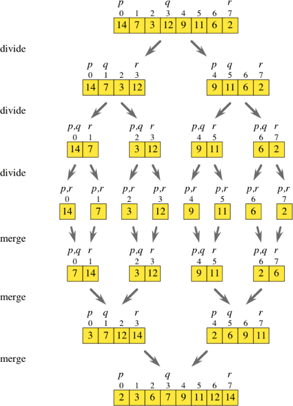

# Code Efficiency & Big O

[Big O Notation PPT](https://docs.google.com/presentation/d/1RNYAhAkNF3-UR9rzlBOaWJ0fyYundS0TAGXEYRv-Ybo/edit#slide=id.g22ef87eb09_0_23)

How do programmers communicate and think about program efficiency? Well, computer scientists have devised notation that allows us to communicate how fast/slow (efficient) a program is. It’s called **Big O**. 

>Here's a general overview of how it works:
> * There are a bunch of efficiency classes: O(1), O(N), O(log n), O(N^2), etc. 
>   * The efficiency class tells you how much work that algorithm does relative to the amount of input that it must process (more on this later)
> * Every algorithm belongs to an efficiency class
>   * The algorithm's efficiency class gives us information about how fast/slow we can expect the program to be.

To understand big O, we need to understand these efficiency classes and what they say about the amount of work the algorithm does relative to the amount of input. Let's look at some of the most common efficiency classes. 

## Constant Time - O(1)
Ideally, we want our algorithms to have to do as little work as possible to get a problem solved. Constant time algorithms are algorithms where no matter what inputs are given to the algorithm, the algorithm always does the same amount of work. 

These algorithms do about the same amount of work, no matter what. No matter if a constant time algorithm is given an input of 1 million elements or of 3 elements, a constant time algorithm will always do the same amount of work. 

Solving a problem with this kind of algorithm is rare. But when you can do it, rejoice: you can’t do any better than that, because O(1) is the “fastest” kind of algorithm. 

```python
scoreJack = 4
scoreJill = 6

if scoreJack > scoreJill:
    print("Jack scored higher")
else:
    print("Jill scored higher")
#In this program, Jack and Jill each have a score. The program compares their scores and returns a message with the higher score holder. No matter what their scores are (the inputs), the program always does the same amount of work. 

#The program would always do the same amount of work, even if 'scoreJack = 170000' and 'scoreJill = 4204200'. 
```
The code example above is an example of an O(1) algorithm. The 1 doesn't mean that only one step is performed. Instead, it means that a fixed number of steps (4, 10, 3000, 1 million, etc.) are performed no matter what the inputs are. As long as a fixed number of steps are performed regardless of the number of inputs, the algorithm is said to run in constant time.

## Linear Time - O(N)
For most algorithms, the amount of work performed is dependent on the inputs. With linear time algorithms, the number of inputs and the amount of work completed have a linear relationship. In other words, as the number of inputs increase or decrease, the amount of work will also increase or decrease at a proportional rate.

o(n).png "Difference between O(1) and O(N)")

In the graph above, notice that as the number of inputs for the O(n) algorithm increases, the number of steps also increase. Notice that with the O(1) algorithm, as the number of inputs increases, the number of steps remains constant. 

```python
arr = [1,2,3,4,5]

for i in arr:
    print(i)

#In this program, we are iterating through the array and printing each item. The number of times we print depends on the length of the array.

#If there are n items in the array, the program needs to perform n iterations. Thus, this algorithm is O(n).
```
## Quadratic Time - O(N^2)
An algorithm is said to run in quadratic time when the amount of work done is proportional to the square of the input size. So, as the size of the input increases, the amount of work increases at a much faster rate.

```python
arr = [1,2,3,4,5]
arrLength = len(arr)
total = 0

for i in range(arrLength):
    for j in range(arrLength):
        total += arr[i] + arr[j]

return total

#This program is calculating the sum of all pairs of elements in the given array.

#Notice that the program will go through n iterations of the outer for loop. However, for each iteration of the outer loop, n iterations are completed in the inner loop. So, as the outer for loop iterates n times, the total number of steps done is n*n or n^2. Thus, this algorithm is O(n^2).

```

## Log Time - O(log n)
Log time (logarithmic time) refers to the logarithm function in mathematics. The logarithm function tells us the number of times that you have to divide the number by a base (the base is 2 in our case) to get to 1 or less. 

In terms of algorithms, when an algorithm with logarithmic time complexity is given N inputs, the algorithm would take log N steps to complete the job. 

Note that O(log n) is more efficient than O(n). To illustrate this, take a look at the table below.

| N Inputs | O(N)  | O(log N) |
| ------------- | ------------- |:-------------:|
| 8| 8      | 3    |
| 16 | 16     | 4     |
| 32 | 32      | 5    |
| 64 | 64      | 6    |
| 128 | 128      | 7    |

While an O(N) algorithm would require as many steps as the number of inputs, the O(log N) algorithm only needs one additional step every time the input size is doubled. Thus, when an algorithm has a logarithmic time complexity, it typically means that the problem is being divided and a significant portion of the input is being discarded on each step.

```python
def power(base, exponent):
    if exponent == 0:
        return 1
    elif exponent % 2 == 0:
        halfPower = power(base, exponent //2)
        return halfPower * halfPower
    else:
        halfPower = power(base, (exponent -1)//2)
        return base * halfPower * halfPower
print(power(2,5)) #return 32 

#In this algorithm, we divide the exponent by half at each step. That means that for an exponent of n, it takes log n recursive steps to reduce it to 0. Thus, the time complexity of the algorithm is O(log n)
```

## O(n log n)
Don't let the notation confuse you. O(n log n) simply that the amount of work done grows in proportion to the product of input size n multiplied by input size log n or more simply n * log n. 

> Several sorting algorithms, such as merge sort and heap sort, run in O(n log n) time. Instead of looking at the code (which can be quite long for these algorithms), let's look at an illustrated version of merge sort to understand the runtime. 



> Without going into too much detail, notice that the algorithm:
>> - Divides the array at the midpoint (q) until we are left with subarrays of 0 or 1 elements
>> - Then it recursively sorts the subarrays
>> - Then it merges the sorted subarrays into one large sorted array

> Dividing the unsorted array into subarrays that only contain 0 or 1 elements take O(log n) time complexity 
> The function we use for merging subarrays does the job in O(N) time because it involves iterating through each element in the subarray once. 
>> The total time complexity of Merge Sort is O(log n) (due to dividing) * O(n) (due to merging) 
>> Thus, the total time complexity is O (n) * O(log n) = O(n log n)

## Other Time Complexity Classes
We've covered some of the common time complexities so far. There are others, however, the information we've covered will give you a great foundation for learning how to calculate the run times for your own programs.

Below is a graph of the time complexities we have covered as well as a few we haven't.


