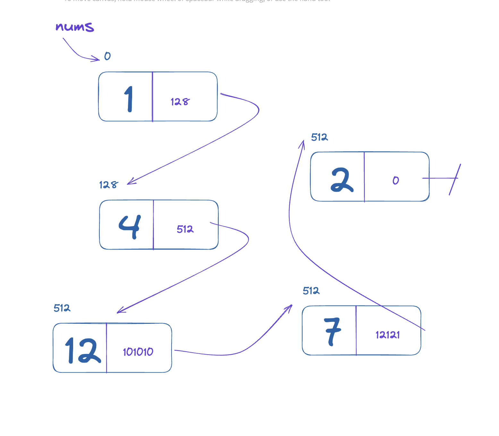

# Linked lists

After Arrays, Linked Lists are the most common, basic data structure. You often won't see these explciitly in a language, but they are definitely used everywhere under the hood. Once again, let's think of this in the abstract first.

A **Linked List** is a _non-contiguous_ data structure, meaning the elements of a linked list are not necessarily next to each other in memory.

Each element in a linked list is called a node and this node holds a `value` (the data value that we are holding) and a pointer `next` which contains a reference to the next element.



A LL is like an array in that it holds ordered data, but it is not contiguous in memory. How is this an advantage? The basic reason for the existence of a LL is that some data is too large to store contiguously. Imagine you wanted to download a 90GB game to your gaming PC, and all that memory needed to be contiguous? Maybe you have a total of 90GB of free space on your hard drive, but all in order? Probably not. A LL is a data structure that takes advantage of free memory being randomly distrbuted throughout your hard drive, which happens as things are created and deleted.

So what does a LL look like in code? In Python you could model such a DS like so:

```py
class Node:
    def __init__(self, value):
        self.value = value
        self.next = None

nums_0 = Node(1)
nums_1 = Node(4)
nums_2 = Node(12)
nums_3 = Node(2)
nums_4 = Node(7)

nums_0.next = nums_1
nums_1.next = nums_2
nums_2.next = nums_3
nums_3.next = nums_4
nums_4.next = None

nums = nums_0
```

The above was meant to be explicit, so you could see how the connections are made, but we can define that much more concisely like so:

```py
class Node:
    def __init__(self, value, next=None):
        self.value = value
        self.next = next

nums = Node(1, Node(4, Node(12, Node(2, Node(7)))))
```

### Analysis

OK, we defined a LL, but what is it good for? Well, let's compare it to an Array. What about lookup? Because the memory is non-contiguous, we can't just do a little math to find the 17-th element, for example, we need to walk through the LL, from the beginning, one element at a time, using `next` to traverse.

```py
class Node:
    def __init__(self, value, next=None):
        self.value = value
        self.next = next

class LL:
    def __init__(self, head):
        self.head = head

    def get_by_index(self, index):
        current = self.head
        current_index = 0

        while(current_index < index):
            assert current.next != None, "Out of bounds!"
            current = current.next
            current_index += 1

        return current.value


nums = Node(1, Node(4, Node(12, Node(2, Node(7)))))
ll = LL(nums)

ll.get_by_index(4) # 7
```

This is not constant time like with an Array, it is linear time, `O(n)`!

However consider adding an element to the end of the LL? Unlike an Array, we could do this forever without ever having to change the size of the array, as the memory can be non-contiguous. And we can hold a pointer to the last element, making this constant time:

```py
class Node:
    def __init__(self, value, next=None):
        self.value = value
        self.next = next

class LL:
    def __init__(self, head):
        self.head = head
        self.last_index = head

    def append(self, value):
        new_node = Node(value)
        self.last_index.next = new_node
        self.last_index = new_node


ll = LL(Node(1))
ll.append(4)
ll.append(12)
ll.append(2)
ll.append(7)
```

This is constant time! This is the basic trade off for an Array vs a LL:

Array:

- get/set: `O(1)`
- add/remove: `O(n)`

LL:

- get/set: `O(n)`
- add/remove: `O(1)`

## Additional Learning

[Stacks and Queues](https://youtu.be/Zai4ejbY6qQ?t=840) (from 14:00 - 21:00 approximately) are two data structures that can be implemented using either an Array or a Linked List. Watch this video about them for the sake of understanding, as this will open up another avenue of LeetCode type problems for you to practice.

## Assignments

- [LinkedList - Remove Elements](https://leetcode.com/problems/remove-linked-list-elements/)
- [LinkedList - Reverse](https://leetcode.com/problems/reverse-linked-list/)