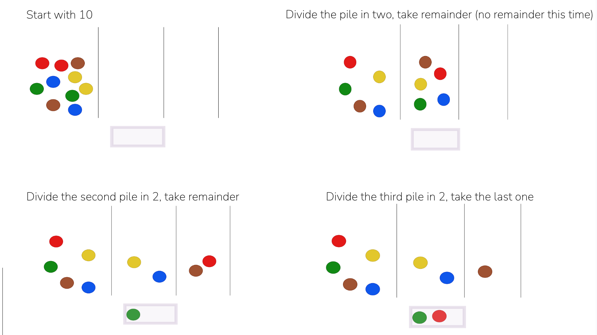

# Recursion

Since you now have a feel for recursion (many of you are still baffled, don't sweat it), let's look at a contrived example together.

You’ve just gone out trick-or-treating with a friend of yours. For whatever reason, he managed a much better haul than you. It just doesn’t seem fair, so you decide to remedy that with a trick of your own. You tell your friend that you will arrange all his M&Ms for him in a nice orderly manner. You will divide them into piles with the following procedure:

1. Take all the M&Ms and put them on the table.
2. Divide the pile in half (if there are an odd number of M&Ms, you’ll eat one so things stay even).
3. Leave the first half in its own pile.
4. Take the other half and divide it in half (still eating an M&M if there are an odd number).
5. Leave the first half of that pile.
6. Take the other half…

Here's a very high-end illustration of how that would work with 10 M&Ms:


By the end, you should have managed to earn yourself a few M&Ms. Speaking of the end, when might that be? Hold that thought. It looks like our procedure is caught in a loop. That’s a good sign we’re dealing with a recursive solution.

Once we have our initial pile of M&Ms, we repeat the same two steps over (2 and 3, 4 and 5) and over again. But how do we know when we’re done?  That brings us to an essential part of any recursive algorithm: the base case. The base case is what tells us that we’ve run out of road, and that it’s time to go home.

What would the base case be for us? Probably when we run out of M&Ms to divide up!  Now that we know what we’re doing, let’s get coding.  We’ll start simple by taking in the number of M&Ms our friend gives us, and checking for our base case (being out of M&Ms):

```python
def prepare_mms(number_of_mms):
    if number_of_mms == 1:
        pass
    else:
        pass
```

What about our recursive case? Well, we can start by implementing a simple decrementing counter to represent dividing up the M&Ms:

```python

def prepare_mms(number_of_mms):
    if number_of_mms == 1:
        return
    else:
        number_of_mms = number_of_mms - 1
        return prepare_mms(number_of_mms)
```
We’ve basically just made ourselves a countdown. When it hits zero, it simply returns. Not too useful as it is, but we’re getting closer.

Now that we have the basic recursive frame, we need to think about our problem again. What we want to return to our friend is a bunch of piles of M&Ms (minus our take, of course). We could represent that as an array of arrays like so:

```python
piles = [
          ["(*)", "(*)", "(*)", "(*)", "(*)"],
          ["(*)", "(*)"],
          ["(*)"]
        ]
```

There is a slight complication with this, however. We need to build up this result over multiple calls to our function. Unless we use a global variable for our piles, this means that we have to pass along information from one invocation to the next. One way to do this is using parameters with default values.

On the first call, we can make “piles” an empty array. Then in the body of our function, we can update “piles” and send it to the next invocation:

```python
def prepare_mms(number_of_mms, piles=None):
    piles = piles if piles else []
    if number_of_mms == 1:
        return piles
    else:
        half = number_of_mms // 2 # we are using floor division to get our cut
        piles.append(half)
        return prepare_mms(half, piles)
```

If you run this with 10 you should get: [5, 2, 1]. The first pile has 5, the second 2 (floor division), and so on. So it works!

Now we’ll just pretty it up a little bit to really sell the con:

```python
def prepare_mms(number_of_mms, piles=None):
    piles = piles if piles else []
    if number_of_mms == 1:
        return piles
    else:
        half = number_of_mms // 2 # we are using floor division to get our cut
        piles.append(["(*)" * half])
        return prepare_mms(half, piles)
```

That’s it! Don’t feel too bad, you can make it up to your friend some other way.

By the way, there is another way to do this.  In the above implementation, we explicitly passed in `piles` to every invocation.  An alternative would be to let the call stack handle that:

```python
def prepare_mms(number_of_mms):
    if number_of_mms == 1:
        return []
    else:
        half = number_of_mms // 2 # we are using floor division to get our cut
        return [["(*)" * half]] + prepare_mms(half)
```