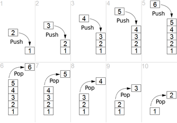
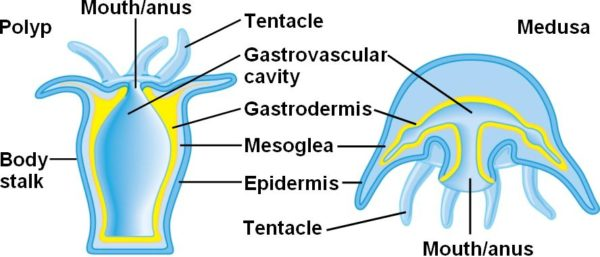
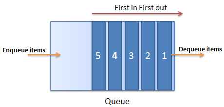
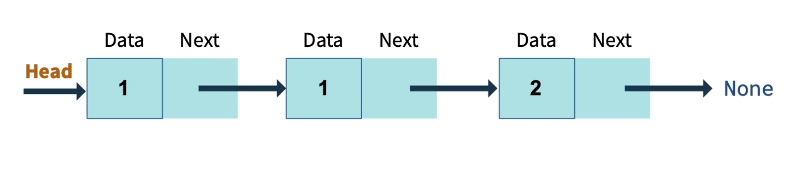

# Data Structures

---

## Introduction

---

We're already familiar with a number of data structures, especially lists (arrays) and dictionaries (objects).  Learning how to choose the right data structure for a given problem is a big part of solving it, and solving it efficiently.

---

However, there are many more possible data structures besides lists and dictionaries.  We'll look at a few common ones today, namely stacks, queues, and linked lists.  As with any data structure, each of them has its own characteristics which makes it either a more or less appropriate tool for solving a given problem.

---

## Stacks

---

We've seen stacks already.  Any time you run a function you are adding a record to the execution stack, which you can see in the VS Code debugger.  If you try running a recursive function in the debugger, pay attention to how records are added to and removed from the stack.


---

You should find that records are always added to the top of the stack, and records are always removed from the top of the stack as well.  This is called LIFO, or Last In First Out.  <br/>

---



---

This also means that stacks have only one access point, like some unfortunate animals that have to do two very different things with only one thing: <br/>

---




Stacks should have (at minimum) the following API:
1. push - add an item to the top
2. pop - remove an item from the top and return that item
3. peek - return the value of the item currently on the top

---

Fortunately, we can create our own custom data types in Python.  Given the above requirements, our `Stack` should start out looking something like this:

```python
class Stack:
    def __init__(self):
        pass

    def push(self):
        pass

    def pop(self):
        pass

    def peek(self):
        pass
```

---

The first thing we need to figure out is the underlying data type we will be pushing onto and popping off of.  The most obvious choice is a list, but there are other options.

```python
class Stack:
    def __init__(self):
        self.base = []

    def push(self):
        pass

    def pop(self):
        pass

    def peek(self):
        pass
```

---

The next step is to implement `push` and `pop`.  This is pretty straightforward using Python list builtins:

```python
class Stack:
    def __init__(self):
        self.base = []

    def push(self, item):
        self.base.append(item)

    def pop(self):
        return self.base.pop()

    def peek(self):
        pass
```

---

Finally, we'll need to implement `peek`.  This is also fairly easy:

```python
class Stack:
    def __init__(self):
        self.base = []

    def push(self, item):
        self.base.append(item)

    def pop(self):
        return self.base.pop()

    def peek(self):
        if self.base:
            return self.base[-1]
        return None
```

You can decide how you handle trying to access an empty `base`.  Here I'm just returning `None`.

---

That's all there is to it.  Try running other Python list methods on a `Stack` instance.  What happens, and why?

---


## Queues

Queues are very similar to stacks, except that you insert from the bottom and remove from the top.  This is more like how a line works (or a queue in British English).  A queue is FIFO, or First In First Out.<br/>



---

Queues should have (at minimum) the following API:
1. enqueue - add an item to the beginning
2. dequeue - remove an item from the end and return that item
3. peek - return the value of the item currently at the beginning

---

## Linked Lists

Stacks and Queues are both simple data structures. Linked Lists, on the other hand, are a bit more complex.

A linked list is composed of a sequence of "nodes."  A node has two properties: a value, and a reference to the next node in the list:<br/>



---

A Linked List should have (at minimum) the following API:
1. insert - add an item to the beginning (or end, depending on the implementation)
2. search - traverse the linked list and return the appropriate node, if found.

---

We'll need to first create a `Node` class:

```python
class Node:
    def __init__(self, value):
        self.value = value
        self.next = None
```
`next` is a reference to the next node in the linked list.  We default it to `None`, because it won't have a neighbour when it's first created.

---

Next, we'll need the basic implementation of a `LinkedList` class:

```python
class LinkedList:

    def __init__(self):
        pass

    def insert(self, value):
        pass

    def search(self, value):
        pass
```

---

Since there is only one way to traverse the linked list, we'll need to make sure we have a starting point:

```python
class LinkedList:

    def __init__(self):
        self.head = None

    def insert(self, value):
        pass

    def search(self, value):
        pass
```

We can either insert at the beginning or the end of a linked list.  Here we'll insert at the beginning.  Because of this we set `head` to `None`.  Now we'll know we've reached the end of our list when the `next` node is `None`

---

We'll create a new node (alternatively, `insert` could be passed an already created node).  The new node will become the `head` node, and the old `head` will be the new `head`s `next`:

```python
class LinkedList:

    def __init__(self):
        self.head = None

    def insert(self, value):
        new_node = Node(value)
        old_node = self.head
        self.head = new_node
        self.head.next = old_node

    def search(self, value):
        pass
```

---

`search` could be implemented either iteratively or recursively.  In either case, a search will have to start at the `head` and continue until either the appropriate node is found, or the end of the linked list is reached.
