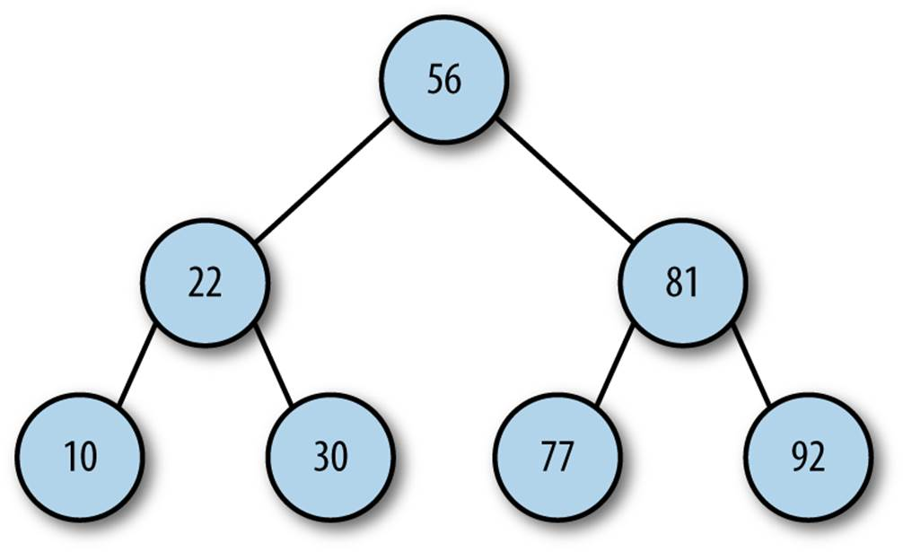

# Binary Trees & Recursion

## Topics Covered / Goals

## Lesson

### Slidedeck

[Binary Trees & Recursion Slide Deck](https://docs.google.com/presentation/d/1zf0dadnpWVIKkg_-gQWPuhaBEQGnuHqTVNhGg5LjETs/edit?usp=sharing)

### Binary Trees

### Optimal Sub-Structure

Questin -- when is recursion _actually_ useful 'in the wild', so to speak? Well, recursive algorithms tend to be a natural fit when working with recursive data structures. What does it mean for a data structure to be recursive? This brings us to the concept of **optimal sub-structure**.

Optimal sub-structure is a quality some data structures have in that they can be _defined in terms of themselves_. The canonical example is a Binary Tree!

A Binary Tree is defined as being either:

1.  A Leaf

This is our base case, a terminating node with no children, or

2.  A Node that links to two other Trees

This is the equivalent of the recursive step

> See `code-examples/binary-tree.py` to see how we would define such a structure

### Binary Search / Binary Search Tree

A binary search tree is a binary tree with some additional properties, namely:

1. the value of the left child (and all of it's children) is always _smaller_ than the value of the node itself

2. the value of the right child (and all of it's children) is always _greater_ than the value of the node itself

These two properties combined mean that searching through such a tree for a given value becomes much simpler - if it's not at the given level we always know to look in _either_ the left _or_ right subtree.

This is the same logic as some asking you to 'pick a number between 1 and 100' and then every time they guess you say 'higher' or 'lower'.

What might be an optimal guessing strategy for such a game? How does this relate to Binary Search Trees?

> see `code-examples/binary-search.py` to see binary search implemented for a binary tree

## External Resources

- [BFs vs DFS](https://medium.com/nothingaholic/depth-first-search-vs-breadth-first-search-in-python-81521caa8f44)
  - There are two main ways to traverse a tree, Depth-first Search (look at the children of children of children ... first) and Breadth-first Search (look at all child nodes at a given level before descending to the next level). These use the concept of stacks and queues from the previous days reading.
