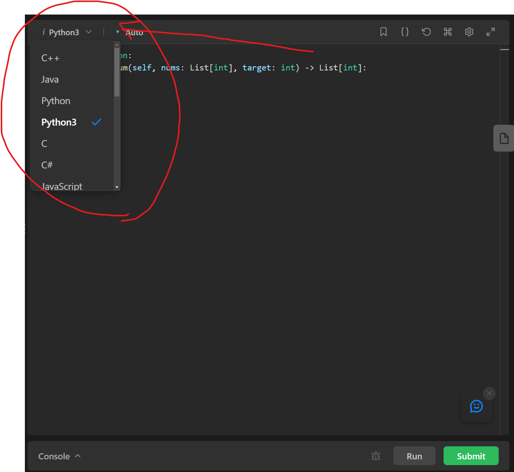

# Leetcode: How to use it & why

There are many websites that mock this experience of a tech interview, but the one we tend to use at Code Platoon is [LeetCode](https://leetcode.com). Let's look at a classic example of an 'easy' level problem on LeetCode just to get a sense of what it looks like - [Two Sum](https://leetcode.com/problems/two-sum/).

Let's break down this page. On the left you'll see a description of the problem, including input => output examples.

On the right you will see a code editor. Notice in the to left of this section you can select the language of your choice:

You will generally be allowed to choose the language you feel most comfortable with, unless explicitly specified otherwise.

From here you can write a solution and test it along the way with the 'Run' button, which will run your solution against some sample cases, including ones you write yourself if desired. Logging to the console will also be output here:

When you feel good about the solution you can hit 'Submit'. This will run your solution against way more test cases, which you cannot see, but it will account for any edge case basically.

If you pass all the test cases you will see a screen like this. Noticed the highlighted section - I am being measured against other passing submissions in terms of both runtime and memory usage. This is an example of the 'analysis' section that comes at the end of a succesful solution - you will be asked to analyze the efficiency of your solution and if you might be able to optimize it. Now let's close this solution panel and go back to the 'Description' tab on the left part of the screen. Scroll down to the 'Follow Up' section:

That sentence should make no sense to you yet, but it's an example of what is called **complexity analysis**, more often refered to simply as **Big-O**. Part of the concept of data structures and algorithms is this idea of a rigorous, mathematical form of analysis of one's alogrithm. This is actual math, but it's possible to learn how to think about complexity analysis without learning the mathematical details. So when the follow up section says "is it possible to come up with an algorithm that is less than `O(N^2)` time complexity?' that essentially means 'you solved it with nested for loops (looking at N elements for each N elements = N^2, the 'big-O' part means 'in the worst case scenario'), is there some way to do that with a better 'worst case' complexity guarantee? Which transaltes to 'could you solve this with only a single loop through the array, instead of nested loops?' We cover this concept in more depth Day 3 of Data Structures week, but it's important to have a basic familiarity upfront.
