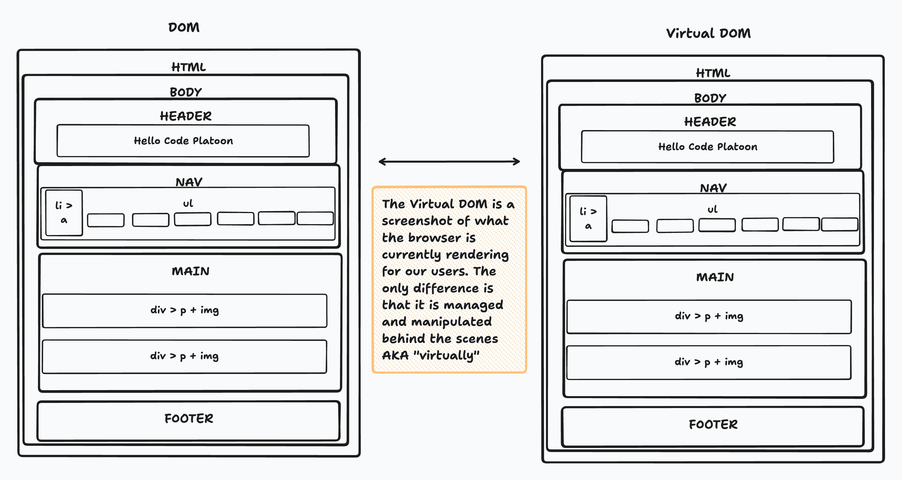
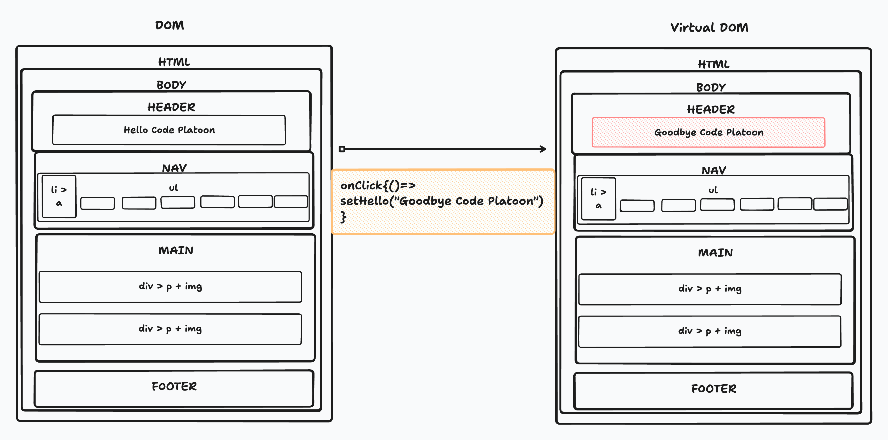
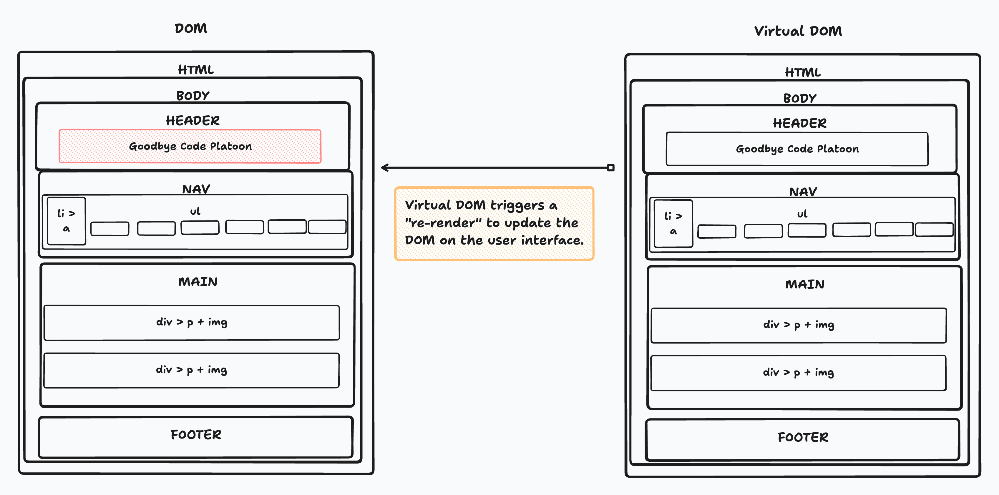
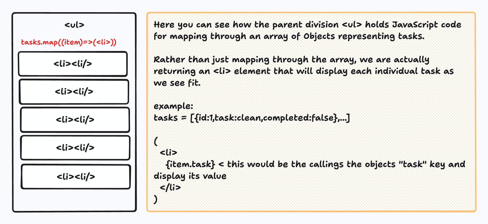

# Understanding useState and useEffect Hooks in React

## Introduction

Welcome to this lesson on two essential React hooks: `useState` and `useEffect`. These hooks are fundamental for building dynamic and interactive React applications. We'll cover how to use them effectively and understand their role in working with the React Virtual DOM. We will also explore practical use cases, such as managing state, performing side effects, and conditional rendering.

## React Virtual DOM

Before diving into hooks, it's crucial to understand the concept of the React Virtual DOM.

- **Virtual DOM**: React maintains a virtual representation of the actual DOM. When you make changes to the application's state, React updates the virtual DOM first, then calculates the difference between the new and previous virtual DOM states. Finally, it only updates the real DOM where changes occurred. This process optimizes rendering performance.



## State and the Virtual DOM

### `useState` Hook

The `useState` hook allows you to add and manage state within your functional components. It's essential for making your components dynamic and interactive.

For example, lets say we wanted to change the greeting within our front-end interface to `Goodbye Code Platoon` with a click of a button. We would create a `useState` const named greeting that would store the original value of we would want to display as it's initializer and render the code like this.

```jsx
function App() {
  //         get    sets           init
  const [hello, setHello] = useState("Hello Victor") //any||null

  return(
    <>
     <h1>{hello}</>
     <button onClick={()=>setHello("Goodbye Victor")}>
       Change Greeting
      </button>
    </>
  )
  // notice the onClick function is taking in a function to be triggered upon an event. You are still setting up an event listener.
}
```

When the button is clicked our Virtual DOM will be updated to look like this, please notice that the onClick function itself did not update the DOM being rendered by the browser.



Now that the Virtual DOM has been update it will trigger a comparison and see that the DOM is no longer matching the Virtual DOM. Once that happens React will update the DOM and update the browser side code to change the User Interface.



#### Adding Items to a `useState` Array

You can use `useState` to manage an array state and add items to it. Here's an example:

```jsx
import React, { useState } from "react";
import jsonTasks from "./data/tasks.json";

function Example() {
  const [items, setItems] = useState([jsonTasks]);

  const addItem = (newItem) => {
    setItems([...items, newItem]);
  };

  return (
    <div>
      <button onClick={() => addItem({ id: tasks.length + 1, task: `newTask${tasks.length + 1}`, completed: false })}>
        Add Item
      </button>
      <ul>
        {items.map((item, index) => (
          <li key={index}>{item.task}</li>
        ))}
      </ul>
    </div>
  );
}
```

In this example, we use the `setItems` function to update the state. By spreading the previous array and adding the new item, we ensure that we create a new array, which triggers a re-render.



#### Removing Items from a `useState` Array

You can remove items from a `useState` array using the `filter` method. Here's an example:

```jsx
const removeItem = (itemToRemove) => {
  setItems(items.filter((item) => item.id !== itemToRemove.id));
};
return (
  //....
      <ul>
        {items.map((item, index) => (
          <li key={index}>
            {item.item}
            <button onClick={()=>removeItem(item)}>Remove Item </button>
          </li>
        ))}
      </ul>
  );
```

This code filters out the item to be removed and sets the state with the new array.

### `useEffect` Hook

The `useEffect` hook is used for handling side effects, such as data fetching, DOM manipulation, or subscription management. It plays a crucial role in the component lifecycle.

#### How `useEffect` Works

- `useEffect` takes two arguments: a function and an optional dependency array.
- The function inside `useEffect` is known as the "effect." It runs after the component renders.

#### When Is It Good to Utilize `useEffect`?

You should use `useEffect` when you need to perform side effects in your functional components. Common use cases include:

- Fetching data from an API.
- Subscribing to event listeners.
- Modifying the DOM directly.
- Cleaning up resources when the component unmounts.

#### Dependency List in `useEffect`

The dependency array in `useEffect` is crucial. It determines when the effect runs.

- If the dependency array is empty (`[]`), the effect runs after every render, including the initial render.
- If you provide dependencies in the array, the effect runs only when one or more of these dependencies change.

```jsx
useEffect(() => {
  // Effect code here
}, [dependency1, dependency2]);
```

Be careful when using the dependency array. If you omit it, the effect will run every time the component renders, potentially causing performance issues.

### Conditional Rendering

Conditional rendering is a fundamental concept in React that allows you to display different content based on conditions. This concept is often used with expressions like `{show ? <H1>I'm Here</H1> : <p>I'm Hiding</p>}`. Let's explore how this works and why it's essential to use a state variable like `show`.

In the expression `{show ? <H1>I'm Here</H1> : <p>I'm Hiding</p>}`, the value of `show` determines whether the `<H1>I'm Here</H1>` component or the `<p>I'm Hiding</p>` component is rendered. Here's how it works:

- If `show` is `true`, the `<H1>I'm Here</H1>` component is rendered.
- If `show` is `false`, the `<p>I'm Hiding</p>` component is rendered.

#### Why Must `show` Be a State Variable?

In React, it's essential to use state variables for conditional rendering. Here's why:

1. **Reactivity**: State variables are reactive, meaning that when they change, React knows to re-render the component. If you use a regular variable instead of a state variable, changes to that variable won't trigger re-renders, leading to issues where your UI doesn't update as expected.

2. **Predictable Updates**: State variables provide a clear and predictable way to handle component updates. When you change a state variable using functions like `useState`, `useReducer`, or similar state management tools, React knows to re-evaluate the JSX expression based on the new state value.

3. **Optimized Rendering**: React can optimize rendering when state variables change. It calculates the minimal necessary updates to the Virtual DOM, reducing the risk of unnecessary re-renders and improving performance.

Using state variables for conditional rendering ensures that your components stay in sync with the application's state and offer a reliable and responsive user interface.

Here's an example of conditional rendering using a state variable:

```jsx
import React, { useState } from "react";

function App() {
  const [show, setShow] = useState(true);

  useEffect(()=>{
    console.log(show)
  }, [show])

  return (
    <div>
      {show ? <h1>I'm Here</h1> : <p>I'm Hiding</p>}
      <button onClick={() => setShow(!show)}>Toggle Button</button>
    </div>
  );
}
```

In this example, we use the `show` state variable to toggle the rendering of the `<H1>I'm Here</H1>` and `<p>I'm Hiding</p>` components. When the "Toggle Button" button is clicked, it changes the `show` state, triggering re-renders and updating the displayed component accordingly.

## Conclusion

In this lesson, you've learned about the `useState` and `useEffect` hooks in React, their role in working with the Virtual DOM, and their practical applications. These hooks are essential for building dynamic, interactive, and performant React applications. Keep practicing and experimenting with them to master their usage and create amazing React applications!
