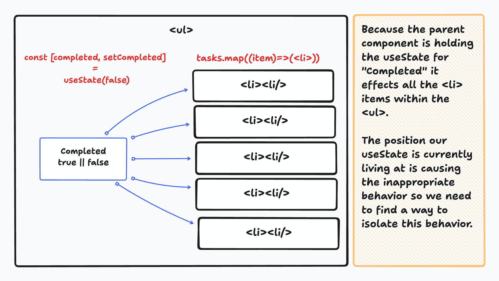
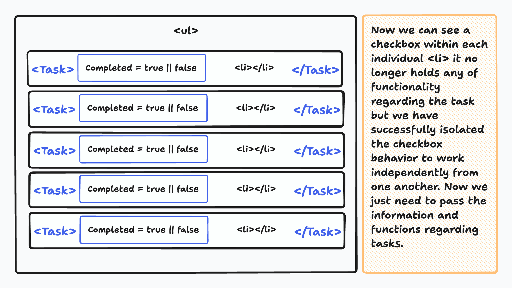
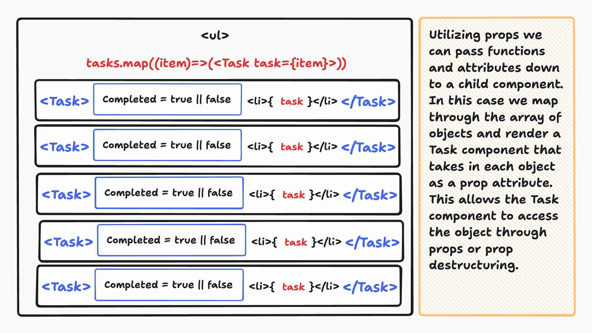

# Utilizing Components in React.js

## Introduction

React.js is a popular JavaScript library for building user interfaces. A core concept in React is the use of components to create modular, reusable, and maintainable code. In this lesson, we'll cover what components are, when and why to utilize them, how to create components, manage project folder structures, and understand `props`.

## What is a Component?

A component in React is a self-contained, reusable piece of user interface that can include both structure (HTML) and behavior (JavaScript). Components are the building blocks of a React application, and they can be used to represent various parts of a user interface, such as buttons, forms, headers, or even entire pages.

## When and Why Utilize Components

### Do Not Repeat Yourself (DRY)

Repeating code is a common source of errors and maintenance headaches. Components help you follow the DRY principle by allowing you to define a piece of UI once and reuse it throughout your application. When you need to make changes or fix issues, you only have to do it in one place.

### Isolating Code

Components create a clear separation of concerns in your code. Each component focuses on a specific task or piece of the UI. This isolation makes debugging easier because you can pinpoint issues to a particular component rather than sifting through a large monolithic codebase.

### Project Folder Structure for Creating Components

To organize your components efficiently, consider structuring your project like this:

```bash
src/
|-  components/
|   |- Button.js
|   |- Form.js
|   |- Header.js
|    ...
|-  App.js
|-  index.js
```

By placing your components in a separate folder, your project remains well-organized, and it's easier to locate and manage them.

### Practical Example

Lets take a look at our to-do-list application and try to create a behavior where a task can be checked as completed by users. My first thought would be to create a `useState` hook for completed and update it upon a user interaction.

```jsx
const [completed, setCompleted] = useState(false)

return (
      <ul>
        {items.map((item, index) => (
          <li key={index}>
            <input type="checkbox" checked={completed} onChange={(e)=>setCompleted(e.target.checked)}>
            {item.item}
            <button onClick={()=>removeItem(item)}>
              Remove Button
            <button>
          </li>
        ))}
      </ul>
)
```

well that didn't work as expected. Rather than only updating one it updated all of my tasks at once. What's going on? Lets take a look:



## Creating a Component

we could change our function to change the individual objects "completed" attribute to but that would really handle the problem at it's root level. Instead we want to isolate this behavior for each individual object by creating a Component that will isolate an objects properties and functions.

```jsx
const Task = () => {
  const [completed, setCompleted] = useState(false)

  useEffect(()=>{
    console.log(completed)
  },[completed])

  return (
      <li>
        <input type="checkbox" checked={completed} onChange={(e)=>setCompleted(e.target.checked)}>
        A task will be displayed here
        <button>
          Remove Button
        </button>
      </li>
  )
}
```

```jsx
import Task from "./components/Task.jsx";

function App() {
  const [tasks, setTasks] = useState(jsonTask);

  // add and remove tasks functions

  return (
    <ul>
      {items.map((item, index) => (
        <Task key={index} />
      ))}
    </ul>
  );
}
```



## Export and Import Statements within React.js

### Exporting Components in React

In React, you have two primary ways to export components: using `export default` and named exports. Each approach has its use cases and implications.

### `export default`

When you use `export default`, you are exporting a single "default" value from your module. In the context of React components, this means that you can export one component as the default export from a file. Here's an example:

```jsx
import React from "react";

function Button() {
  return <button>Click me</button>;
}

export default Button;
```

In this case, `Button` is the default export of the `Button.js` file. When you import this component in another file, you can choose any name you want for the imported value. For example:

```jsx
import MyButton from "./Button";
```

Here, we named the imported component `MyButton`, but you could name it anything you prefer.

### Named Exports

In contrast to default exports, named exports allow you to export multiple values from a single module, each with a distinct name. You can have multiple named exports in one module. Here's an example:

```jsx
import React from "react";

export function Button() {
  return <button>Click me</button>;
}

export function Link() {
  return <a href="#">Click me</a>;
}
```

In this case, both the `Button` and `Link` components are named exports of the file. When importing named exports, you must use the exact name specified in the module. For example:

```jsx
import { Button, Link } from "./Button";
```

Here, you import both `Button` and `Link` by their respective names.

### When to Use `export default` vs. Named Exports

- **`export default`**: Use this when you want to export a single value, typically the main or primary component of a file. It simplifies the import statement in other files and allows you to use any name when importing.

- **Named Exports**: Use named exports when you need to export multiple values from a single module. This is helpful when you have several components, utility functions, or constants in one file, and you want to use them individually in other files.

Understanding the difference between `export default` and named exports is essential when organizing and structuring your React application. Your choice should align with the modularity and reusability goals of your project.

### Import Statements

- **Import**: To use a component in another file, you need to import it using `import`. You can import default or named exports, depending on how the component was exported.

```jsx
// Importing a default export
import Button from "./Button";

// Importing a named export
import { Button } from "./Button";
```

Certainly, let's explain the concept of parent and child relationships within React.js.

## Parent and Child Relationship in React

In React, components are often organized in a hierarchy, creating a tree-like structure. This structure is based on parent and child relationships. Here's what it means:

- **Parent Component**: A parent component is a higher-level component that contains and renders one or more child components. It controls and manages the child components, passing data to them via props and often defining the structure of the user interface.

- **Child Component**: A child component is a lower-level component that is rendered inside a parent component. Child components receive data (props) from their parent and typically represent smaller, more focused parts of the user interface. They can be reused in different parts of the application.

### Example

Consider a simple example where we have a `User` component as the parent and `Profile` and `Posts` components as child components:

```jsx
function User() {
  const userData = { userId: 1, name: "John", age: 30 };

  return (
    <div>
      <h2>User Profile</h2>
      <Profile />
      <Posts />
    </div>
  );
}

function Profile() {
  return (
    <div>
      <h3>John</h3>
      <p>Age: 30</p>
    </div>
  );
}

function Posts() {
  // Fetch and display user posts based on the userId and save to useState
  const [posts, setPosts] = useState([]);

  return (
    <ul>
      {posts.map((post) => (
        <li>{post.title}</li>
      ))}
    </ul>
  );
}
```

In this example, the `User` component is the parent, and it renders the `Profile` and `Posts` components as children. The parent (`User`) can pass data to the child components using props.

## What is `props`

`props` (short for properties) are a way to pass data from a parent component to a child component. They allow you to configure and customize child components dynamically. For example:

```jsx
function Greeting(props) {
  return <h1>Hello, {props.name}!</h1>;
}

<Greeting name="John" />; // Renders "Hello, John!"
```

## `props` Destructuring

To make your code more readable, you can destructure `props` directly in the function parameters:

```jsx
function Greeting({ name }) {
  return <h1>Hello, {name}!</h1>;
}
```

This way, you can access `name` directly, simplifying your component's code.

```jsx
function User() {
  const userData = { userId: 1, name: "John", age: 30 };

  return (
    <div>
      <h2>User Profile</h2>
      <Profile user={userData} />
      <Posts userId={userData.userId} />
    </div>
  );
}

function Profile({ user }) {
  return (
    <div>
      <h3>{user.name}</h3>
      <p>Age: {user.age}</p>
    </div>
  );
}

function Posts({ userId }) {
  // Fetch and display user posts based on the userId and save to useState
  const [posts, setPosts] = useState([]);

  return (
    <ul>
      {posts.map((post) => (
        <li>{post.title}</li>
      ))}
    </ul>
  );
}
```

- `Profile` receives the `user` prop and displays user information.
- `Posts` receives the `userId` prop and fetches and displays user-specific posts.

This hierarchical structure and the passing of data from parent to child components are fundamental to building complex and reusable user interfaces in React. It allows you to create modular and maintainable code by breaking down the UI into smaller, manageable parts.

## Finishing To-Do App

utilizing what we just learned we can now pass each individual task object from our `tasks` useState and functions down to the `Task` component.

```jsx
import Task from "./components/Task.jsx";

function App() {
  const [tasks, setTasks] = useState(jsonTask);

  // add and remove tasks functions

  return (
    <ul>
      {items.map((item, index) => (
        <Task key={index} task={item} removeATask={removeATask} />
      ))}
    </ul>
  );
}
```

```jsx
const Task = (props) => {
  const [completed, setCompleted] = useState(props.task.completed)

  useEffect(()=>{
    console.log(completed)
  },[completed])

  return (
      <li>
        <input type="checkbox" checked={completed} onChange={(e)=>setCompleted(e.target.checked)}>
        {props.task.task}
        <button onClick={()=>props.removeATask(props.task)} >
          Remove Button
        </button>
      </li>
  )
}
```



## Conclusion

Components are the heart of React development. They provide reusability, maintainability, and a structured approach to building user interfaces. By using components effectively, you can create scalable and modular React applications. Understanding how to create, export, import, and pass data through `props` is essential to becoming a proficient React developer.
