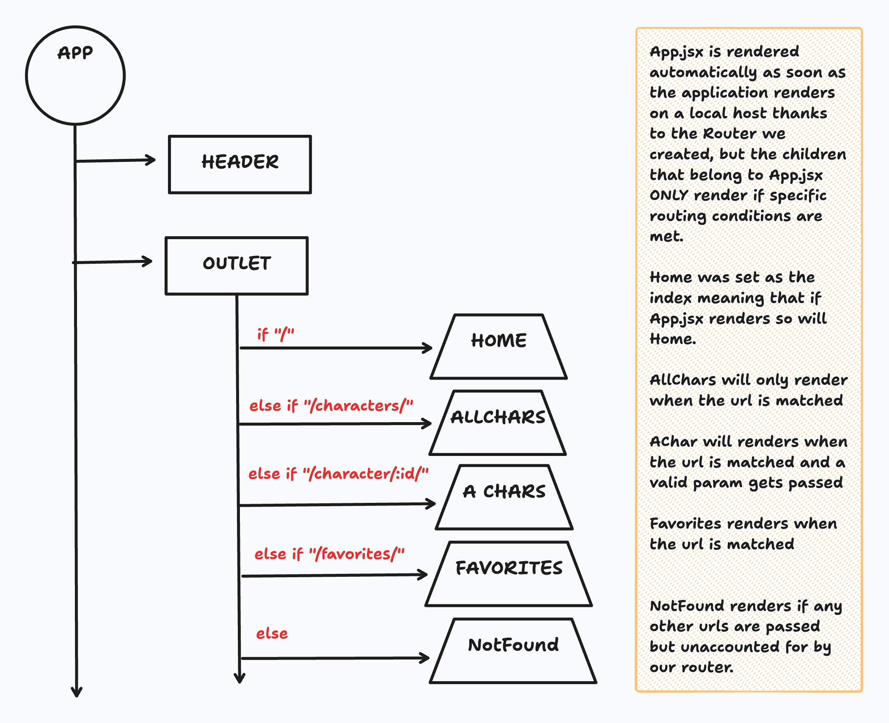
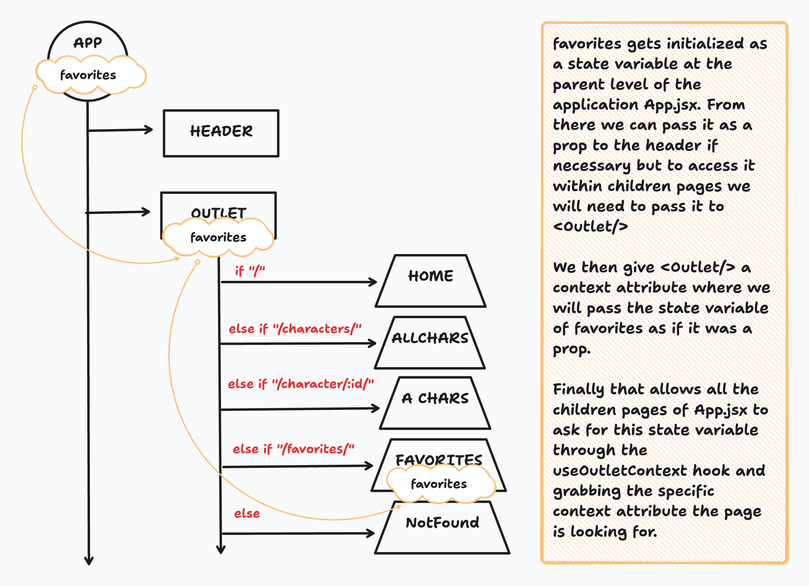

# Utilizing `useOutletContext` in React Router with Vite

## Introduction

In this lesson, you'll learn how to use `useOutletContext` provided by React Router's `react-router-dom` library. `useOutletContext` is a powerful tool for managing and accessing routing-related data in your React application, helping you avoid prop drilling and simplify the sharing of routing information.

## What is `useOutletContext`?

`useOutletContext` is a hook provided by React Router's `react-router-dom` library. It allows you to access context data related to the currently matched route and route parameters without having to pass them down through props. It simplifies the way you access and share routing information throughout your application.

## What is Prop Drilling?

**Prop drilling** is the process of passing data from a component to its child components by chaining props. When you have deeply nested components that need access to the same data, it can become cumbersome to pass props down through each layer of the component tree. This can lead to less maintainable and harder-to-read code.

### Code Example of Prop Drilling

```jsx
// ParentComponent.js
import React from 'react';
import ChildComponent from './ChildComponent';

const ParentComponent = ({ data }) => {
  return (
    <div>
      <ChildComponent data={data} />
    </div>
  );
};

// ChildComponent.js
import React from 'react';
import GrandchildComponent from './GrandchildComponent';

const ChildComponent = ({ data }) => {
  return (
    <div>
      <GrandchildComponent data={data} />
    </div>
  );
};

// GrandchildComponent.js
import React from 'react';

const GrandchildComponent = ({ data }) => {
  return (
    <div>
      <p>Data: {data}</p>
    </div>
  );
};
```

In the above example, `data` is passed down through multiple layers, which can become unwieldy as the component tree grows.

## What Problem Does `useOutletContext` Solve and How?

`useOutletContext` solves the problem of prop drilling when dealing with routing-related information. It provides a way to access context data from the current matched route, including route parameters and data, without having to pass this information explicitly through component props.

## When Should `useOutletContext` Be Used?

You should consider using `useOutletContext` when:

- Your application has complex route structures with many nested components that need access to routing information.
- You want to simplify the sharing of route-related data among components.
- You want to avoid the complexities of prop drilling and improve code maintainability.

## Code Example: Utilizing `useOutletContext`

To use `useOutletContext`, follow these steps:

### Step 1: Install Dependencies

If you haven't already, make sure you have `react-router-dom` installed in your Vite project:

```bash
npm install react-router-dom
```

### Step 2: Give your outlet Context within App.jsx

You are about to give your outlet `context` meaning that anything passed into this parameter will be accessible to all the children Connected to App.jsx through the Outlet component.

```jsx
import { useState } from "react";
import { Outlet, Link } from "react-router-dom";
import DetailsPanel from "./components/DetailsPanel";
import MyNavBar from "./components/MyNavBar";

export default function App() {
//        GETTER     SETTER
  const [feedback, setFeedback] = useState("");
  
  //every child within App.jsx will have access to both feedback and setFeedback
  return (
    <>
      <h1>A very simple site to demonstrate client side routing</h1>
      <MyNavBar/>
      <Outlet context={{ feedback, setFeedback }} /> 
      <DetailsPanel feedback={feedback} />
    </>
  );
}
```

### Step 3: Import and Use `useOutletContext`

In a component where you want to access routing information, import and use the `useOutletContext` hook:

```jsx
import { useOutletContext } from "react-router-dom";

export default function ContactUsPage() {
  const { feedback, setFeedback } = useOutletContext();

  return (
    <>
      <h2>This is the Contact Us page</h2>
      <h3>What's your complaint?</h3>
      <textarea
        rows={20}
        cols={50}
        value={feedback}
        onChange={(event) => setFeedback(event.target.value)}
      />
    </>
  );
}
```

In this example, `useOutletContext` provides access to `route` and its properties, such as `path` and `params`, without having to pass these as props from a parent component.

## Passing down the Context

At this point we know that children pages within the router are connected to `App.jsx` through `<Outlet/>`... but how exactly does that look?



Now that we see that how can we pass a state variable named `favorites` and set as a list to multiple pages within the Outlet? Thats where outlet context comes in. The state variable is passed to the outlet as `context` and accessed by the children of `App.jsx` as necessary.



## Summary

In this lesson, you learned about `useOutletContext`, a valuable tool for managing and accessing routing information in your React application. It helps you avoid prop drilling and simplifies the sharing of routing data among components. By using `useOutletContext`, you can improve code maintainability and enhance the organization of your routing-related code.
