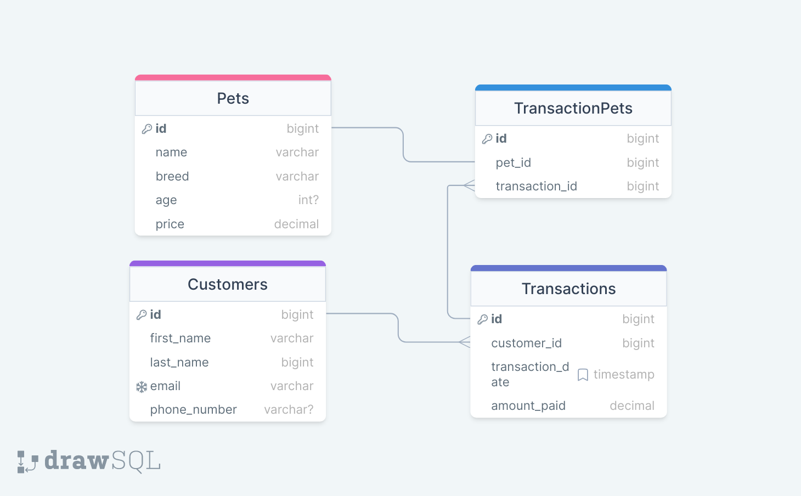
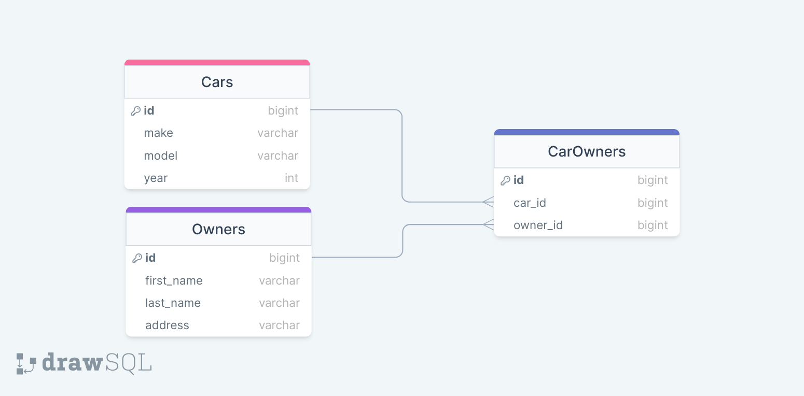
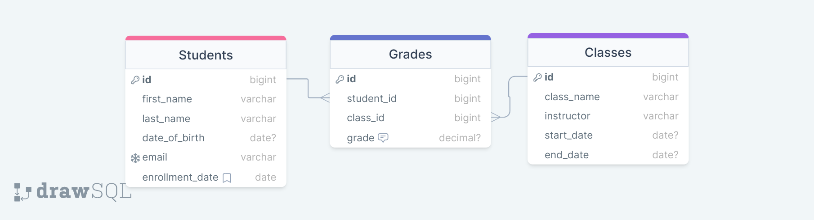

# SQL Schema Design

## What is Schema Design?

**Database schema design** refers to the process of defining the structure that represents the organization of data in a database. A well-designed database schema is crucial for ensuring data integrity, performance, and ease of maintenance. Here are some good practices and potential pitfalls to consider when starting your database schema design:

## How to Create Schema Designs?

### Good Practices

1. **Normalization:**
   - **Good Practice:** Normalize your database to reduce data redundancy and improve data integrity. Follow normalization principles like 1st, 2nd, and 3rd normal forms.
   - **Caution:** Over-normalization can lead to complex queries and performance issues. Strike a balance based on the specific requirements of your application.

2. **Use Primary Keys:**
   - **Good Practice:** Each table should have a primary key to uniquely identify each record. This is essential for maintaining data consistency.
   - **Caution:** Avoid using columns that might change frequently as primary keys.

3. **Foreign Keys for Relationships:**
   - **Good Practice:** Use foreign keys to establish relationships between tables. This ensures referential integrity.
   - **Caution:** Make sure to handle cascading actions (deletes or updates) appropriately to avoid unintended consequences.

4. **Data Types and Constraints:**
   - **Good Practice:** Choose appropriate data types for each column and enforce constraints (e.g., NOT NULL, UNIQUE) to maintain data accuracy.
   - **Caution:** Be mindful of the data types chosen, as they can impact storage and performance.

5. **Indexes:**
   - **Good Practice:** Use indexes to speed up query performance, especially on columns frequently used in WHERE clauses.
   - **Caution:** Too many indexes can slow down write operations. Strike a balance based on read and write patterns.

6. **Consistent Naming Conventions:**
   - **Good Practice:** Adopt a consistent naming convention for tables, columns, and other database objects. This improves maintainability.
   - **Caution:** Avoid overly complex or ambiguous names.

7. **Documentation:**
   - **Good Practice:** Document your database schema, including table relationships, constraints, and any other important information.
   - **Caution:** Lack of documentation can lead to confusion and difficulties during maintenance.

### Bad Practices

1. **Denormalization Without Reason:**
   - **Bad Practice:** Denormalize the database without a valid reason. This can lead to data inconsistencies and maintenance challenges.

2. **Ignoring Indexing:**
   - **Bad Practice:** Neglecting to create indexes on columns used in WHERE clauses can result in poor query performance.

3. **Unrestricted NULL Values:**
   - **Bad Practice:** Allowing excessive NULL values can make it challenging to enforce data integrity.

4. **Ignoring Relationships:**
   - **Bad Practice:** Ignoring relationships between tables can lead to data redundancy and integrity issues.

5. **Inconsistent Naming:**
   - **Bad Practice:** Inconsistent or unclear naming conventions can make the schema difficult to understand and maintain.

6. **Lack of Documentation:**
   - **Bad Practice:** Failing to document the schema can make it hard for developers and administrators to understand the database structure.

7. **Ignoring Security:**
   - **Bad Practice:** Neglecting to implement proper security measures can expose the database to unauthorized access and potential breaches.

8. **Ignoring Scalability:**
   - **Bad Practice:** Failing to consider scalability requirements can lead to performance issues as data grows.

When designing a database schema, it's crucial to strike a balance between normalization and performance optimization, taking into account the specific needs of your application. Regularly review and update the schema as the application evolves to ensure it remains efficient and maintainable.

## Understanding Entity Fields in PostgreSQL

In PostgreSQL, designing an effective database schema involves careful consideration of various types of entity fields. Each type serves a specific purpose, and understanding when to use them is crucial for building a well-structured and efficient database. Let's explore different types of entity fields and when each one should or should not be utilized.

### 1. **Serial and Primary Key Fields:**

- **Usage:** Serial fields are often used as primary key identifiers for tables. They automatically increment, providing a unique identifier for each record.
- **When to Use:** Ideal for primary keys to ensure each record has a unique identifier.
- **When Not to Use:** Avoid if the application requires specific control over the values or if a composite primary key is more suitable.

### 2. **VARCHAR and Text Fields:**

- **Usage:** VARCHAR is used for variable-length character strings, while Text is used for longer text data.
- **When to Use:** VARCHAR for short strings with a defined length, Text for longer textual data.
- **When Not to Use:** Avoid using VARCHAR for very long text, and Text for fields with a known length.

### 3. **Numeric and Decimal Fields:**

- **Usage:** Numeric for arbitrary precision, Decimal for fixed-point numbers.
- **When to Use:** Use Numeric for calculations requiring precision, Decimal for financial data.
- **When Not to Use:** Avoid if storage space is a significant concern and a floating-point representation is acceptable.

### 4. **Date and Timestamp Fields:**

- **Usage:** Date for storing dates, Timestamp for storing dates and times.
- **When to Use:** Use Date for birth dates or events without specific times, Timestamp for events with specific times.
- **When Not to Use:** Avoid Timestamp if only date information is needed.

### 5. **Boolean Fields:**

- **Usage:** Represents true/false values.
- **When to Use:** Ideal for fields with binary states, like "active" or "inactive."
- **When Not to Use:** Avoid for fields with more than two states or if the application requires a more complex representation.

## Relationships between Tables

**Overview of Relationship Types in Database Modeling:**

In database modeling, understanding different types of relationships between entities is crucial for designing a robust and efficient database schema. Let's explore three common relationship types: many-to-many, one-to-one, and one-to-many with real-life examples and the process behind recognizing these relationships.

### 1. **Many-to-Many Relationship:**

- **Real-Life Example:** Consider a scenario where students can enroll in multiple courses, and each course can have multiple students. This is a classic many-to-many relationship.
- **Recognition Process:**
  - Look for scenarios where entities on both sides can have multiple instances related to each other.
  - Identify situations where one instance of an entity can be associated with multiple instances of another entity, and vice versa.
  - Recognize the need for an intermediary table (junction table) to resolve the many-to-many relationship.

### 2. **One-to-One Relationship:**

- **Real-Life Example:** In a human resources database, each employee may have only one unique employee ID card, and each ID card is associated with only one employee. This is a one-to-one relationship.
- **Recognition Process:**
  - Look for scenarios where one instance of an entity is related to, at most, one instance of another entity.
  - Identify situations where the existence of one entity depends on the existence of another entity, forming a unique pairing.
  - Recognize that the primary key of one entity becomes a foreign key in the related entity.

### 3. **One-to-Many Relationship:**

- **Real-Life Example:** In a library database, one author can write multiple books, but each book is written by only one author. This represents a one-to-many relationship.
- **Recognition Process:**
  - Look for scenarios where one instance of an entity is related to multiple instances of another entity.
  - Identify situations where the existence of one entity has a direct impact on multiple instances of another entity.
  - Recognize the foreign key in the "many" side that references the primary key in the "one" side.

## Practical Application

Lets take a look at a couple of prompts and their solutions when it comes to database schema design.

### Scenario 1: Pet Store

**Prompt:**
Design a database schema for a pet store. The store sells different types of pets and keeps track of customer transactions. Each pet has a breed, age, and price. Customers can make purchases, and the store wants to maintain information on customer details.

**Schema:**

This schema includes tables for Pets, Customers, and Transactions. It establishes relationships between customers and transactions, as well as pets and transactions through a connecting table to allow for multiple pets to belong to one transaction.

### Scenario 2: Cars and Owners

**Prompt:**
Create a database schema for a system that tracks information about cars and their owners. Each car has a make, model, and year. Owners have names and addresses. The system should be able to handle multiple owners for a single car.

**Schema:**

In this schema, there are tables for Cars, Owners, and a linking table CarOwners to represent the many-to-many relationship between cars and owners. The CarOwners table connects cars and owners by linking their respective IDs.

### Scenario 3: School Management System

**Prompt:**

Design a database schema for a university management system that efficiently tracks information about students, classes, and grades. The system should be able to store details about individual students, including their names, date of birth, email, and enrollment date. It should also handle information about different classes, such as class name, instructor, start date, and end date. Additionally, the system needs to record and manage grades for each student in each class, ensuring that grades fall within a valid range (0 to 100). Consider the relationships between students, classes, and grades, and ensure that the schema supports the necessary data integrity constraints.

**Schema:**

## Conclusion

In conclusion, today's comprehensive lecture covered the essential aspects of SQL schema design, ranging from best practices and potential pitfalls in schema design to understanding entity fields in PostgreSQL and exploring different types of relationships between tables. The guidelines for schema design emphasized normalization, effective use of primary keys, establishment of relationships using foreign keys, careful consideration of data types and constraints, strategic use of indexes, and the importance of consistent naming conventions and documentation. The lecture further extended its focus to the practical application of these concepts through real-life scenarios, providing schema designs for a pet store, a system tracking cars and owners, and a university management system. By combining theoretical knowledge with practical examples, this lecture equips learners with the skills needed to create well-structured, efficient, and scalable database schemas for diverse applications.
