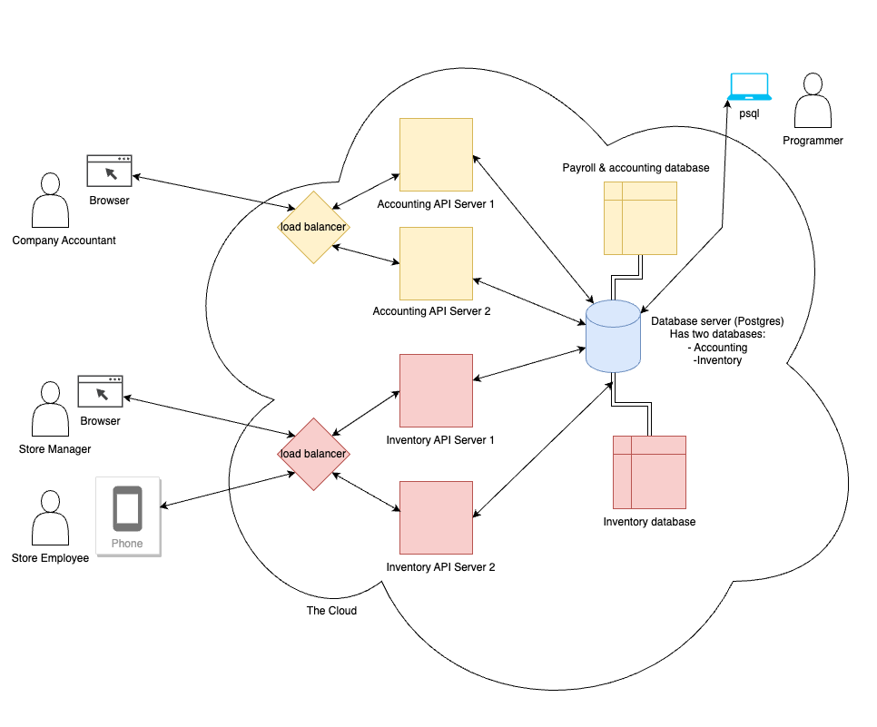
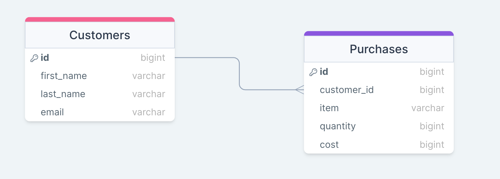

# Intro to Relational Databases & Postgresql

*We recommend using [drawsql](https://drawsql.app/) to visualize your data schema - you can import SQL files into it or directly write sql in the app*

## Table of Contents

1. [What is a database?](#what-is-a-database)
2. [Relational DB's: Structuring data Tables and Relationships](#structuring-data-with-tables-and-relationships)
3. [Relational DB's: SQL - CREATE, INSERT, SELECT](#creating-the-database)
4. [Workflow: Running SQL files in psql](#workflow-write-in-sql-files-and-execute-them-in-psql)
5. [Relational DB's: Data Integrity - ACID](#postgres-data-integrity-transactions-and-acid)
6. [Other Database Systems: NoSQL Document Database](#other-database-systems-nosql-document-databases)
7. [Review](#review)
8. [References & Resources](#references--resources)

## What is a database?

A database, or, *database server*, or, *database engine*, is a special kind of program for storing **data** -- the most important part of our program. A database usually forms the heart of any software application or system. Databases let us do the following:

- **Write** data: Create, Update, or Destroy data in the database.
- **Read** data: Query and search our data.
- **Organize** data: Different kinds of databases do this differently. Relational databases do this with **tables**.
- **Persist** data: Databases are designed to never accidentally delete the data they store, and be easy to back or make copies of.
- **Access Control**: Database programs usually let you create users which have *different levels of access* to different parts of a database. Database engines can also hold *multiple databases* and control access to them.
- **Maintain Data Integrity:** Depending on the database, a database program gives us various guarantees about how our data is handled.

And ... do all this *very efficiently*:
- Postgres can handle thousands of reads (querying data) and writes (creating new data) **per second.**

### Architecture diagram for a retail company web app

Imagine a retail company that has stores that sell stuff. They want their software system to handle *Accounting* (payroll, etc) and *Inventory*.



Note that:

1. The database engine has **multiple** databases. The Accounting API Server program can only access the Accounting database, and the Inventory API Server program can only access the Inventory database.
2. This means store managers are unable to see the Accounting Database, which is probably good for reasons of security.
3. Similarly, though not explicitly shown here, the Store Employee could have a *different level of access* to the Inventory database than the Store Manager.
4. The database engine is the heart of a *software system* which can have many different applications and handle a lot of traffic and users.

**Also note the programmer in the corner!** They are using psql, a *Postgres client* program, to connect to the database server as well! Since they are a programmer their DB user account is an admin and has access to (almost) everything. Often companies *audit* (track) everything that is done on their system specifically to watch out for things like a malicious programmer!
 
 There are other architectures, where different databases *do not share the same database server* - maybe we want Accounting and Inventory to be *completely separate systems* - , but, this architecture of a *central data repository* has been around a long time and is still used.

## What is a relational database?

### Structuring data with Tables and Relationships

#### Tables, Columns, and Rows

A relational database is *one* kind of database program. It *Organizes* and stores data in a *structured* manner:

- Data is organized into **tables**. *Examples:* "Customers", "Purchases".

- Each table has one or more **columns**, which are of different **types** such as integer, boolean, varchar, string, date, etc. *Examples:* The "Customers" table has "first_name", "last_name", and "email" columns.

  **Customers**
  |first_name|last_name|email|
  -----------|----------|----|

  **Purchases**
  |item |quantity|cost|
  -----------|----------|----|

- We can create **constraints** -- rules about what is, or isn't allowed in a column of a table. *Example: The "email" column in the "User" table cannot be null.* We will see this later.

- The actual data is stored in **rows**. A **table** has zero or more **rows** of data.

  **Customers**
  |first_name|last_name|email|
  -----------|----------|----|
  | alice    | waters    |alice@gmail.com|
  | bob    | hope    |bob@gmail.com|

  *The "Customers" table has **two rows** of data.*

  **Purchases**
  |item |quantity|cost|
  -----------|----------|----|
  |spatula | 5 | 2|
  |microphone | 1 | 100|
  
  *The "Purchases" table has **two rows** of data.*

#### Relationships with Primary and Foreign Keys

- We can create **relationships** between **tables**. We do this with **primary keys**, which *uniquely identify* a row of data in a specific table, and **foreign** keys, which **reference** a specific row of data in some other table.

  **Customers**
  |id|first_name|last_name|email|
  --|-----------|----------|----|
  |1| alice     | waters    |alice@gmail.com|
  |2| bob    | hope    |bob@gmail.com|

  *The "id" column is the primary key of on our "Customers" table.*


  **Purchases**
  |id|customer_id|item |quantity|cost|
  --|----|-----------|----------|----|
  |1|2|microphone | 1 | 100|
  |2|1|spatula | 5 | 2|

  *The "customer_id" column is a foreign key on our "Purchases" table, pointing to the "Customers" table. The "id" column is the primary key of our "Purchases" table.*


  This establishes the **relationship** between **tables** -- we can see that Alice bought the spatulas and Bob bought the microphone.

  

  **A table can only have one column that is the Primary Key. The primary key column uniquely identifies any row in a table**

### SQL

Relational databases use SQL -- the **Structured Query Language**. SQL is easy to read, powerful, and flexible. It can do more than just search or query - we also use it to:

- Create & modify our **data schema** -- our tables, columns, constraints, and relationships:
  - Insert data into a database.
  - Creating or deleting ("dropping") databases.
  - Creating or dropping (the SQL term for "delete") tables.
  - Adding new columns to a table, dropping columns, or altering existing columns.
  - Specifying relationships between tables & constraints on columns.
  - Creating users and managing their permissions.
  - and more ...

### SQL and psql: Creating Databases, Tables, and Inserting data

#### Creating the database

Let's use SQL to create the very simple database we just designed!

First log into psql:

```bash
> psql
```

Now create the database:

```sql
/* Create the retail store database schema */
CREATE DATABASE retail_store;
```

With Postgres we can't use SQL to use a particular database, or *schema* - we have to connect to it with our Postgres client program. This is part of how Postgres manages *access control* - which users can access what database.

Here is the psql command to connect to a specific database schema:

```bash
# \c retail_store
```

`\c` is short for `\connect`, which you can also type, if you prefer.

`\conninfo` will print out information about your connection:

```bash
# \conninfo
You are connected to database "postgres" as user "adamcee" via socket in "/tmp" at port "5432".
```

#### Creating the tables

Now create our tables:

```sql
/* Create the customers table */
CREATE TABLE customers (
    id SERIAL PRIMARY KEY,
    first_name VARCHAR(100),
    last_name VARCHAR(100),
    email VARCHAR(255) NOT NULL
);

/* Create the purchases table */
CREATE TABLE purchases (
    id SERIAL PRIMARY KEY,
    item VARCHAR(100),
    quantity INTEGER,
    cost INTEGER,
    customer_id INTEGER REFERENCES customers(id)
);
```

Let's briefly review what we just did:

##### The "customers" table

- **Column named "id":** This is the **primary key** of the table. `SERIAL` is a special data type, as in "increasing in order". Postgresql will auto-generate the values of the "id" column of each row for us.
- **Column named "first_name":** `VARCHAR` is a data type for alphanumeric data ("abc123!", etc) - *Variable Character*. We also told Postgres the "item" column cannot be more than 100 characters in length.
- **Column named "last_name":** Another `VARCHAR`.
- **Column named "email":** Another `VARCHAR`. *Note: The max length here is 255, which is the max length for a `VARCHAR` data type.* It's unlikely an email address would be that long but we wouldnt want anything to break if it was.

##### The "purchases" table

- **Column named "id":** This is the **primary key** of the table.
- **Column named "item":** Another `VARCHAR`.
- **Column named "quantity":** The value in this column must be an `INTEGER`.
- **Column named "cost":** Another `INTEGER`.
- **Column named "customer_id":** This is a **foreign key** of this table. It is an integer, but we are telling Postgresql that this column **references** a column on another table -- `customers.id`, the primary key of the "customers" table.

There is something very cool about `purchases.customer_id`, our foreign key -- **Postgresql is aware of and manages this relationship.** `purchases.customer_id` MUST be the value of a primary key for some row on our `customers` table. Observe what happens if we try to insert a row into the `purchases` table with a foreign key that does not exist:

```bash
retail_store=# INSERT INTO purchases (customer_id, item, quantity, cost) VALUES (999, 'foo', 1,1);
ERROR:  insert or update on table "purchases" violates foreign key constraint "purchases_customer_id_fkey"
DETAIL:  Key (customer_id)=(999) is not present in table "customers".
```

`purchases.customer_id` is linked to `customers.id` -- this is how **relationships** between tables are managed - with **foreign keys** in one table that reference the **primary key** in another table.

#### Checking our work with psql

Whenever you run an SQL statement that *modifys the data schema* or *modifies the actual data*, Get in the habit of using psql or running a few SQL queries to confirm your SQL did what you expected it to.

The psql program has a special syntax for **psql commands** -- directions to psql which are **NOT** sql. Every psql command starts with a "\" -- and the `\?` command is the help command. It will list all commands.

The `\d` is used to *describe* stuff, and has many variations.

Lets use `\dt` command to list all the tables in our schema (database):

```bash
retail_store=# \dt
          List of relations
 Schema |   Name    | Type  |  Owner  
--------+-----------+-------+---------
 public | customers | table | adamcee
 public | purchases | table | adamcee
(2 rows)

```

If we want get information about the columns in a table, we can just use `\d <MY_TABLE_NAME>`. Let's look at the customers table:

```bash
retail_store=# \d customers
                                      Table "public.customers"
   Column   |          Type          | Collation | Nullable |                Default                
------------+------------------------+-----------+----------+---------------------------------------
 id         | integer                |           | not null | nextval('customers_id_seq'::regclass)
 first_name | character varying(100) |           |          | 
 last_name  | character varying(100) |           |          | 
 email      | character varying(255) |           | not null | 
Indexes:
    "customers_pkey" PRIMARY KEY, btree (id)
Referenced by:
    TABLE "purchases" CONSTRAINT "purchases_customer_id_fkey" FOREIGN KEY (customer_id) REFERENCES customers(id)
```

And now let's look at the purchases table:

```bash
retail_store=# \d purchases
                                      Table "public.purchases"
   Column    |          Type          | Collation | Nullable |                Default                
-------------+------------------------+-----------+----------+---------------------------------------
 id          | integer                |           | not null | nextval('purchases_id_seq'::regclass)
 item        | character varying(100) |           |          | 
 quantity    | integer                |           |          | 
 cost        | integer                |           |          | 
 customer_id | integer                |           |          | 
Indexes:
    "purchases_pkey" PRIMARY KEY, btree (id)
Foreign-key constraints:
    "purchases_customer_id_fkey" FOREIGN KEY (customer_id) REFERENCES customers(id)
```

> **Pro tip:** The `\l` command in psql will list all databases. Also, psql doesn't have a "disconnect" command. Run `\connect postgres` to connect to the "postgres" database (which is created by default and is actually used by postgres to *manage* all the other databases and users) to disconnect from your current database.

Awesome! Let's continue on.

#### Inserting data

Let's add that data! We call this *inserting* the data into our database:

```sql
/* Create a new row of data in our customer table - create a new customer */
INSERT INTO customers (first_name, last_name, email)
VALUES ('alice', 'waters', 'alice@gmail.com');

--Create another customer
INSERT INTO customers (first_name, last_name, email)
VALUES ('bob', 'hope', 'bob@gmail.com');

/* Create bob's microphone purchase 
and alice's spatula purchase in one single SQL statement */
INSERT INTO purchases (customer_id, item, quantity, cost)
VALUES 
(1, 'microphone', 1, 100),
(2, 'spatula', 5, 2);
```

After the first two `INSERT` statements you should have seen: `INSERT 0 1`. After the third INSERT statement you should have seen: `INSERT 0 2`

- The first number `0`: This is a [PostGres OID](https://www.postgresql.org/docs/current/datatype-oid.html) placeholder. **It will always be 0 [and we can ignore it](https://www.postgresql.org/message-id/4AD5F063.8050708@iol.ie).** See the link for details.
- The second number: This is **the number of rows inserted with our statement**.

#### Comments in SQL

There are two ways to comment in SQL:

```sql
--single-line comments can be done with two dashes like this.
/*
multi line comments are done with an opening/closing slash and star,
like in JS.
*/
```

#### Querying our data

Let's make some queries about our data!

```sql
/* Get the email of all customers */
SELECT email FROM customers;

/* Get Alice's email */
SELECT email FROM customers WHERE first_name = 'alice';

/* Get names of all things purchased */
SELECT item FROM purchases;

/ * Get names of everything Alice purchased */
SELECT items FROM purchases
JOIN customers on customer.id = purchases.customer_id
WHERE customers.first_name = 'alice';
```

Finallly, let's quit psql:

```bash
retail_store=# \q
```

This is just a preview - we go in-depth into SQL later.

## Workflow: Write in SQL files and execute them in psql

### Using `.sql` files

#### Organizing SQL code

As your data schema and your queries grow more complex, you will want to be able to save your SQL code in files and organize them - just like with Python or JS code.

It is possible to modify a data schema with SQL - we will see later how to run `ALTER TABLE` in psql - but the danger is **losing track of the changes you have made.**

And, you will find that the workflow when designing or implementing a data schema involves a lot of dropping and re-creating tables and deleting and re-inserting data as you make changes. These tips will help you establish an efficient workflow and avoid common "gotchas" that produce bugs.

As a rule of thumb:

- All of your SQL statements to create or modify the data schema - creating tables - should live in `.sql` files. Always keep them up to date.
- All of the data you want to insert should always live in `.sql` files.
- Only modify the data schema in psql - `CREATE TABLE`, `ALTER TABLE`, etc - when *prototyping*. Use the `.sql` files as your "source of truth".
- Prototype your SQL *queries* (`SELECT * FROM PURCHASES WHERE item='spatula'`, etc) by running SQL directly in psql but then once you have it working, **put the query in an `.sql` file.
- Try to have each `.sql` file just hold one thing - it is a little extra work but it makes it easier to follow this process and only change one thing at a time without affecting others.

To recap:

- **You should be able to entirely drop the database, and then easily rebuild it (including your test/mock data!) by running a few `.sql` files.**

Here is an example:

```bash
adamcee@adams-air code-examples % tree
.
├── create-customers.sql
├── create-purchases.sql
├── insert-customers.sql
└── insert-purchases.sql

1 directory, 4 files
```

One file *only* has the SQL to create the `customers` table, another *only* has the SQL to create the `purchases` table, another *only* has the SQL to insert customer data, and so on.

#### Running .sql files inside psql

**Recommended:** Here is how to run an sql file inside psql, using a *relative path* - relative to **the directory we ran psql from**:

```bash
retail_store=# \i ./code-examples/create-customers.sql 
CREATE TABLE
```

Here is how to run an sql file inside psql, using an *absolute path*:

```bash
retail_store=# \ir /Users/adamcee/code/code-platoon-curriculum/curriculum/6SQL/1-intro-sql-basic-schema-design/code-examples/insert-customers.sql
INSERT 0 1
INSERT 0 1
```

We recommend using relative paths with the psql `\i` command as there is usually less to type.

## Postgres Data Integrity: Transactions and ACID

Postgresql does a lot "under the hood" to ensure the integrity of the data it stores. Most other relational databases do similar stuff.

The following is not directly used in this course, but it is important background and contextual knowledge about how relational databases work and the value they provide.

**You may be asked what ACID stands for, and what it means, in a technical interview.**

### Transactions

The excellent PostgreSQL docs have a great explanation of awhat a transaction is:

[Transactions](https://www.postgresql.org/docs/current/tutorial-transactions.html) are a fundamental concept of all database systems. The essential point of a transaction is that it bundles multiple steps into a single, all-or-nothing operation.

Different transactions happening at the same time are independent and unaffected by each other, and if some failure occurs that prevents the transaction from completing, then none of the steps affect the database at all.

For example, consider a bank database that contains balances for various customer accounts. Suppose that we want to record a payment of $100 from Alice's account to Bob's account. Simplifying outrageously, the SQL commands for this might look like:

```sql
BEGIN; --begins a Transaction
UPDATE accounts SET balance = balance - 100.00
    WHERE name = 'Alice';
UPDATE accounts SET balance = balance + 100.00
    WHERE name = 'Bob';
COMMIT; --ends the Transaction
```

Our bank's officers will want to be assured that either all these updates happen, or none of them happen.

**It would certainly not do for a system failure to result in Bob receiving $100.00 that was not debited from Alice.**

**We need a guarantee that if something goes wrong partway through the operation, none of the steps executed so far will take effect.**

Grouping the updates into a transaction gives us this guarantee. A transaction is said to be **atomic:** it either happens completely or not at all.

We also want a guarantee that a completed transaction has been permanently recorded and won't be lost even if a crash ensues just microseconds later.

A relational database guarantees that all the updates made by a transaction are logged in permanent storage (i.e., on disk) before the transaction is reported complete.

*PostgreSQL treats every SQL statement as being executed within a transaction.* **In this class you will never need to explicitly define when a transaction starts and ends,** [but if you are curious you can learn more in the Postgresql docs](https://www.postgresql.org/docs/current/tutorial-transactions.html).

### ACID: Atomic, Consistent, Isolated, Durable

[ACID](https://en.wikipedia.org/wiki/ACID) is an acronym describing *guarantees* that a relational database like Postgres gives us about [ts transactions.](https://www.postgresql.org/files/developer/transactions.pdf).

These guarantees ensure that certain kinds of "bad state" - such as our example of a transaction with Alice being debited $100 but Bob never being paid $100 - cannot occur.

- **Atomic, or Atomicity:** Results of a transaction are seen entirely or not at all within other transactions.
  - *Example:* The Alice and Bob scenario. You're transferring money from one bank account to another. The transaction is atomic - if the withdrawal from one account succeeds, the deposit into the other account must also succeed. If any part of the transaction fails the entire transaction is rolled back, and no changes are made.

- **Consistent, or Consistency:**  A transaction brings the database from one valid state to another. In other words, the database should satisfy integrity constraints before and after the transaction.
  - *Example:* Suppose our database has a constraint that the total balance a bank account is never negative. If a transaction would violate this constraint (e.g., by attempting to withdraw more money than is available), it will be rejected, and the database will remain in a consistent state.

- **Isolated, or Isolation:** : Transactions are not affected by the behavior of concurrently-running
transactions. Each transaction should appear as if it's executing in isolation, even though it may be running simultaneously with other transactions.
  - *Example:* : Example: If two users simultaneously try to update the same bank account, isolation ensures that one transaction is completed before the other starts, avoiding conflicts and inconsistencies in the data.

- **Durable, or Durability:** Once a transaction is committed, its effects are permanent and will survive system failures (e.g., power outage or hardware failure). Even if the database crashes, the changes made by committed transactions are not lost.
  - *Example:* After you successfully transfer money between bank accounts and receive a confirmation, you can trust that this transaction's effects will be saved to the database and remain intact, even if the database server crashes immediately after.

ACID Transactions are a core feature of relational databases.  
Again, you will not directly have to use this knowledge in class but is important to understand this feature of relational databases.

### Postgres vs other relational dbs

Not every relational database system ([MySQL](https://www.mysql.com/), [MariaDB](https://mariadb.com/docs/server/connect/programming-languages/python/transactions/), [Microsoft SQL Server](https://www.microsoft.com/en-us/sql-server)) implements transactions or fully guarantees ACID compliance for each transaction by default.

For example with MariaDB you have to explicitly declare when you are making a transaction, where in Postgresql by default every SQL statement is a transaction.

This isn't necessarily bad - there can be performance tradeoffs involved with ACID transactions and it normal to "tune" a database to fit our specific needs.

An interesting relational database is [sqlite](https://www.sqlite.org/index.html) - it is extremely small and fast. It used on mobile OS's, mobile apps, and embedded systems because of its small size and is actually the [most widely deployed database engine in the world](https://www.sqlite.org/mostdeployed.html).

It is [even a part of the Python standard library.](https://docs.python.org/3/library/sqlite3.html)

By default [Django is configured to use sqlite.](https://docs.djangoproject.com/en/4.2/intro/tutorial02/)

## Other Database Systems: NoSQL Document Databases

There are other database systems that are not relational - they don't use tables, fixed property (column) types, relationships, don't use SQL, or have ACID transactions.


A [NoSQL database](https://www.geeksforgeeks.org/introduction-to-nosql/)  aka document database is a popular non-relational database often used in web apps.

[Data in a NoSQL database is organized into "documents"](https://www.mongodb.com/document-databases) that look an awfully lot like JSON:

```json
{
     "_id": 1,
     "first_name": "Tom",
     "email": "tom@example.com",
     "cell": "765-555-5555",
     "likes": [
        "fashion",
        "spas",
        "shopping"
     ],
}
```

A NoSQL database lets you insert all sorts of data very quickly - great if you are building, say, twitter. But not so great for managing financial transactions.

Other non-relational database systems, like a [NoSQL database](https://www.geeksforgeeks.org/introduction-to-nosql/) such as [MongoDB](https://www.mongodb.com/document-databases), [Firebase](https://firebase.google.com/docs/database), or [CouchDB](https://couchdb.apache.org/) may not guarantee ACID transactions at all.

Some database systems like [FoundationDB](https://apple.github.io/foundationdb/transaction-manifesto.html) are more hybrid - it is similar to a NoSQL database but also [guarantees ACID transactions](https://apple.github.io/foundationdb/transaction-manifesto.html)

Postgres itself is somewhat hybrid - it actually has a [JSON column type](https://www.postgresql.org/docs/current/datatype-json.html) lets you use it in a NoSQL-like fashion.

There is no "best" database model or system - each one has its own strengths and weaknesses and you should always choose your tool specific to the task at hand.  [Twitter actually was originally built using a MySQL database.](https://blog.twitter.com/engineering/en_us/topics/infrastructure/2017/the-infrastructure-behind-twitter-scale)

That said, we teach Postgresql for a reason. It is open-source, flexible, popular, and has good performance. As a rule of thumb, use Postgres or another relational database until you have a specific need that they are unable to fulfill.

## Review

### Databases

- A database, or database engine/server can have multiple database schemas and control access to them.
- Databases let us efficiently *read* and *write* data, as well as ensuring *data integrity.*
- Databases are often the hub, or heart, of a software system.

### Postgresql and psql

- Postgresql, or Postgres is a database engine, or database server, that uses the *relational database* model.
- psql is a command-line *Postgres client* we use to connect to postgres and interact with it.

### Tables, rows, and columns

- Tables consist of columns, which must have a data type.
- Postgres gives you data types for integers, strings, dates, and so on.
- Tables have rows of data. Each column of data in a row can only have the specified data type.

### Relationships between tables with primary and foreign keys

- A primary key is a special column, usually an integer that uniquely identifies each row in a table.
- A foreign key column **references** primary key of another table - this lets us establish **relationships** between tables that Postgresql will enforce, and that we can use in our SQL queries.

### Postgres data types

- `VARCHAR`: Alphanumeric letters and numbers, up to 255 characters in length.
- `INTEGER`: An integer
- `SERIAL PRIMARY KEY`: An auto-generated, auto-incrementing integer usually used for the primary key column of a table.
- `<PRIMARY_KEY_TYPE> REFERENCES`: Used create a foreign key. This column will also *reference* the primary key of another table. *Example: `INTEGER REFERENCES customers(id)`*


### SQL Statements

- [`CREATE TABLE`: Define a new table](https://www.postgresql.org/docs/16/sql-createtable.html)
- [`INSERT`: Creates new rows in a table.](https://www.postgresql.org/docs/current/sql-insert.html)
- [`SELECT`: Retrieve rows from a table or view](https://www.postgresql.org/docs/16/sql-select.html)
  - [`FROM` clause: Specifies on or more *source tables* for `SELECT`. If multiple source are specified, the result is the Cartesion product (cross join) of all the sources](https://www.postgresql.org/docs/16/sql-select.html#SQL-FROM)
  - [`WHERE` clause: Any row that doesn't satisfy this condition will be eliminated from the output.](https://www.postgresql.org/docs/16/sql-select.html#SQL-WHERE) Produces a subset of the Cartesion product for a `JOIN`.
  - ['JOIN' clause: Combine rows from one table (or results of another query) with rows from a second table, with an expression specifying which rows are to be paired. Default value is `INNER JOIN`](https://www.postgresql.org/docs/16/tutorial-join.html)

### Data Integrity: ACID Transaction

**You may be asked what ACID stands for and why it matters in a technical interview.**

- A transaction is 1 or more SQL statements that Postgres is able to guarantee the integrity of. Specifically, Postgres guarantees that every transaction will be ACID (Atomic, Consistent, Isolated, Durable).

- **Atomicity**: A transaction either completely succeeds or completely fails.

- **Consistency:**  A transaction will never result in data in our database being in an "invalid" state, such as a bank account balance having -$100 dollars if `account.balance` must always be an integer equal to or greater than 0.

- **Isolation:** : Transactions are not affected by the behavior of concurrently-running
transactions. If two users simultaneously try to update the same bank account, isolation ensures that one transaction is completed before the other starts.

- **Durability:** Once a transaction is committed, it will remain committed even if there is a system failure. Usually this means a transaction is not complete until the data has been stored to a hard disk or other storage that will survive a crash.

### Other database systems

- For web apps, a common alternative to a relational database database system is a NoSQL database sytem, which uses the *document model*.

- Not every database has **ACID compliant** transactions or enables them by default.

## References & Resources

- [Official Postgres SQL Tutorial](https://www.postgresql.org/docs/16/tutorial-sql.html)
- [Postgres SQL command reference](https://www.postgresql.org/docs/16/sql-select.html)
- [psql guide](https://www.postgresguide.com/utilities/psql/)