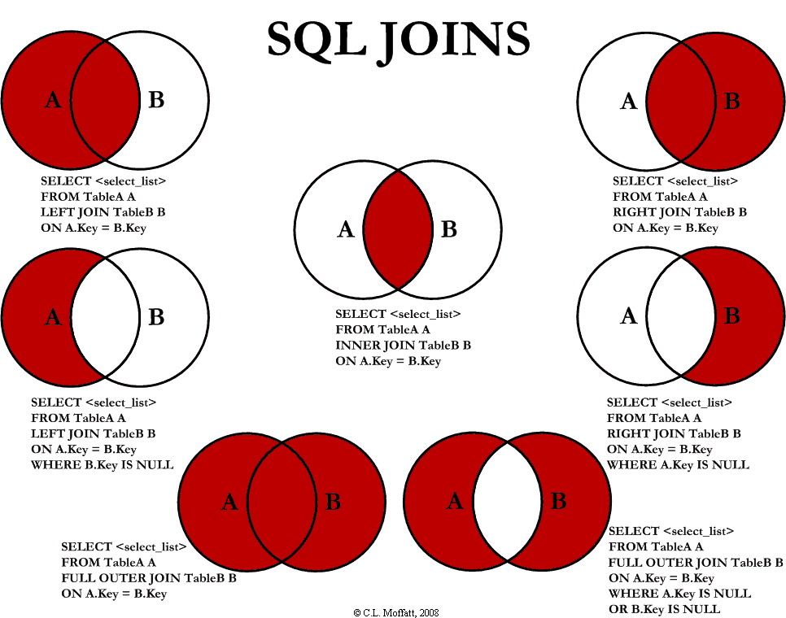

# SQL Queries

## Table of Contents

1. [`SELECT` and the `WHERE` clause](#select)
2. [`GROUP BY`](#group-by)
3. [Joins](#joins)
- Review

## SELECT

The core of retrieving information from a SQL database is the `SELECT` statement:

```sql
SELECT * FROM table_name;
```

This returns all the rows and columns for a particular table. Selecting all the rows and columns is a bit risky though -- if our table held millions of records, retrieving them all at once might be more load than our server is prepared for.

We can reduce the amount of data we retrieve by naming the columns we want to retrieve from the database. You can specify one or more columns like so:

```sql
SELECT col1, col2, col3 FROM table_name;
```

We can also restrict the number of rows we retrieve from the database:

```sql
SELECT col1, col2, col3 FROM table_name LIMIT 5;
```

Try retrieving only the `account_id`, `first_name` and `last_name` from the `AppUser` table. You should see output like this:

```bash
 account_id | first_name | last_name
------------+------------+-----------
          1 | James      | Butt
          2 | Josephine  | Darakjy
          3 | Art        | Venere
          4 | Lenna      | Paprocki
          5 | Donette    | Foller
(5 rows)
```

You should get in the habit of only requesting data that you need.  This doesn't include data exploration, of course.

### WHERE Conditions

Most of the time you don't just want to indiscriminately fetch everything from a given table.  Filtering by different conditions is an important part of learning how to use SQL.

The general syntax is: `SELECT * FROM table_name WHERE [column] [operator] [value];`.

Possible operators include:

operator | description | example |
------ |  ---------- | --- |
=  | equals | `SELECT * FROM students WHERE first_name = 'Andre';` |
<> | not equals | `SELECT * FROM enrollments WHERE grade <> 'A';` |
\>  | greater than | `SELECT * FROM classes WHERE credits > 2;` |
<  | less than | `SELECT * FROM enrollments WHERE grade < 'B';` |
\>= | greater than or equal to | `SELECT * FROM enrollments WHERE grade >= 'B';` |
<= | less than or equal to | `SELECT * FROM enrollments WHERE grade <= 'C';` |
BETWEEN | between values | `SELECT * FROM classes WHERE credits BETWEEN 3 AND 4;` |
LIKE | pattern match, `%` represents wildcard | `SELECT * FROM classes WHERE name like 'SPAN%';` |
IN | match against a list of values | `SELECT * FROM enrollments WHERE grade IN ('A','B');` |

When a single operator isn't enough you can combine them with `AND` and `OR`:

Let's get everyone whose first_name is "Art":

```sql
SELECT * FROM AppUser WHERE first_name = 'Art';
```

```bash
 account_id | first_name | last_name |     email      |             password
------------+------------+-----------+----------------+----------------------------------
          3 | Art        | Venere    | art@venere.org | 927ca2c6b20ce8f72f645715299da5b9
```

Notice the single quotes around the string "Art". In SQL, double quotes are optionally used for column names.

What if we only want users whose emails end in ".com"?

```sql
SELECT * FROM AppUser WHERE email LIKE '%.com';
```

```bash
account_id | first_name |   last_name   |               email                |             password
------------+------------+---------------+------------------------------------+----------------------------------
          1 | James      | Butt          | jbutt@gmail.com                    | 1b9ef408e82e38346e6ebebf2dcc5ece
          4 | Lenna      | Paprocki      | lpaprocki@hotmail.com              | 3bd5b329d175d85bb46b78623153e083
          6 | Simona     | Morasca       | simona@morasca.com                 | b00cc3487bce69b13854779af4cb465a
          7 | Mitsue     | Tollner       | mitsue_tollner@yahoo.com           | fb778b1ccdede07fc8656fe6e6c5c6a7
          8 | Leota      | Dilliard      | leota@hotmail.com                  | 0e40896cce848beb4237f1e4fef5204e
         10 | Kris       | Marrier       | kris@gmail.com                     | 830d2342ce8166f53f569ec822eea115
         11 | Minna      | Amigon        | minna_amigon@yahoo.com             | 02d695a819461ba56acb4edb2b304ad8
         12 | Abel       | Maclead       | amaclead@gmail.com                 | 7576e09f8eaa7b9030fe898cc3247a87
         13 | Kiley      | Caldarera     | kiley_caldarera@aol.com            | 5d253687ac595809d119ec2d03ff7ae7
         15 | Cammy      | Albares       | calbares@gmail.com                 | d2ec5a9c5fb7c3802c9dfb65e17a52c4
         16 | Mattie     | Poquette      | mattie@aol.com                     | 931256559e0f69a7e85c5f951b7ee281
         17 | Meaghan    | Garufi        | meaghan@hotmail.com                | 1321e3b811f46d603933ca63e6c547af
         19 | Yuki       | Whobrey       | yuki_whobrey@aol.com               | 2229eef349226401c1e3a5c224b70d10
         20 | Fletcher   | Flosi         | fletcher_flosi@yahoo.com           | 22c9a5ad5f4c5dedd9fbf0c68ce60710
```

That's more than I want to look at right now.  Sometimes, you don't care that much about particular values, but instead are interested in the bigger picture

### Aggregate Functions

So far we've just been selecting individual rows, but you can also aggregate values from multiple rows. Commonly used aggregate functions include `MIN`, `MAX`, `COUNT`, `SUM` and `AVERAGE`.

Let's say we just want to know how many users have emails ending in ".com":

```sql
SELECT COUNT(*) FROM AppUser WHERE email like '%.com';
```

```bash
 count
-------
   349
```

There are several aggregate functions which you can explore on your own, but another common one you'll see is `AVG`.  Let's get the average number of previous owners per car:

```sql
SELECT AVG(number_of_owners) FROM Car;
```

```bash
        avg
--------------------
 1.9563318777292576
 ```

You can also combine these with WHERE clauses to get more specific results.  This query gets the average number of previous owners per car for cars whose manufacture year is prior to 2008:

```sql
SELECT AVG(number_of_owners) FROM Car WHERE manufacture_year < '2008';
```

## GROUP BY

You remember aggregate functions like `COUNT` and `AVG`.  There are times when you don't just want the count of everything in a table, but instead want to get the count per X.  For example, we can get the count of all distinct models:

```sql
SELECT COUNT(DISTINCT model) FROM CarModel;
```

```bash
 count
-------
    99
```

But what if we want to get the count of models per make?

```sql
SELECT COUNT(*), make FROM CarModel GROUP BY make;
```

Let's clean that up a bit, and order the results by count, starting with the biggest:

```sql
SELECT COUNT(*), make FROM CarModel GROUP BY make ORDER BY COUNT(*) DESC;
```

Actually, that is starting to get too long to read easily. Fortunately SQL doesn't really care about whitespace, so you can write your queries over multiple lines, as long as the query ends with a semicolon:

```sql
SELECT COUNT(*), make 
FROM CarModel 
GROUP BY make 
ORDER BY COUNT(*) DESC;
```

```bash
 count |     make
-------+---------------
     9 | BMW
     7 | Citroen
     7 | Audi
     7 | Toyota
     6 | Nissan
     5 | Volvo
     5 | Peugeot
     5 | Ford
     5 | KIA
     ...
```

Filtering with `GROUP BY` is a little odd.  Let's say we want to get the count of models per make, but we only care about Volvos, Fords, and KIAs.  You might reasonably expect something like this to work:

```sql
SELECT COUNT(*), make 
FROM CarModel 
GROUP BY make 
WHERE make IN ('Volvo', 'Ford', 'KIA');
```

But if you try and run this, you'll get a typically unhelpful error message:

```bash
ERROR:  syntax error at or near "where"
LINE 1: SELECT COUNT(*), make FROM CarModel GROUP BY make where make...
```

The problem here is that when filtering a `GROUP BY` column, you have to use the keyword `HAVING` instead. The correct version of the above query would then be:

```sql
SELECT COUNT(*), make 
FROM CarModel 
GROUP BY make 
HAVING make IN ('Volvo', 'Ford', 'KIA');
```

```bash
 count | make
-------+-------
     5 | Volvo
     5 | Ford
     5 | KIA
```

## JOINS

Up until now, you've only selected records from a single table at a time. Now it's time to really up your SQL game and learn how to join multiple tables together with a single query.

SQL joins come in a number of flavors:



Join Type  | Description |
--- | --- |
INNER  | Returns rows that have a match in **both** tables |
LEFT  | Returns **all rows from the left** table and matching rows from the right |
RIGHT | Returns **all rows from the right** table and matching rows from the left table |
FULL | Returns matching rows from the **left or right** table |

We'll look briefly at other join types later, but 90% of the time you'll be using `INNER JOIN`.

A join can allow us to support a pretty common use case, retrieve users and their advertisements in a single query:

```sql
SELECT * 
FROM AppUser 
INNER JOIN Advertisement 
ON AppUser.account_id = Advertisement.seller_account_id 
LIMIT 5;
```

```shell
 account_id | first_name | last_name |           email           |             password             | advertisement_id |   advertisement_date   | car_id | seller_account_id
------------+------------+-----------+---------------------------+----------------------------------+------------------+------------------------+--------+-------------------
         59 | Delmy      | Ahle      | delmyahle@hotmail.com     | a8d6e005815ed2825ffee7ba8c941941 |                1 | 2014-01-03 00:00:00+00 |      1 |                59
         55 | Karl       | Klonowski | karl_klonowski@yahoo.com  | 6d11daa7b82485e7d7134ba69ba8d02d |                2 | 2014-01-03 00:00:00+00 |      1 |                55
         89 | Stephen    | Emigh     | stephen_emigh@hotmail.com | cb10a8246adfc9e2d2a2cc81ff89db6f |                3 | 2014-07-14 00:00:00+00 |      2 |                89
         26 | Allene     | Iturbide  | allene_iturbide@cox.net   | eb5e77db628971b9881fba19faa48b14 |                4 | 2014-07-26 00:00:00+00 |      3 |                26
         18 | Gladys     | Rim       | gladys_rim@rim.org        | 7178b8de04b73664c61f17c18d338a1d |                5 | 2014-09-15 00:00:00+00 |      4 |                18
```

Let's dissect this query in a bit more detail:

```sql
SELECT * 
FROM AppUser 
INNER JOIN Advertisement 
ON AppUser.account_id = Advertisement.seller_account_id 
LIMIT 5;
```

Breaking it up into its components:

Columns to select | Starting Table | Join Type | Join Table |  How to join the tables |
--- | ---- | --- | --- | --- |
`SELECT *` | `FROM AppUser` | `INNER JOIN` | `Advertisement` | `ON AppUser.account_id = Advertisement.seller_account_id`

The last clause is often the most difficult part to figure out.  We need to explain to the database how we want to "connect" the different rows from each table. In this example we connect each `AppUser` row to a corresponding row in the `Advertisement` table by matching `AppUser.account_id` with `Advertisement.seller_account_id`. You might think of the `ON` in a join as meaning `WHEN`.

We prefixed each column we selected with its table name, this way there isn't any ambiguity when executing the query.  If two different tables happen to have the same column names you will have to fully specify which column you mean, otherwise SQL doesn't require a fully-specified column name.

Note that an `INNER JOIN` will only return rows where there is a match in both tables.  For example, there is one user who has placed no advertisements (Bob Nonparticipant).

You can see that he doesn't show up in the above query:

```sql
SELECT * 
FROM AppUser 
INNER JOIN Advertisement 
ON AppUser.account_id = Advertisement.seller_account_id 
WHERE AppUser.first_name = 'Bob' 
AND AppUser.last_name = 'Nonparticipant';
```
```bash
 account_id | first_name | last_name | email | password | advertisement_id | advertisement_date | car_id | seller_account_id
------------+------------+-----------+-------+----------+------------------+--------------------+--------+-------------------
```

even though he exists in the AppUser table:

```sql
 WHERE AppUser.first_name = 'Bob' 
 AND AppUser.last_name = 'Nonparticipant';
 ```

 ```bash
 account_id | first_name |   last_name    |     email     |             password
------------+------------+----------------+---------------+----------------------------------
        482 | Bob        | Nonparticipant | bob@yahoo.com | ff38ca9b84b9f5acd849848f5dbeb1bf
 ```


Let's look at one final example.  Let's get the number of doors for every make and model:

```sql
SELECT CarModel.make, CarModel.model, Car.number_of_doors 
FROM Car 
JOIN CarModel 
ON Car.car_model_id = CarModel.car_model_id 
LIMIT 10;
```

```bash
     make      |    model     | number_of_doors
---------------+--------------+-----------------
 Peugeot       | 308          |               5
 Opel          | Corsa        |               3
 Citroen       | C3           |               5
 Mercedes Benz | C klasse     |               4
 Toyota        | Land Cruiser |               3
 Ferrari       | 458 Italia   |               3
 BMW           | 3er          |               3
 Ford          | Mondeo       |               3
 Volkswagen    | Tuareg       |               4
 Skoda         | Fabia        |               4
 ```

You can join multiple tables together in one query 

Let's say you want to get the distinct street names of anyone in New Orleans who placed an ad in May of 2014:

```sql
SELECT DISTINCT p.street_name 
FROM UserProfile p 
JOIN AppUser a 
ON a.account_id = p.account_id 
JOIN Advertisement ad 
ON ad.seller_account_id = a.account_id 
WHERE p.city = 'New Orleans' 
AND extract(MONTH FROM ad.advertisement_date) = 5;
```

```bash
   street_name
-----------------
 Hamilton street
```

[Here](https://www.techonthenet.com/postgresql/functions/index.php) is a list of some useful built-in functions, such as `extract`.

Note that we're using aliases to rename the tables.  This is purely for convenience, though it is standard practice.  Here it is without aliasing the tables:

```sql
SELECT DISTINCT UserProfile.street_name 
FROM UserProfile 
JOIN AppUser 
ON AppUser.account_id = UserProfile.account_id 
JOIN Advertisement 
ON Advertisement.seller_account_id = AppUser.account_id 
WHERE UserProfile.city = 'New Orleans' 
AND extract(MONTH FROM Advertisement.advertisement_date) = 5;
```

## Challenges

- [SQL Queries 1](https://github.com/echoplatoonew/sql_queries_1)
- [SQL Zoo](http://sqlzoo.net/)

SQL Queries: SELECT, GROUP BY, Joins (use cars database)

## References

- [SQL Joins as a Venn Diagram](https://stackoverflow.com/questions/13997365/sql-joins-as-venn-diagram)