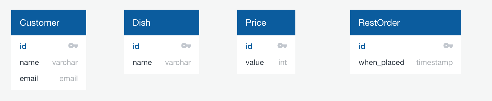
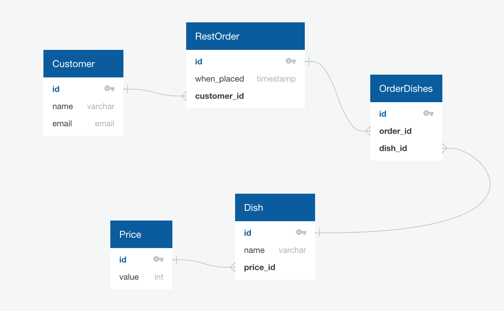

# SQL Schema Design: Restaurant

[Restaurant db](https://github.com/echoplatoonew/restaurant-db)

Let's say we wanted to design the schema for a restaurant.  There are any number of different ways we might implement something like that, but keeping things simple and making some assumptions, we'll start by defining our entities.

### Entities
- Customer
- Dish
- Price
- Order (NOTE: "order" is a reserved word, so we'll use "RestOrder")

`Price` probably seems odd, and it is.  But for the sake of this example we're assuming that this restaurant only has a few different price categories (i.e. side dishes are $3, entrees are $8, and a meal is $10).

The first pass at a minimal solution might look like this:



### Relationships
If we're happy with that we can move on to the relationships.  There are a few obvious relationships here:

- __Customer - RestOrder__: A customer can have many orders, an order belongs to one customer
- __Price - Dish__: A price can be associated with many dishes, a dish has one price
- __Dish - RestOrder__: A dish can belong to many orders, and an order can have many dishes

Because the relationship between Dish and RestOrder is many-to-many, we're going to have to add another table to represent that relationship:



Now that we have a something to look at, let's implement this design in SQL.

### SQL Implementation
```sql
create table Customer (
  id serial primary key,
  name varchar(100),
  email varchar(100)
);

create table RestOrder (
  id serial primary key,
  when_placed date,
  customer_id int references Customer(id)
);

create table Price (
  id serial primary key,
  value int
);

create table Dish (
  id serial primary key,
  name varchar(50),
  price_id int references Price(id)
);

create table OrderDishes (
  id serial primary key,
  order_id int references RestOrder(id),
  dish_id int references Dish(id)
);
```
__NOTE: Just like Python, Postgres has [reserved keywords](https://www.postgresql.org/docs/current/sql-keywords-appendix.html).  You shouldn't use them in your tablenames.  Unfortunately the list of reserved keywords includes things like "user" and "order"--beware!__

At this point you would want to insert some dummy data and then write queries to make sure things are working as you expect.

### Queries
The example db in this repo already has data ready to go.  As a test, answer the question, "How much has Randy spent at the restaurant?"

First let's get Randy's Customer.id:
```sql
select id from Customer where name = 'Randy';
```
```bash
 id 
----
  3
```

Then join all the necessary tables together, filtering by the Customer.id that we're interested in:
```sql
select c.name, sum(p.value) 
  from Customer c 
  join RestOrder o 
    on o.customer_id = c.id 
  join orderDishes od 
    on o.id = od.order_id 
  join Dish d 
    on od.dish_id = d.id 
  join Price p 
    on p.id = d.price_id 
  where c.id = 3 
group by c.name;
```
```bash
 name  | sum 
-------+-----
 Randy |  84
 ```
 
Or more directly:
 ```sql
select c.name, sum(p.value) 
  from Customer c 
  join RestOrder o 
    on o.customer_id = c.id 
  join orderDishes od 
    on o.id = od.order_id 
  join Dish d 
    on od.dish_id = d.id 
  join Price p 
    on p.id = d.price_id 
  where c.name = 'Randy' 
group by c.name;
```
```bash
 name  | sum 
-------+-----
 Randy |  84
 ```

### Advanced Queries
Or if you want to get really fancy, you can have select statements inside select statements:
```sql
select c.name, sum(p.value) 
  from Customer c 
  join RestOrder o 
    on o.customer_id = c.id 
  join orderDishes od 
    on o.id = od.order_id 
  join Dish d 
    on od.dish_id = d.id 
  join Price p 
    on p.id = d.price_id 
  where c.id = (select id from Customer where name = 'Randy') 
group by c.name;
```
```bash
 name  | sum 
-------+-----
 Randy |  84
 ```


## Challenges
[Grubhub Schema Design](https://github.com/echoplatoonew/grubhub_schema)
