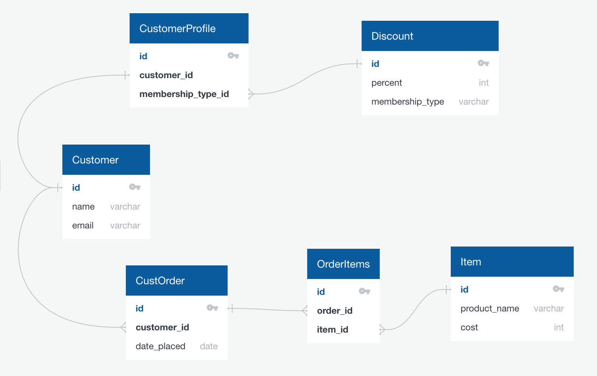

# SQL Schema Design: Grocery Store

[Grocery Store db](https://github.com/code-platoon-assignments/grocery-store-db)

Today we're going to design the database schema for a grocery store.

### Entities
We'll start with the following entities:
- Customer (will store basic info about a customer)
- Discount (will store the membership type (i.e. "gold"), and the discount rate)
- CustomerProfile (will store supplemental info about a customer, especially a reference to membership type)
- Item (grocery goods)
- CustOrder (a given customer's order)

### Relationships
Here are some possible relationships these tables could have to each other:
- a Customer has a CustomerProfile, and a CustomerProfile belongs to a customer (one-to-one)
- a CustomerProfile has zero or one references to a membership type (Discount), and a Discount can belong to many CustomerProfiles (one-to-many)
- an Item could belong to many CustOrders, and a CustOrder could have many Items (many-to-many)

Since we can't directly express a many-to-many relationship in SQL, we'll have to create another table to connect Item with CustOrder.

Our revised entity list:
- Customer (will store basic info about a customer)
- Discount (will store the membership type (i.e. "gold"), and the discount rate)
- CustomerProfile (will store supplemental info about a customer, especially a reference to membership type)
- Item (grocery goods)
- CustOrder (a given customer's order)
- OrderItems (a way to associate an Item with a CustOrder)

For your own sanity, you should always take the time to create a visual representation of your schema:


### SQL Implementation
```sql
CREATE TABLE Customer (
    id SERIAL PRIMARY KEY,
    name VARCHAR(100),
    email VARCHAR(255) NOT NULL
);

CREATE TABLE Discount (
    id SERIAL PRIMARY KEY,
    percent INTEGER,
    membership_type VARCHAR(10)
);

CREATE TABLE CustomerProfile (
    id SERIAL PRIMARY KEY,
    customer_id INTEGER REFERENCES Customer(id),
    membership_type_id INTEGER REFERENCES Discount(id)
);

CREATE TABLE Item (
    id SERIAL PRIMARY KEY,
    product_name VARCHAR(100),
    cost INTEGER
);

CREATE TABLE CustOrder (
    id SERIAL PRIMARY KEY,
    customer_id INTEGER REFERENCES Customer(id),
    date_placed DATE
);

CREATE TABLE OrderItems (
    id SERIAL PRIMARY KEY,
    order_id INTEGER REFERENCES CustOrder(id),
    item_id INTEGER REFERENCES Item(id)
);
```

### Queries
What is Dalton's membership type?
```sql
select membership_type, percent 
from Customer c
join CustomerProfile cp
on c.id = cp.customer_id
join Discount d
on cp.membership_type_id = d.id
where c.name = 'Dalton';
```
```bash
 membership_type | percent 
-----------------+---------
 Silver          |      20
```

What is the distribution of membership types among customers?
```sql
select count(*), membership_type
from Customer c
join CustomerProfile cp
on c.id = cp.customer_id
left join Discount d
on cp.membership_type_id = d.id
group by membership_type;
```
```bash
 count | membership_type 
-------+-----------------
    23 | 
     8 | Silver
    10 | Bronze
     9 | Gold
```
Notice the left join to Discount.  What happens if you use an inner join there instead?


#### Advanced Queries (Do not worry about these)
How many customers have no discount vs. have one?
```sql
with membership_count_by_type as (
  select count(*) as total, membership_type
  from Customer c
  join CustomerProfile cp
  on c.id = cp.customer_id
  left join Discount d
  on cp.membership_type_id = d.id
  group by membership_type
)
select sum(total),
  case 
    when membership_count_by_type.membership_type is null
    then 'nonmember'
    else 'member'
  end as cust_type
from membership_count_by_type
group by 2;
```
```sql
 sum | cust_type 
-----+-----------
  27 | member
  23 | nonmember
```

What percent of customers have no discount vs. have one?
```sql
with membership_count_by_type as (
  select count(*) as total, membership_type
  from Customer c
  join CustomerProfile cp
  on c.id = cp.customer_id
  left join Discount d
  on cp.membership_type_id = d.id
  group by membership_type
), sum_by_cust_type as (
  select sum(total) sum_total,
    case 
      when membership_count_by_type.membership_type is null
      then 'nonmember'
      else 'member'
    end as cust_type
  from membership_count_by_type
  group by 2
)
select cust_type, (sum_total / SUM(sum_total) OVER ()) AS proportion
from sum_by_cust_type;
```
```bash
 cust_type |       proportion       
-----------+------------------------
 member    | 0.54000000000000000000
 nonmember | 0.46000000000000000000
 ```
Note the use of a [window function](https://www.postgresqltutorial.com/postgresql-window-function/) (which you absolutely do not need to know about for this course).


## Challenges

[Grocery Store Schema II](https://github.com/echoplatoonew/grocery-store-db-ii)

[Blue Apron Schema Design](https://github.com/echoplatoonew/blue_apron_schema) 
