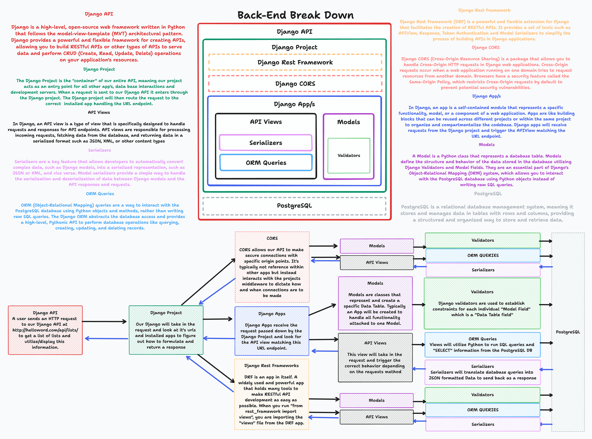

# Django

## Module Topics

- [Intro to Django & Django-ORM](./Day1/part-I/Intro-Django-ORM/README.md)
- [Django Model Validators](./Day2/part-I/Intro-Validators-and-Tests/README.md)
- [Django Model Serializers](./Day2/part-II/Intro-to-Serializers/README.md)
- [Django Model Associations](./Day3/part-I/Intro-to-Django-Associations/README.md)
- [Django Rest Frameworks](./Day4/part-I/Django-Rest-Frameworks-API-Views/README.md)
- [BackEnd API's](./Day5/Back-End-APIs/README.md)
- [CRUD Capabilities and Best Practices](./Day6/part-I/Intro-to-CRUD/README.MD)
- [Django User Authentication](./Day7/Django-Auth/README.md)
- [Full Stack Life Cycle](./Day8/README.md)

## What is Django?

Django is a high-level web framework written in Python that allows developers to build robust and scalable web applications quickly. It follows the Model-View-Controller (MVC) architectural pattern, emphasizing reusability and the "Don't Repeat Yourself" (DRY) principle. Django provides a comprehensive set of tools and libraries that simplify the development process and promote best practices.

## Django Rest Framework (DRF)

Django Rest Framework (DRF) is an extension to Django that facilitates the creation of RESTful APIs. It provides a powerful set of tools for serializing and deserializing data, handling authentication and authorization, handling requests, and responding with appropriate HTTP status codes.

> Please read ["Why DRF"](./Resources/Why_DRF.md) if you are interested on this Django Extension

### Interacting with Django

DRF seamlessly integrates with Django, leveraging its features to build RESTful APIs. DRF uses Django's URL routing system to define API endpoints, allowing developers to map URLs to views and control how requests are handled. DRF also integrates with Django's authentication and authorization mechanisms, making it easy to secure API endpoints.

DRF leverages Django's powerful Object-Relational Mapping (ORM) to interact with databases. It provides serializers that allow conversion between complex data types, such as Django models, and Python data types suitable for rendering into JSON or other content types. DRF's serializers simplify the process of validating incoming data and saving it to the database.

## Django ORM and PostgreSQL

Django's ORM is a powerful feature that allows developers to interact with databases without writing raw SQL queries. It abstracts the underlying database engine and provides a high-level, Pythonic API for performing common database operations.

When working with PostgreSQL, Django's ORM seamlessly integrates with the database engine. Django provides a PostgreSQL-specific backend that enables advanced features like JSON field support, full-text search, and advanced querying capabilities. Developers can define models that represent database tables and perform CRUD (Create, Read, Update, Delete) operations using Django's ORM, which automatically generates the necessary SQL queries.

## Django's Capabilities and Limitations

### Capabilities

1. Rapid Development: Django's philosophy of "batteries included" means it comes with numerous built-in features and libraries, making development faster and more efficient.

2. Scalability: Django's architecture supports the development of scalable applications by leveraging its modular design, caching mechanisms, and support for horizontal scaling.

3. Security: Django provides numerous security features such as protection against common web vulnerabilities like cross-site scripting (XSS), cross-site request forgery (CSRF), and SQL injection attacks.

4. Community and Ecosystem: Django has a vibrant community and a vast ecosystem of packages and extensions, providing solutions for various use cases and integrations.

### Limitations

1. Complexity: Django's extensive feature set can be overwhelming for beginners, requiring a learning curve to master its concepts and best practices.

2. Flexibility: Django follows a specific design philosophy and conventions, which might limit flexibility in certain scenarios where a more customized approach is required.

3. Performance: While Django is highly optimized, its performance may not be on par with more lightweight frameworks when handling extremely high traffic loads. However, Django's caching mechanisms and scalability features can mitigate performance concerns.

## Why Django?

Django is an excellent choice for building RESTful APIs due to its robustness, scalability, and extensive ecosystem. Here are a few reasons why developers choose Django:

1. Rapid Development: Django's built-in features, such as the admin interface, authentication, and database handling, accelerate the development process.

2. Comprehensive Documentation: Django provides detailed and comprehensive documentation, making it easy for developers to learn and understand its features.

3. Security: Django incorporates security best practices, mitigating common web vulnerabilities and providing a secure foundation for API development.

4. ORM and Database Abstraction: Django's ORM simplifies database interactions, allowing developers to focus on business logic instead of writing raw SQL queries.

5. Community and Ecosystem: Django has a large and active community that provides support and contributes to the framework's growth. The vast ecosystem of packages and extensions offers solutions for various use cases.

In conclusion, Django is a powerful back-end framework that excels in building RESTful APIs. Its integration with Django Rest Framework and Django ORM simplifies the development process, while PostgreSQL compatibility adds advanced database capabilities. Despite its complexity and some limitations, Django's capabilities, security features, and robustness make it a popular choice for building scalable and maintainable APIs.

> Note: This markdown file provides an overview of Django as a back-end framework for building RESTful APIs. For more detailed information, please refer to the official Django documentation and Django Rest Framework documentation.

## What you'll be able to accomplish by the end of this Module

- Build a CRUD capable Application Programming Interface(API)
  - Create an item for a database table
  - Read an item from database table
  - Update an item from database table
  - Delete a item from database table
- Build a User Authentication Capable API
- Build Back-End Model View Controllers (MVC's)

### [**More About Djangos popularity**](https://lp.jetbrains.com/django-developer-survey-2021-486/)
