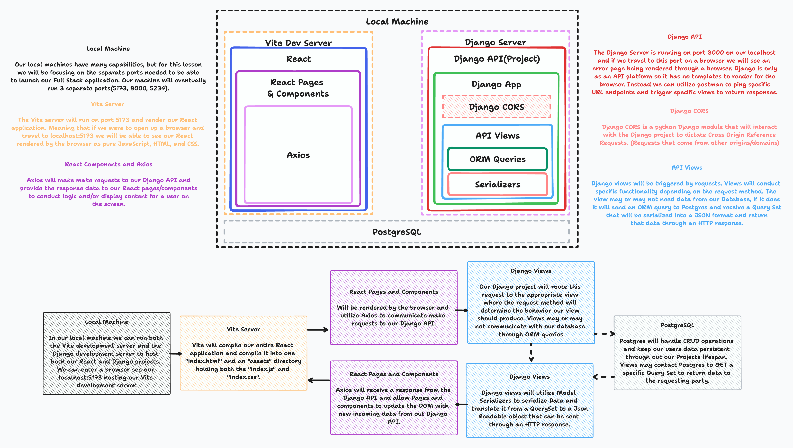

# Pokedex Front-End

## Intro

> In this lesson you will learn how to send requests from your Vite + React Front-End application to your Django Back-End API to `GET` information from our PostgreSQL database and render it in our User Interface.



## Full-Stack Life Cycle of a Web Application

1. User Interaction
   The life cycle begins when a user interacts with the frontend application. This can include actions like clicking buttons, submitting forms, or any other user-triggered events.

2. Frontend Axios Request
   When the user performs an action, Axios is utilized in the frontend to send an HTTP request to a specific API endpoint on the backend. The request includes the desired HTTP method and any required data.

3. Backend Django View (APIView)
   The Django backend receives the request and routes it to the appropriate DRF APIView based on the URL pattern and HTTP method. The APIView contains the logic to handle the request and perform necessary business operations.

4. Database Interaction and Serializer
   If data retrieval or modification is needed, the APIView can interact with the database to fetch or update the required data. This interaction depends on the request's purpose and the application's design. After obtaining data from the database or performing any necessary manipulations, the APIView may use a DRF serializer to convert the data into the suitable format for the API response.

5. Backend API Response
   The APIView generates an HTTP response with the processed data or any relevant error messages. The response is then sent back to the frontend as the result of the Axios request.

6. Frontend Axios Response Handling
   In the frontend, Axios receives the API response. If the response is successful, Axios extracts the data and triggers the appropriate actions to update the user interface. In case of errors, Axios handles the errors and provides appropriate feedback to the user.

7. UI Update
   Based on the API response, the frontend updates the user interface to reflect changes, display data, or show error messages. This step ensures that the user gets an updated and interactive experience.

8. User Interaction (Cycle Continues)
   The updated user interface is presented to the user, and the cycle of user interaction, Axios

## Creating a Pokedex React Front-End

> At this point we are all pretty familiar with vite and how it works, but before we go and start creating new folders and projects we need to organize our project a bit better. We've seen how many files and directories are generated when we start a Django or React application so lets make sure that our directories are neatly structured. Create a `pokedex` directory holding two other directories [`front-end` and `back-end`]. Move all of our Django API into the `back-end` directory to ensure none of our files are hanging around where we don't need them. Finally change directory into the `front-end` directory and start a new vite application with the following command:

```bash
npm create vite . # <== Don't forget the DOT!!
# select React
# select JavaScript
npm install
npm run dev
```

> If you open the `front-end` directory, you'll see all your React and Vite related files meaning we are ready to install any dependencies we will need for this project.

```bash
npm install axios
npm install react-router-dom
npm install react-bootstrap bootstrap
```

> Throw away all the previous code from `App.jsx`, `index.css`, and `App.css`. Insert the following within our `App.jsx`.

```javascript
import Container from "react-bootstrap/Container";
import Row from "react-bootstrap/Row";

export default function App() {
  return (
    <Container>
      <Row style={{ textAlign: "center" }}>
        <h1>POKEDEX</h1>
      </Row>
      <Row style={{ textAlign: "center", padding: "0 10vmin" }}>
        <p>
          <strong>Welcome to Code Platoons Pokedex Application!!</strong>
          <br />
          In this application users will be able to view Pokedex information of
          a limited amount of Pokemon. We are still on our first version, but as
          we build up our Database we are sure more and more useful information
          will be provided by this application.
        </p>
      </Row>
    </Container>
  );
}
```

> In a browser open [http://localhost:5173/](http://localhost:5173/) to view our very dry and straight forward react Application. Now we know our `App.jsx` is rendering correctly and we know it's a bit more responsive to screen size thanks to React BootStraps Container and Row components. Lets add `react-browser-router` to the mix and begin and create a couple of pages.

```bash
# front-end/src/
mkdir pages
touch pages/Home.jsx
touch pages/Pokemon.jsx
touch pages/Moves.jsx
```

> Fill in the pages we've just created with the following code.

```javascript
// front-end/src/pages/Home.jsx
import Row from "react-bootstrap/esm/Row";

export const Home = () => {
  return (
    <Row style={{ textAlign: "center", padding: "0 10vmin" }}>
      <p>
        <strong>Welcome to Code Platoons Pokedex Application!!</strong>
        <br />
        In this application users will be able to view Pokedex information of a
        limited amount of Pokemon. We are still on our first version, but as we
        build up our Database we are sure more and more useful information will
        be provided by this application.
      </p>
    </Row>
  );
};

// front-end/src/pages/Moves.jsx
import Row from "react-bootstrap/esm/Row";

export const Moves = () => {
  return (
    <Row style={{ textAlign: "center", padding: "0 10vmin" }}>
      <h1>Moves</h1>
    </Row>
  );
};

// front-end/src/pages/Pokemon.jsx
import Row from "react-bootstrap/esm/Row";

export const Pokemon = () => {
  return (
    <Row style={{ textAlign: "center", padding: "0 10vmin" }}>
      <h1>Pokemon</h1>
    </Row>
  );
};
```

> Create a `react-router` within a `router.jsx` file located on the same level as `App.jsx` and fill it in with the following router.

```javascript
// front-end/src/router.jsx
import { createBrowserRouter } from "react-router-dom";
import App from "./App";
import { Pokemon } from "./pages/Pokemon";
import { Home } from "./pages/Home";
import { Moves } from "./pages/Moves";

const router = createBrowserRouter([
  {
    path: "/",
    element: <App />,
    children: [
      {
        index: true,
        element: <Home />,
      },
      {
        path: "pokemon",
        element: <Pokemon/>,
      },
      {
        path: "moves",
        element: <Moves />,
      },
    ],
  },
]);

export default router;
```

> Change `main.jsx` and `App.jsx` to the following code

```javascript
// front-end/src/main.jsx
import React from 'react'
import {RouterProvider} from "react-router-dom"
import router from "./router"
import ReactDOM from 'react-dom/client'
import './index.css'

ReactDOM.createRoot(document.getElementById('root')).render(
  <RouterProvider router={router} />
)

// front-end/src/App.jsx
import Container from "react-bootstrap/Container";
import Row from "react-bootstrap/Row";
import { Outlet } from "react-router-dom";

export default function App() {
  return (
    <Container>
      <Row style={{ textAlign: "center" }}>
        <h1>POKEDEX</h1>
      </Row>
      <Outlet/>
    </Container>
  );
}
```

> Finally, create a `components` directory with a `Navbar.jsx` file containing `Link` tags to our individual url paths that we can plug into our `App.jsx`.

```javascript
// front-end/src/components/Navbar.jsx
import Row from "react-bootstrap/esm/Row";
import { Link } from "react-router-dom";

export const Navbar = () => {
    return (
        <Row style={{display:"flex", justifyContent:"space-around"}}>
            <Link to="/">Home</Link>
            <Link to="pokemon">Pokemon</Link>
            <Link to="moves">Moves</Link>
        </Row>
    )
}

// front-end/src/App.jsx
import Container from "react-bootstrap/Container";
import Row from "react-bootstrap/Row";
import { Outlet } from "react-router-dom";
import { Navbar } from "./components/Navbar";

export default function App() {
  return (
    <Container>
      <Row style={{ textAlign: "center" }}>
        <h1>POKEDEX</h1>
      </Row>
      <Navbar />
      <Outlet/>
    </Container>
  );
}
```

> Now we have a fully functional React front-end with routing capabilities that we can use to contact our Django API through axios and render our Database information to the user.
