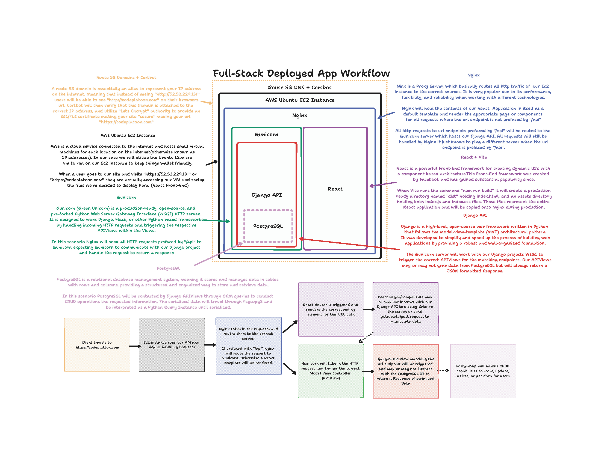

# Deployment

## Table of Contents

- [Understanding a Deployed Site on the Internet](#1-understanding-a-deployed-site-on-the-internet)
- [Configurations and Set Up](#2-configurations-and-set-up)
- [Creating an Ubuntu EC2 t2.micro Instance](#3-creating-an-ubuntu-ec2-t2micro-instance)
- [Connecting to EC2 Instance via SSH](#4-connecting-to-ec2-instance-via-ssh)
- [Setting Up Ubuntu's Dependencies](#5-setting-up-ubuntus-dependencies)
- [Getting Nginx to serve our React Application](#6-getting-nginx-to-serve-our-react-application)
- [Gunicorn and Django](#7-gunicorn-and-django)
- [Nginx and Gunicorn](#8-nginx-and-gunicorn)
- [Making back-end calls from our Front-End application](#9-making-back-end-calls-from-our-front-end-application)
- [AWS Route53](#10-aws-route53)
- [Certbot](#11-certbot)

## 1. Understanding a Deployed Site on the Internet



When a user types in "https://codeplatoon.com", "codeplatoon.com" represents the domain name of a website hosted on an AWS EC2 t2.micro instance running Ubuntu (this is essentially just a Virtual Machine). AWS (Amazon Web Services) EC2 is a cloud computing service that provides resizable compute capacity in the cloud. The t2.micro instance is a low-cost, general-purpose instance type suitable for small applications.

To handle the domain name, the website uses Route53, which is AWS's domain name system (DNS) service. Route53 allows users to manage domain names and associate them with the EC2 instance's IP address, enabling users to access the site using the domain name instead of the IP address.

The "https" in the URL stands for Hypertext Transfer Protocol Secure, indicating that the website uses a secure SSL/TLS (Secure Sockets Layer/Transport Layer Security) connection. To enable SSL on the website and protect data transmitted between the user's browser and the server, the website utilizes an SSL certificate obtained through Certbot. Certbot is a free and open-source tool that automates the process of obtaining and renewing SSL certificates from the Let's Encrypt Certificate Authority.

Once the secure connection is established, the website serves a React application using Nginx as the web server. Nginx is a popular and efficient web server that can handle concurrent requests and serve static files. It acts as a reverse proxy, forwarding requests to the React application and handling the responses.

The React application, running on the client-side in the user's browser, provides a dynamic and responsive user interface. It interacts with the Django API hosted on the same EC2 instance. Django is a high-level Python web framework that facilitates the development of powerful and scalable web applications. The Django API handles various user requests, processes data, interacts with a database, and sends responses back to the React application through HTTP requests.

To handle the communication between the Nginx server and the Django API, the website uses Gunicorn (Green Unicorn), a Python Web Server Gateway Interface (WSGI) server. Gunicorn acts as a middleman between Nginx and Django, allowing multiple requests to be processed concurrently.

In summary, when a user types in "https://helloworld.com," AWS Route53 translates the domain name to the IP address of the EC2 instance. The SSL certificate obtained through Certbot ensures a secure connection. Nginx serves the React application, which runs in the user's browser, providing a dynamic user interface. The React application communicates with the Django API hosted on the EC2 instance through Gunicorn, enabling data processing and retrieval for a seamless user experience. The combination of these technologies and services allows for a fully functional and secure web application deployed on AWS.

## 2. Configurations and Set Up

### Django

> We'll need to make a few changes to our Django API to prepare it for deployment. First we have to make sure that all of our secret keys are within a `.env` file so we can prevent any vital information from being exposed.

```python
# project/settings.py
SECRET_KEY = os.environ.get("SECRET_KEY")

DEBUG = False

ALLOWED_HOSTS = ["*"]

CORS_ALLOW_ALL_ORIGINS = True
```

- DEBUG

> The DEBUG setting determines whether Django is in "debug" mode. When DEBUG is set to True, it enables various debugging features like detailed error pages with stack traces and information about the context of errors. This is useful during development for identifying and fixing issues in the code.

> However, for production environments, it is crucial to set DEBUG to False. When in production, Django's debug mode should be disabled to prevent exposing sensitive information to users and potential attackers. When DEBUG is set to False, Django will display generic error pages for exceptions, which helps to protect sensitive information and maintain the security of the application.

- ALLOWED_HOSTS

> The ALLOWED_HOSTS setting specifies a list of hostnames or IP addresses that Django will consider as valid for serving the application. When a request is made to Django, it checks whether the Host header in the request matches any of the values in the ALLOWED_HOSTS list. If it doesn't find a match, Django will raise a "Bad Request (400)" error.

> In the given configuration, the ALLOWED_HOSTS is set to ["*"], which means that any hostname or IP address is allowed to access the application. While this might be convenient for testing purposes or for applications without a specific domain, it is generally not recommended for production environments. For production, it is essential to specify the actual hostnames or IP addresses that should be allowed to access the application, as this helps prevent unauthorized access to the application.

- CORS_ALLOW_ALL_ORIGINS

> The CORS_ALLOW_ALL_ORIGINS setting is related to Cross-Origin Resource Sharing (CORS) policy. CORS is a security feature implemented by web browsers to restrict web pages from making requests to a different domain than the one from which the web page originated. This security measure is in place to prevent cross-site request forgery (CSRF) and other potential security risks.

> In the given configuration, CORS_ALLOW_ALL_ORIGINS is set to True, which means that any origin (domain) is allowed to make requests to the Django application. This effectively disables the CORS policy and allows requests from any domain. Similar to the ALLOWED_HOSTS setting, this configuration should generally be avoided in production environments.

> For production, it is recommended to specify specific origins that are allowed to access the Django application. For example, you can use the CORS_ALLOWED_ORIGINS setting to list the domains that are allowed to make cross-origin requests. This helps to enforce a more secure CORS policy and prevent potential security vulnerabilities.

> We will keep these values to get our project served first and then we will go back and configure these settings to make our application as secure as possible.

## 3. Creating an Ubuntu EC2 t2.micro Instance

To deploy our application, we need an Ubuntu EC2 instance, but what exactly are we creating?

> The "t2.micro" instance type is part of AWS's T2 family of instances, which are designed for general-purpose workloads. The "micro" size denotes that it is one of the smallest instance types available, suitable for low-demand applications or for users who want to get started with AWS on a budget.

> The "t2.micro" instance provides a single virtual CPU (vCPU) and 1 GB of RAM. It also includes a burstable performance feature, which allows the instance to accumulate "CPU credits" during periods of low CPU utilization. When the instance requires more processing power, it can consume these credits to burst its CPU performance temporarily.

> As an Ubuntu t2.micro EC2 instance runs Ubuntu Linux, users have access to a reliable and widely-used operating system with a vast community and extensive documentation. It offers a familiar environment for developers and system administrators who are accustomed to working with Linux distributions.

We'll create a `t2.micro` instance using the AWS Management Console and generate a PEM certificate for SSH access.

1. Sign in to your AWS Management Console.
2. Navigate to EC2 Dashboard and click "Launch Instance."
3. Choose "Ubuntu Server 20.04 LTS" as the instance type.
4. Select "t2.micro" as the instance size and follow the prompts to configure the instance.
5. In the "Security Group" settings, open ports 22 (SSH), 80 (HTTP), and 443 (HTTPS).
6. Download the PEM certificate
7. Launch the instance

**Keep your PEM certificate secure, as it provides access to your EC2 instance!**

## 4. Connecting to EC2 Instance via SSH

Now that we have our PEM key and our Ec2 instance launched we can enter our Ubuntu VM through SSH. To connect to the EC2 instance via SSH, use the following command:

```bash
ssh -i <your_pem_key>.pem ubuntu@<ip_address>
```

> Replace `your-aws.pem` with the actual PEM certificate file and `your-ec2-instance-public-ip` with the EC2 instance's public IP address(from AWS-EC2-Instances there's a header named Public IPv4 address).

### Handling PEM Key Permissions

> You might have gotten an error about the permissions on your private SSH key. If so, we need to change the permissions on our private key to make it more secure.

> **About permissions:** There are 3 things you can do to a file(`r`ead, `w`rite, and e`x`ecute) By running `ls -l` in your terminal, you'll see a list of files in your current directory with their corresponding permissions in the following format: `-rw-r--r--@`.

> Lets take a second to break this down. the first `-rw-` is in reference to the users permissions (who can read and write on this file), the second portion of `r--` is in reference to staff(who are only able to read this file), and the last set of permission is in reference to anyone (who is only able to read this file).

> Now that we know how to read these bootstrapped permission message, let's talk about what they mean. Every segment of 3 letters actually represents a binary string under the hood meaning `rw-r--r--` is equal to `110-100-100` which in decimal representation (we won't be covering this today) equates to `644`.

> This means that if I wanted to change a files permissions on my computer to where `I`(the user) can read and write on said file, I'd simply run the command `chmod 600`.

```bash
# 600 => 110-000-000 => rw------- => (users can read&write)(staff none)(anyone none)
chmod 600 your-aws.pem
```

Once you've done this step you'll notice your terminal looks a bit different... That's because you are no longer within your own local machine, you've officially entered a VM hosted on the AWS cloud!!!

## 5. Setting Up Ubuntu's Dependencies

> After we successfully log into the server, we'll need to clone our project repository. Conveniently, git is preinstalled on the server.

```bash
git clone <repo_url>
```

Unfortunately, many other tools that we need are not installed so we will have to install them ourselves manually.

```bash
# Update package lists
sudo apt update

# Install Python 3 package manager
sudo apt install python3-pip

# Install PostgreSQL database server
sudo apt install postgresql

# Create a PostgreSQL superuser with your current user name
sudo -u postgres createuser --superuser $USER

# Install the PostgreSQL development library
sudo apt install libpq-dev

# Install Nginx web server (core components)
sudo apt install nginx-core

# Install Python dependencies from requirements.txt
pip install -r requirements.txt

# Create a PostgreSQL database with a name of your choice
createdb <database_name>

# Run Django database migrations
python3 manage.py migrate

# Install Node.js package manager (npm)
sudo apt install npm

# Install Node.js version manager (n)
sudo npm install -g n

# Install the latest stable version of Node.js
sudo n stable

# Install JavaScript dependencies (from package.json)
npm install

# Build the project using npm
npm run build
```

## 6. Getting Nginx to serve our React Application

Our Vite development server works fine for local development but when it comes to production it seems to struggle in rendering the correct information in a secure, and scalable manner. Instead we want to utilize a `proxy server` named `Nginx` to handle all http traffic that comes through our Ec2 Instance.

### What is Nginx?

> Nginx is a popular and powerful open-source web server, reverse proxy server, and load balancer. It is designed to handle high concurrency, high-performance tasks, and efficiently serve static content while consuming minimal system resources. Nginx is widely used for hosting websites, web applications, and content delivery networks (CDNs).

### Configuring Nginx

> The main, global config file for nginx is located at `/etc/nginx/nginx.conf`. The first line of this file specifies the user that nginx runs as. By default, it's `www-data`, but we need to change it to the owner of the application files, `ubuntu`. We will have to utilize `sudo vim` to be able to access this file and change it's value. You could instead change the owner of the application files to `www-data` using the command `chown`, if you prefer that. What matters is that they match.

```bash
user www-data; #<--- Change this to ubuntu
worker_processes auto;
pid /run/nginx.pid;
include /etc/nginx/modules-enabled/*.conf;

events {
        worker_connections 768;
        # multi_accept on;
}

http {

        ##
        # Basic Settings
        ##
```

> There is a second config file, located in `/etc/nginx/sites-enabled/default`, which contains information specific to the application we want to run. In the config below, nginx will listen on port 80, and then handle the http request by rendering our React application. Let's first set up our `default` file through vim.

```bash
server {
  listen 80 default_server;
  listen [::]:80 default_server;

  index index.html index.htm index.nginx-debian.html;
  server_name _;

  location / {
          root /usr/share/nginx/html/dist;
          try_files $uri $uri/ /index.html;
        }
}
```

> Currently we are telling `Nginx` that it will find our index.html from our built directory within `/usr/share/nginx/html/dist` but that's not the case. Our `dist` directory is actually living within our `front_end` directory. We could fix this by simply copying the `dist` directory onto `/usr/share/nginx/html` with the following command.

```bash
cp -r <path_to_dist_dir>/dist /usr/share/nginx/html
```

> Now lets restart `Nginx` to make sure it recognizes the changes we've made with `sudo service nginx restart`. Finally, if we open up our Chrome browser and type in `http://<ip:address>` we will be able to see our React application being hosted through our Ec2 instance!

## 7. Gunicorn and Django

> Django's built-in webserver is not fit to be a production web server on the public internet so we will have to utilize a separate server that can efficiently interact with Python Frameworks. In this case we will utilize Gunicorn.

### What is Gunicorn?

> Gunicorn is a popular production-ready WSGI (Web Server Gateway Interface) server for running Python web applications. It is used to serve Python web applications, such as those built with Django, Flask, or other WSGI-compliant frameworks, in a production environment.

> Gunicorn is designed to efficiently handle concurrent requests and provide high performance for Python web applications. It uses pre-fork worker model, which means it creates multiple worker processes to handle incoming requests. This enables Gunicorn to serve multiple requests simultaneously, improving response times and overall performance.

### Binding Gunicorn to our Django Application

> I'm sure you've noticed all the different files and directories that are automatically created when we create when we create a new django project and unfortunately we can't go in depth into every single one of them but the WSGI within our projects directory becomes crucial at this point.

> The Django project's .wsgi file, often named wsgi.py, serves a crucial role in deploying Django applications using WSGI (Web Server Gateway Interface). WSGI is a standard interface that defines how web servers communicate with Python web applications, allowing Python web frameworks like Django to be compatible with various web servers.

> The primary purpose of the Django project's .wsgi file is to provide the WSGI application object, which acts as an interface between Gunicorn and the Django application. When Gunicorn receives a request, it passes the request to the WSGI application, and the application returns the response back to the server.

> Now that we know how Gunicorn and our Django project communicate lets bind the projects wsgi file to gunicorn with the following command:

```bash
gunicorn project.wsgi --bind 0.0.0.0:8000 --daemon
```

> Here, we are simply telling `gunicorn` to connect with the projects `wsgi` file and host this connection on port `8000` of this virtual machine. By using `--daemon` we are telling `gunicorn` to run as a `background` service rather than occupying our entire terminal like `runserver` does.

## 8. Nginx and Gunicorn

> Nginx is our default server interacting with our actual deployed site, meaning that if we want to be able to talk to our Gunicorn server we have to tell Nginx to do so. With that said we are going to go back into `/etc/nginx/sites-enabled/default` file and just add an extra consideration.

```bash
server {
        listen 80 default_server;
        listen [::]:80 default_server;

        index index.html index.htm index.nginx-debian.html;

        server_name _;

        location /api{
                proxy_pass http://0.0.0.0:8000;
        }

        location / {
                root /usr/share/nginx/html/dist;
                try_files $uri $uri/ /index.html;
        }
}
```

> When we built our RESTful API we kept in mind best practices and prefaced all `API URL ENDPOINTS` with `/api`. At the time I'm sure it felt meaningless, but now during deployment we can see how it is essential to follow these best practices, otherwise `Nginx` wouldn't be able to handle routing appropriately for us.

> Now we can restart Nginx with `sudo service nginx restart`, go onto Postman and ping our api with `http://<ip.address>/api/users/login/` and we will see a response from our Django API.

## 9. Making back-end calls from our Front-End application

> You'll notice that our application seems to be broken. If we try to sign up a user through our React application on our Ec2 instance we get an error stating our API call failed with a Network Error. Which is True, our Django server no longer exist and currently, all of our API calls are being sent to `http://127.0.0.1:8000` which doesn't exist in our Ec2 instance. Luckily we isolated this behavior so we only have to change it in one place. Inside of utilities.jsx we created an `axios` instance to make all of our Back-End API calls. Now we can simply use vim to update this file and place the correct url in it.

```javascript
//utilities.jsx
import axios from "axios";

export const api = axios.create({
  baseURL: "http://<ip.address>/api/",
});
```

> Now we've made the update on our React Application, but Nginx doesn't know about this change. We will have to update the dist folder within `/usr/share/nginx/html/` with our new changes.

```bash
# run the build to update our dist dir
npm run build
# copy the build into the correct dir
sudo cp -r ./dist /usr/share/nginx/html
# restart nginx
sudo service nginx restart
```

> Our Full Stack application is finally on the internet and working properly. Congratulations!!!

## 10. AWS Route53

> To get a domain name for our website, we'll need to use another AWS service, Route53, which is used for DNS and routing settings. After registering a domain name, click 'Manage DNS settings' for this domain. DNS is the Domain Name System, a network of servers that are used to convert domain names into IP addresses, so that clients can find the location of servers that they're looking for. We need to create an A Record, which simply maps a domain name to an IP address. The value for the record should be the IP address of our EC2 instance. All other fields can be left at their default settings.

## 11. Certbot

> The last thing we need when we deploy our website is an SSL certificate, so we can serve traffic over HTTPS. Using HTTPS encrypts your HTTP traffic, which prevents hackers from viewing or modifying the pages your users visit or the forms they submit using a Man-in-the-middle attack (MitM). Using HTTPS also enables certain "powerful features" in the browser, such as hardware access (microphone, camera, accelerometer, GPS, MIDI devices) or notifications.
> Thankfully, we can get these for free using [certbot](https://certbot.eff.org/instructions). Just select your server and OS (nginx on Ubuntu) and follow the instructions. Certbot will generate an SSL certificate for you, and then automatically change your nginx config file so that your app serves HTTPS traffic on port 443 using that certificate.

```bash
sudo snap install --classic certbot
sudo ln -s /snap/bin/certbot /usr/bin/certbot
sudo certbot --nginx
```

> After you restart the nginx server with `sudo service nginx restart`, your full stack application should be publicly accessible over HTTPS, but you'll notice that your Back-end calls are now broken.

> Axios is currently making back-end calls through HTTP and not HTTPS and is causing a network/security error to be raised. All we have to do to finalize the process is update our axios instance with the new Route53 domain and https values in our url.

```javascript
//utilities.jsx
import axios from "axios";

export const api = axios.create({
  baseURL: "https://<domain_name>/api/",
});
```

> We can run the build to get an updated `dist` directory, copy it onto nginx and then restart nginx to host these new values.

```bash
npm run build
sudo cp -r <path_to_dist>/dist /usr/share/nginx/html
sudo service nginx restart
```

## **Your Site is now officially served through HTTPS!!!!!**

## External Resources

- [certbot](https://certbot.eff.org/instructions)
